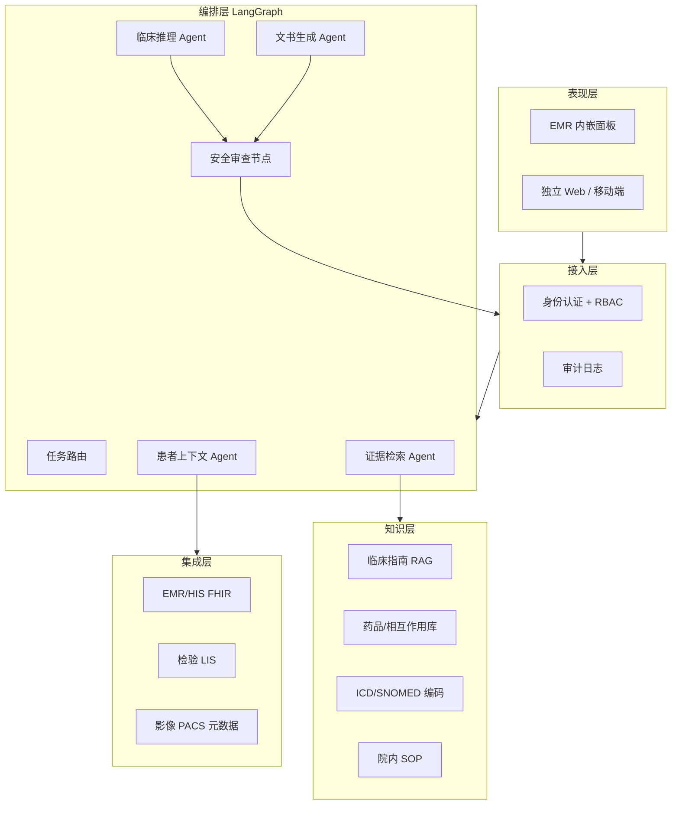
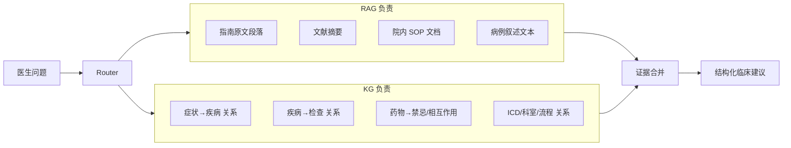
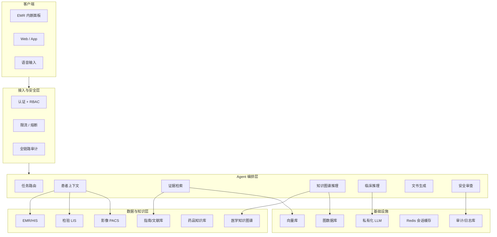
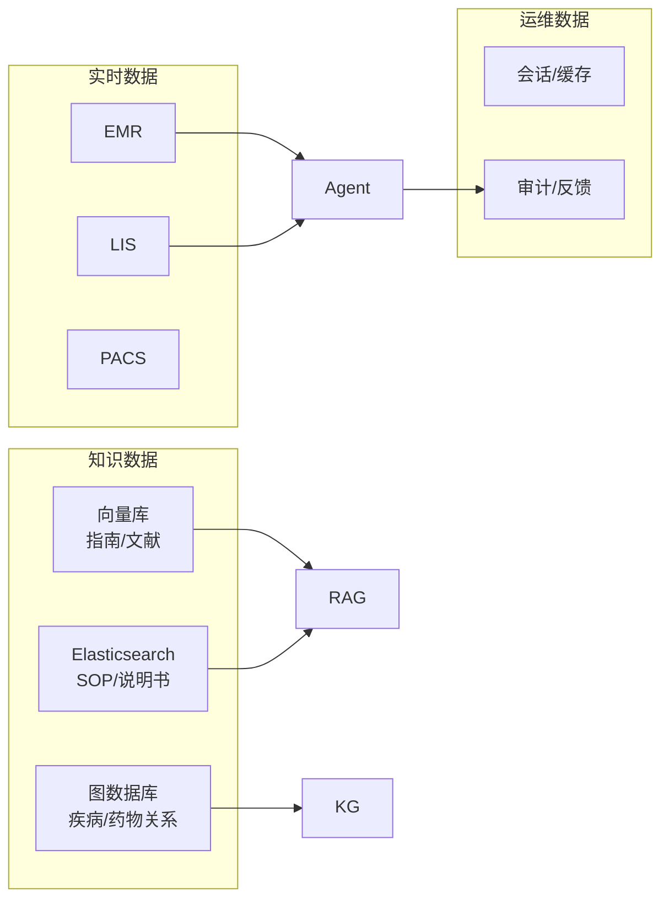
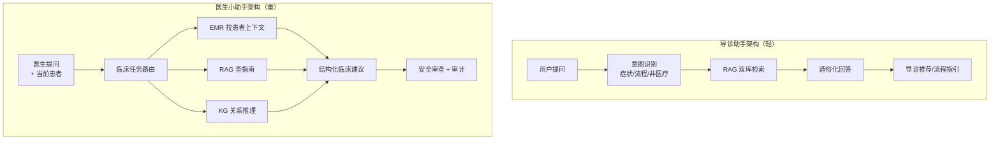

# 医生小助手架构设计
_Exported on 2026/6/5 at GMT+8 18:05:54 from Cursor (3.6.31)_

---

**User**

那要是给医生做的小助手agent，辅助医生看病的话，架构是啥

---

**Cursor**

你问的是面向医生的临床小助手 agent 架构。我先看看项目里已有的架构设计和相关文档。


**给医生用的临床小助手**和当前仓库里的**患者导诊助手**，定位不同：前者是 **CDSS（临床决策支持）**，辅助医生看诊、查资料、写病历；后者是 **患者侧问答 + 导诊**。底层可以复用 LangGraph + RAG + Tool 的模式，但架构要更重「患者上下文、证据链、合规、人机协同」。

---

## 一、定位差异

| 维度 | 当前项目（患者导诊） | 医生小助手 |
|------|---------------------|-----------|
| 用户 | 患者/家属 | 执业医师 |
| 目标 | 症状科普、就医流程 | 辅助诊断思路、查指南、看病历、写文书 |
| 输出 | 通俗解释 | 结构化临床建议 + **引用来源** |
| 数据 | 通用医学知识库 | **EMR 患者数据** + 指南/文献 |
| 责任 | 免责声明即可 | **医生最终决策**，全程审计 |
| 权限 | 低 | RBAC、患者数据隔离、HIPAA/等保 |

---

## 二、整体架构（分层）



---

## 三、核心编排流（LangGraph）

在你现有图的基础上扩展，而不是推倒重来。当前流程是：

```19:53:d:\InitialArchitectureForMedicalAgent1\app\graph\builder.py
def build_graph() -> StateGraph:
    graph = StateGraph(AppState)
    ...
    graph.add_edge(START, "trim_history")
    graph.add_edge("trim_history", "decision")
    graph.add_conditional_edges("decision", route_after_decision, {
        "answer_generate": "answer_generate",
        "es_rag": "es_rag",
        "tool_calling": "tool_calling",
    })
    ...
```

**医生助手建议的图：**

```
START
  → auth_check（校验医生身份 + 患者访问权限）
  → load_patient_context（从 EMR 拉当前患者摘要）
  → trim_history
  → clinical_router（临床任务路由，替代 symptom/process 二分）
      ├─ emr_query        → 查病历/检验/用药史
      ├─ guideline_rag    → 查指南/文献（Milvus + ES）
      ├─ drug_check       → 药物相互作用/禁忌
      ├─ differential     → 鉴别诊断思路（仅建议，不下诊断结论）
      ├─ documentation    → 生成 SOAP/病程记录草稿
      └─ general_qa       → 一般医学知识问答
  → evidence_merge（合并 EMR 数据 + 检索证据）
  → relevance_check（证据是否足够，不够则 rewrite）
  → clinical_answer（结构化输出 + 引用）
  → safety_review（幻觉检测、越权检测、免责声明）
  → audit_log
  → END
```

---

## 四、关键模块说明

### 1. 临床任务路由（替代现有 `decision_node`）

现有意图是 `symptom | process | mixed | non_medical`，面向患者提问。

医生侧应改为例如：

```python
class ClinicalIntent(BaseModel):
    task_type: Literal[
        "patient_lookup",      # 查这个患者的历史
        "lab_interpret",       # 解读检验结果
        "differential_dx",     # 鉴别诊断辅助
        "treatment_options", # 治疗方案参考（引用指南）
        "drug_interaction",    # 用药审查
        "documentation",       # 写病历/处方说明
        "guideline_search",    # 查指南/文献
        "general_medical",     # 一般医学问题
    ]
    patient_id: Optional[str]   # 当前会话绑定的患者
    need_emr: bool              # 是否需要拉 EMR
    need_guideline_rag: bool
    need_drug_db: bool
    urgency: Literal["routine", "urgent"] = "routine"
```

### 2. 患者上下文 Agent（Tool 层扩展）

你已有 `get_patient_history` 的雏形，生产环境要对接真实 EMR（HL7 FHIR）：

```python
# 医生助手需要的 Tool 示例
get_patient_summary(patient_id)      # 主诉、现病史、过敏史
get_recent_labs(patient_id, days=30) # 近期检验
get_medications(patient_id)          # 当前用药
get_imaging_reports(patient_id)      # 影像报告摘要
search_similar_cases(dept, icd_code) # 院内相似病例（脱敏）
```

**权限**：医生只能查自己科室/自己负责的患者，每次调用写审计日志。

### 3. 证据检索（RAG 双库可复用）

| 库 | 内容 | 检索方式 |
|----|------|---------|
| Milvus | 临床指南、教材、UpToDate 类内容 | 向量语义检索 |
| ES | 院内 SOP、药品说明书、ICD 编码 | 关键词 + 结构化过滤 |

医生场景比患者场景更强调：
- **必须带引用**（指南名、章节、年份）
- 检索结果按 **科室/病种/证据等级** 过滤
- 不支持的内容明确说「无足够证据」，不编造

### 4. 临床推理 Agent（CDSS）

输出应是**结构化**，不是纯聊天：

```json
{
  "differential_diagnoses": [
    {"name": "急性心肌梗死", "probability": "需排除", "supporting": ["..."], "against": ["..."]}
  ],
  "recommended_workup": ["心电图", "肌钙蛋白"],
  "treatment_references": [
    {"source": "2023 ESC ACS Guidelines", "recommendation": "..."}
  ],
  "cautions": ["需结合床旁表现，本建议仅供参考"],
  "citations": [{"doc_id": "...", "title": "...", "excerpt": "..."}]
}
```

**红线**：
- 不替代医生下最终诊断
- 不自动开处方、不自动下单
- 急危重症 → 固定话术提醒立即处置

### 5. 安全审查节点（必须有）

在 `answer_generate` 之后加一层 `safety_review`：

- 检查是否出现「确诊」「必须用药 XX mg」等越权表述
- 检查引用是否在 `medical_docs` 里真实存在
- 注入固定免责声明
- 敏感操作（如儿童/孕妇/肝肾功能不全）加额外警告

### 6. 审计与合规

每次交互记录：

```
doctor_id, patient_id, timestamp, query, 
retrieved_docs[], model_output, 
doctor_accepted/rejected/edited
```

满足医疗数据留存和事后追溯要求。

---

## 五、和当前项目的复用关系

| 现有模块 | 医生助手中的用法 |
|---------|-----------------|
| `LangGraph + AppState` | 保留，扩展 State 字段 |
| `decision_node` | 改为 `clinical_router` |
| `es_rag` / `milvus_rag` | 保留，换医生向知识库 |
| `check_docs` / `rewrite` | 保留，证据不足时重写查询 |
| `tool_calling` | 扩展为 EMR/LIS 工具集 |
| `answer_generate` | 改为结构化临床输出 |
| Redis Session | 保留，按 doctor_id + patient_id 隔离 |
| FastAPI | 保留，加 RBAC 中间件 |

**建议新增的 State 字段：**

```python
class ClinicalState(AppState):
    doctor_id: str
    patient_id: Optional[str]
    patient_context: Optional[PatientSummary]  # EMR 摘要
    clinical_intent: Optional[ClinicalIntent]
    drug_alerts: List[DrugAlert] = []
    citations: List[Citation] = []
    safety_passed: bool = False
    audit_id: Optional[str] = None
```

---

## 六、典型看诊场景时序

```
医生打开患者「张三」的看诊页面
    ↓
Agent 自动加载：过敏史、现用药、今日检验
    ↓
医生问："这个肌钙蛋白轻度升高，怎么考虑？"
    ↓
Router → differential_dx + lab_interpret
    ↓
并行：EMR 拉历史心电图 + RAG 查 ACS 指南
    ↓
生成：鉴别诊断列表 + 建议完善检查 + 指南引用
    ↓
Safety Review → 展示给医生（带来源链接）
    ↓
医生采纳/修改 → 写入病历（可选一键插入 EMR）
```

---

## 七、部署与安全建议

1. **数据不出院**：LLM 私有化部署或专有云，患者数据不送公网 API  
2. **最小权限**：Tool 按医生角色限制可查患者范围  
3. **人机协同**：所有输出标注「AI 辅助，最终决策由医师负责」  
4. **版本管理**：知识库、Prompt、模型版本可回溯  
5. **灰度发布**：新能力先在单科室试点，对比采纳率与错误率  

---

## 八、和患者助手的架构对比（一句话）

- **患者助手**：`问题 → 意图 → RAG → 通俗回答`  
- **医生助手**：`患者上下文 + 临床问题 → 多源证据 → 结构化 CDSS 建议 → 安全审查 → 医生确认`

你现在的 LangGraph 骨架（路由、双 RAG、Tool、Session）可以直接演进；主要增量是 **EMR 集成、临床任务路由、结构化 CDSS 输出、安全审计层**。

如果你希望，我可以按这个方案，在你现有 `app/graph/builder.py` 上画一版具体的 `ClinicalState` 和节点拆分改造清单（含文件级改动列表）。

---

**User**

kg和rag哪里起作用了

---

**Cursor**

你问的是 KG 和 RAG 在架构里各自在哪一层、起什么作用。我先对照项目代码和前面那套医生助手设计，把两者的落点说清楚。


**先说结论：当前项目里只有 RAG 在起作用，没有 KG。**

我搜了整个仓库，没有 Neo4j、知识图谱或类似实现。上次说的医生助手架构里，RAG 是明确用到的；KG 是**可以补、但还没落地**的一层。

---

## 一、RAG 在当前项目里哪里起作用

RAG 负责：**从文档库里找相关内容，再交给 LLM 生成回答**。

完整链路：

```
用户提问
  → decision（判断要不要查症状库 / 流程库）
  → es_rag（Elasticsearch，流程/SOP 类文档）
  → milvus_rag（Milvus 向量库，医学知识）
  → check_docs（LLM 评估检索结果够不够）
  → rewrite_question（不够就改写 query 再查）
  → answer_generate（把检索到的文档塞进 prompt 生成答案）
```

对应代码：

| 环节 | 文件 | 作用 |
|------|------|------|
| 路由 | `route_after_decision` | 决定走 RAG 还是直接回答 |
| ES 检索 | `es_rag_node` | 查「怎么办、流程、导诊」类文档 |
| 向量检索 | `milvus_rag_node` | 查「症状、疾病、医学知识」 |
| 质量评估 | `check_docs_node` | 判断检索到的 chunk 能否回答问题 |
| 生成答案 | `answer_generate_node` | 把 `medical_docs` + `process_docs` 注入 prompt |

RAG 解决的是：**非结构化文本的语义/关键词匹配**——比如「头疼发烧怎么办」→ 从指南段落里找相似内容。

---

## 二、KG 在当前项目里：没有

当前架构是 **RAG + Tool（查 mock 病历）**，没有知识图谱。

没有 KG 意味着系统**做不了**这类事：

- 症状 → 疾病 → 检查 → 治疗 的**多跳推理**
- 药物 A 和药物 B 的**结构化相互作用**
- ICD 编码、科室、科室 SOP 之间的**关系遍历**
- 「这个检验异常 + 这个用药 + 这个过敏史」的**组合约束推理**

这些靠 RAG 查段落，效果不稳定；KG 就是补这块的。

---

## 三、医生助手里，RAG 和 KG 各自干什么

两者不是替代关系，是**分工协作**：



### RAG 擅长的（找「怎么说」）

| 场景 | 例子 |
|------|------|
| 查指南原文 | 「ACS 肌钙蛋白升高怎么处理？」→ 检索 ESC 指南段落 |
| 查院内 SOP | 「我们科收 MI 的标准流程？」 |
| 查文献/教材 | 「某罕见病的最新治疗进展」 |
| 病历/报告摘要 | 从 EMR 长文本里找相关段落 |

→ **非结构化、叙述性、需要引用原文**的内容。

### KG 擅长的（推「是什么关系」）

| 场景 | 例子 |
|------|------|
| 鉴别诊断路径 | 胸痛 → {ACS, 主动脉夹层, 肺栓塞}，按症状/检验边权重排序 |
| 用药审查 | 患者正在用华法林 + 新开阿司匹林 → KG 查 `(华法林)-[相互作用]->(阿司匹林)` |
| 检查推荐 | 怀疑糖尿病 → KG 遍历 `疾病→推荐检查→参考范围` |
| 编码/流程 | 某 ICD 编码 → 对应科室 → 对应转诊规则 |

→ **结构化、关系型、需要精确推理**的内容。

---

## 四、放进 LangGraph 里长什么样

在你现有图的基础上，KG 会多一条并行分支：

```
clinical_router
  ├─ emr_query          → Tool（结构化患者数据，不是 KG）
  ├─ guideline_rag      → Milvus/ES（RAG）✅ 已有模式
  ├─ drug_check         → KG 查药物关系 ⚠️ 当前没有
  ├─ differential_dx    → KG 多跳推理 + RAG 补证据 ⚠️ 当前没有
  └─ documentation      → 主要靠 EMR + RAG
```

**典型组合用法（鉴别诊断）：**

```
医生："45岁男，胸痛+ST段抬高，怎么考虑？"

Step 1  KG：从「胸痛+ST抬高」沿图谱找候选诊断
         → [STEMI, 心包炎, ...] + 每条边的支持/排除条件

Step 2  RAG：对每个候选诊断，检索指南里相关段落作证据

Step 3  EMR Tool：拉该患者过敏史、现用药、既往心电图

Step 4  LLM：合并 KG 结构 + RAG 引用 + EMR 事实 → 结构化输出
```

没有 KG 时，Step 1 只能让 LLM「凭记忆猜」或 RAG 碰运气找段落，**关系推理不可靠**。

---

## 五、一张对照表

| | RAG | KG |
|--|-----|-----|
| 数据形态 | 文档 chunk（文本） | 实体 + 关系（三元组） |
| 检索方式 | 向量相似度 / 关键词 | 图遍历 / Cypher / SPARQL |
| 强项 | 找原文、给引用 | 多跳推理、关系约束 |
| 弱项 | 精确关系推理差 | 难覆盖叙述性长文本 |
| **当前项目** | ✅ ES + Milvus 已实现 | ❌ 未实现 |
| **医生助手价值** | 指南引用、SOP、文献 | 用药审查、鉴别诊断、编码流程 |

---

## 六、实际落地建议

**第一阶段（可基于现有代码）**：RAG + EMR Tool 就够覆盖大部分场景——查指南、查流程、拉病历。

**第二阶段再加 KG**，优先建这几块 ROI 最高：

1. **药物 KG**：成分、禁忌、相互作用（对接药品说明书结构化数据）
2. **疾病-症状-检查 KG**：支撑鉴别诊断路径
3. **ICD / 科室 / 流程 KG**：院内转诊、编码辅助

KG 不必一开始就很大；可以先做「药物相互作用」这种**关系明确、容错要求低**的子图，和现有 RAG 并行跑。

---

**一句话**：  
- **RAG** = 从文档里「找相关段落」→ 当前项目已在用  
- **KG** = 在实体关系上「做推理」→ 当前项目没有，医生助手里主要在**用药审查、鉴别诊断、流程关系**这类场景补 RAG 的短板  

如果你想，我可以画一版「RAG + KG 双路检索」的具体节点设计，直接对应你现有的 `builder.py` 怎么改。

---

**User**

和该项目无关，只是说医生小助手的价格设计是啥

---

**Cursor**

**医生小助手**的架构设计，可以按「辅助决策、不替代医生」来分层。下面是一套通用、和具体项目无关的设计。

---

## 1. 产品定位

**Clinical Decision Support System（CDSS）+ 临床工作流助手**

- 服务对象：执业医师（门诊、住院、急诊）
- 核心价值：省时间、补证据、降遗漏，**不自动下诊断、不开处方**
- 交互形态：EMR 内嵌侧边栏 + 独立 Web/App + 语音输入（看诊中）

---

## 2. 总体架构



---

## 3. 分层职责

### 3.1 客户端层

| 模块 | 职责 |
|------|------|
| EMR 插件 | 绑定当前患者，一键带入上下文 |
| 对话面板 | 问答、追问、引用展开 |
| 结构化卡片 | 鉴别诊断、检查建议、用药提醒（非纯聊天） |
| 文书编辑器 | SOAP/病程/出院小结草稿，医生可改后写入 EMR |

### 3.2 接入与安全层

| 模块 | 职责 |
|------|------|
| 身份认证 | 医生工号、科室、职称 |
| RBAC | 只能访问权限内患者 |
| 数据脱敏 | 日志中敏感字段加密/掩码 |
| 审计 | 每次 query、检索结果、模型输出、医生采纳/拒绝全记录 |
| 合规 | 等保/HIPAA、数据不出院、模型私有化 |

### 3.3 Agent 编排层（核心）

建议用 **LangGraph / 多 Agent 编排**，主流程：

```
请求进入
  → 鉴权 + 绑定 patient_id
  → 加载患者上下文摘要
  → 临床任务路由
  → 并行执行（EMR / RAG / KG / 药品库）
  → 证据融合
  → 结构化生成
  → 安全审查
  → 返回 + 写审计
```

---

## 4. 核心 Agent / 节点设计

### 4.1 任务路由 Agent

把医生意图分到具体能力，例如：

| task_type | 说明 |
|-----------|------|
| `patient_summary` | 汇总这个患者的关键信息 |
| `differential_dx` | 鉴别诊断辅助 |
| `lab_interpret` | 检验/影像结果解读参考 |
| `treatment_ref` | 治疗方案参考（引用指南） |
| `drug_check` | 用药审查、相互作用 |
| `documentation` | 病历/病程书写辅助 |
| `guideline_search` | 查指南、文献 |
| `general_medical` | 一般医学知识 |

输出：`task_type`、是否需要 EMR / RAG / KG、紧急程度。

### 4.2 患者上下文 Agent

对接 **HL7 FHIR / 院内 API**，拉结构化数据：

- 主诉、现病史、既往史、过敏史
- 当前用药、近期检验、影像报告摘要
- 生命体征、入院/门诊记录

输出：`PatientContext` 结构化摘要，供后续节点使用。

### 4.3 RAG Agent（非结构化证据）

| 知识源 | 检索方式 | 用途 |
|--------|----------|------|
| 临床指南 | 向量 + 元数据过滤（科室/年份） | 治疗建议、引用原文 |
| 教材/文献 | 向量检索 | 补充证据 |
| 院内 SOP | ES 关键词 + 过滤 | 流程、转诊规则 |
| 药品说明书 | 混合检索 | 剂量、禁忌叙述 |

**要求**：每条建议必须带 `citation`（来源、章节、年份）。

### 4.4 KG Agent（结构化推理）

| 子图 | 典型关系 | 用途 |
|------|----------|------|
| 疾病-症状 | 症状 → 可能疾病 | 鉴别诊断路径 |
| 疾病-检查 | 疾病 → 推荐检查 | 完善检查建议 |
| 药物 | 成分 → 禁忌/相互作用 | 用药审查 |
| 编码-流程 | ICD → 科室 → 转诊规则 | 流程辅助 |

**和 RAG 的分工**：
- **RAG**：找「怎么说」（原文段落）
- **KG**：推「是什么关系」（多跳、约束）

### 4.5 临床推理 Agent

输入：患者上下文 + RAG 证据 + KG 推理结果  
输出：**结构化 JSON**，例如：

```json
{
  "differential_diagnoses": [
    {"name": "...", "likelihood": "需排除", "supporting": [], "against": []}
  ],
  "recommended_workup": ["..."],
  "treatment_references": [{"source": "...", "recommendation": "..."}],
  "drug_alerts": [{"drug_a": "...", "drug_b": "...", "severity": "..."}],
  "citations": [{"doc_id": "...", "excerpt": "..."}],
  "disclaimer": "仅供参考，最终决策由医师负责"
}
```

### 4.6 文书生成 Agent

- 输入：对话 + 患者上下文 + 医生确认要点
- 输出：SOAP、病程、出院小结、会诊意见草稿
- 约束：不编造未做检查/未开药物；缺失项标「待补充」

### 4.7 安全审查 Agent（必做）

生成后过一遍：

- 是否越权（「确诊」「必须开 XX 药」）
- 引用是否在检索结果中真实存在
- 儿童/孕妇/肝肾功能不全等特殊人群警告
- 急危重症 → 固定提醒立即处置

不通过则降级为「仅展示证据，不给结论性建议」。

---

## 5. 数据架构



| 存储 | 内容 |
|------|------|
| 向量库 | 指南、文献 chunk + embedding |
| ES | SOP、药品说明书、ICD 编码表 |
| 图数据库 | 疾病-症状-检查-药物关系 |
| Redis | 会话、患者上下文缓存 |
| PostgreSQL | 审计日志、医生反馈、版本管理 |

---

## 6. 典型场景时序

**场景：看诊中问「肌钙蛋白轻度升高怎么考虑？」**

```
1. 医生打开患者张三 → 系统自动加载 PatientContext
2. 医生提问 → Router → differential_dx + lab_interpret
3. 并行：
   - EMR：历史心电图、既往 MI、现用药
   - RAG：ACS 指南相关段落
   - KG：「肌钙蛋白升高」→ 候选疾病及排除条件
4. 临床推理 Agent 合并 → 结构化鉴别 + 建议检查 + 引用
5. 安全审查 → 展示给医生
6. 医生采纳/修改 → 可选一键插入 EMR 病历
7. 全链路写入审计库
```

---

## 7. 人机协同原则（架构红线）

| 原则 | 设计体现 |
|------|----------|
| 医生最终决策 | 所有输出带免责声明，无自动下单/开方 |
| 可解释 | 每条建议有 citation 或 KG 路径 |
| 可审计 | query → 检索 → 生成 → 采纳 全记录 |
| 可纠错 | 医生 reject/edit 反馈用于评估，不直接在线学习 |
| 数据安全 | 私有化部署，患者数据不出院 |

---

## 8. 部署架构（医院常见）

```
┌─────────────────────────────────────────┐
│  医院内网 / 专有云                        │
│  ┌─────────┐  ┌─────────┐  ┌─────────┐ │
│  │ API GW  │→ │ Agent   │→ │ 私有 LLM │ │
│  └─────────┘  │ Service │  └─────────┘ │
│               └────┬────┘               │
│        ┌───────────┼───────────┐        │
│        ▼           ▼           ▼        │
│     EMR API    向量库/ES    图数据库      │
└─────────────────────────────────────────┘
```

- LLM：院内 GPU 或医疗专有云
- 知识库：定期从指南、说明书、院内 SOP 更新
- 灰度：按科室试点，对比采纳率、错误率、耗时

---

## 9. 和患者侧助手的架构差异（一句话）

| | 患者助手 | 医生小助手 |
|--|----------|------------|
| 目标 | 科普、导诊 | 决策支持、文书、用药审查 |
| 数据 | 通用知识库 | **EMR + 指南 + KG** |
| 输出 | 通俗问答 | **结构化 + 引用** |
| 安全 | 免责声明 | **审计 + RBAC + 安全审查** |
| 技术 | RAG 为主 | **RAG + KG + EMR Tool 并行** |

---

## 10. 实施分期建议

| 阶段 | 能力 | 技术重点 |
|------|------|----------|
| MVP | 患者摘要 + 指南问答 + 病历草稿 | RAG + EMR Tool |
| V2 | 用药审查 + 检验解读 | 药品 KG + 规则引擎 |
| V3 | 鉴别诊断辅助 | 疾病 KG + 多 Agent 推理 |
| V4 | 深度 EMR 集成、语音看诊 | 插件化、流式、低延迟 |

---

**总结**：医生小助手架构 = **接入安全层** + **任务路由** + **患者上下文（EMR）** + **RAG（证据原文）** + **KG（关系推理）** + **结构化临床推理** + **安全审查** + **全链路审计**。RAG 负责「找依据」，KG 负责「推关系」，EMR 负责「这个患者的事实」，三者合并后再交给 LLM 生成给医生看的结构化建议。

---

**User**

这个和导诊比较呢

---

**Cursor**

**导诊助手**和**医生小助手**都是医疗 Agent，但服务对象、架构重心和安全要求差很多。可以这样对比：

---

## 一、一句话定位

| | 导诊助手 | 医生小助手 |
|--|----------|------------|
| **给谁用** | 患者 / 家属 | 医生 |
| **解决什么** | 「我该挂什么科、要不要紧、怎么就医」 | 「这个患者怎么考虑、查什么、用什么方案参考、怎么写病历」 |
| **本质** | 就医导航 + 健康科普 | 临床决策支持（CDSS） |
| **决策权** | 无（只给建议，不能看病） | 无（辅助医生，医生拍板） |

---

## 二、架构对比（核心差异）



| 架构层 | 导诊 | 医生小助手 |
|--------|------|------------|
| **输入** | 自然语言症状描述 | 自然语言 + **绑定患者 ID** |
| **意图路由** | 症状 / 流程 / 非医疗 | 鉴别诊断 / 检验解读 / 用药 / 文书 / 查指南… |
| **数据源** | 通用医学知识 + 医院流程文档 | **EMR + LIS + 指南 + 药品库 + KG** |
| **检索** | RAG 为主（向量 + ES） | RAG + **KG + 结构化 Tool** 并行 |
| **输出** | 通俗文本 + 科室推荐 | **结构化 JSON** + 引用 + 风险提示 |
| **安全层** | 免责声明 + 紧急转诊话术 | **RBAC + 审计 + 安全审查 + 不越权** |
| **集成** | 公众号 / 小程序 / 官网 | **EMR 内嵌** + 院内系统对接 |
| **复杂度** | 低～中 | 高 |

---

## 三、RAG / KG 在两者里的作用

| 能力 | 导诊 | 医生小助手 |
|------|------|------------|
| **RAG** | **核心**：查「症状对应什么科」「就医流程怎么走」 | **重要**：查指南原文、SOP、文献作证据 |
| **KG** | 可选（科室-症状映射） | **重要**：鉴别诊断路径、药物相互作用、检查推荐 |
| **EMR Tool** | 一般不需要 | **必须**：患者病史、检验、用药 |
| **结构化推理** | 弱（「像什么科」即可） | 强（候选诊断、排除条件、证据链） |

导诊：**RAG 够用**，KG 是加分项（比如「发热+皮疹 → 儿科/皮肤科」）。  
医生助手：**RAG 不够**，需要 KG + EMR 做精确、可审计的推理。

---

## 四、典型问答对比

| 用户问题 | 导诊怎么答 | 医生助手怎么答 |
|----------|------------|----------------|
| 「我头疼还发烧怎么办？」 | 科普可能原因，建议挂**神经内科/发热门诊**，说明急诊指征 | 结合**该患者** EMR：既往、用药、近期检验 → 鉴别思路 + 建议完善检查 + **指南引用** |
| 「肚子大怎么减小？」 | 区分是肥胖还是腹胀，推荐**消化内科/普外**，给就医流程 | 不这么问；医生会问「这个患者腹水怎么考虑？」→ 查 EMR 肝功能、超声 → 鉴别肝硬化/肿瘤等 |
| 「张三以前看过什么病？」 | 通常**不能答**（无患者权限） | 调 EMR Tool，返回结构化病史摘要 |
| 「华法林能和阿司匹林一起吃吗？」 | 通俗说「可能有风险，请咨询医生」 | 查药品 KG + 患者当前用药 → **结构化 alert** + 严重程度 + 替代方案参考 |

---

## 五、输出形态对比

**导诊**：聊天为主，语言通俗。

```
您描述的发热、头痛，建议先到发热门诊或神经内科就诊。
若出现意识不清、持续高热不退，请立即急诊。
本院挂号可通过 XXX…
```

**医生小助手**：聊天 + 结构化卡片。

```json
{
  "differential": ["STEMI需排除", "心包炎"],
  "workup": ["复查心电图", "肌钙蛋白"],
  "citations": [{"source": "2023 ESC ACS Guidelines", "..."}],
  "drug_alerts": [],
  "disclaimer": "AI辅助，最终决策由医师负责"
}
```

---

## 六、安全与合规对比

| 维度 | 导诊 | 医生小助手 |
|------|------|------------|
| **数据敏感度** | 低（通常不存真实病历） | 高（真实 PHI/EMR） |
| **权限** | 匿名或弱账号 | 强 RBAC，按科室/患者隔离 |
| **审计** | 可选 | **必须**（谁、何时、看了什么、采纳与否） |
| **部署** | 公网 / 云端可接受 | **私有化**，数据不出院 |
| **错误后果** | 挂错科、延误（仍有医生兜底） | 直接影响诊疗（责任在医生，但系统需可解释） |
| **红线** | 不做诊断、不开药、急症转急诊 | 不替代诊断、不自动开方/下单、必须带引用 |

---

## 七、技术栈量级对比

| 组件 | 导诊 | 医生小助手 |
|------|------|------------|
| LLM | 1 个通用模型 | 1～2 个（推理 + 可选小模型做审查） |
| 向量库 | 1 个（医学知识） | 1 个（指南/文献） |
| ES | 1 个（流程/SOP） | 1 个（SOP/说明书/编码） |
| 图数据库 | 通常无 | 建议有（药物/疾病关系） |
| EMR 对接 | 无 | **FHIR/API，核心依赖** |
| Agent 节点数 | 5～8 个 | 10～15+ 个 |
| 开发周期 | 1～3 个月 MVP | 6～12+ 个月（含对接、合规） |

---

## 八、流程图：同一症状，两条路径

```
患者："胸口闷、出冷汗"
         │
         ▼
    ┌─────────┐
    │ 导诊助手 │ → 疑似心血管急症 → 建议立即急诊/挂心内科
    └─────────┘    输出：通俗 + 流程 + 科室
         │
         │ （患者到医院后）
         ▼
    ┌─────────┐
    │ 医生看诊 │ + 打开医生小助手
    └─────────┘
         │
         ▼
    ┌─────────┐
    │医生小助手│ → 拉 EMR：55岁、高血压、现用药
    └─────────┘ → RAG：ACS 指南段落
                  → KG：胸痛+冷汗 → 候选诊断树
                  → 输出：鉴别列表 + 建议检查 + 引用
                  → 医生决策 → 写回 EMR
```

导诊在**进医院前**；医生助手在**进医院后、看诊中**。

---

## 九、能不能做成一个系统？

可以，但建议**分层、分路由**，不要混成一个 Prompt：

```
                    ┌──────────────┐
                    │  统一接入层   │
                    └──────┬───────┘
                           │
              ┌────────────┴────────────┐
              ▼                         ▼
       ┌─────────────┐           ┌─────────────┐
       │  导诊 Agent  │           │ 医生 Agent   │
       │  轻量 RAG    │           │ EMR+RAG+KG  │
       │  无患者绑定  │           │ 强审计      │
       └─────────────┘           └─────────────┘
```

- **用户角色路由**：患者 → 导诊；医生 → 临床助手  
- **知识库可部分共用**：通用医学知识、流程文档  
- **不能共用**：EMR Tool、KG 推理、输出模板、安全策略  

---

## 十、总结

| | 导诊 | 医生小助手 |
|--|------|------------|
| **架构关键词** | 意图路由 + 双 RAG + 通俗生成 | 患者上下文 + RAG + KG + 结构化 CDSS + 审计 |
| **难点** | 意图准、话术安全、科室映射 | EMR 对接、证据链、合规、低幻觉 |
| **KG 必要性** | 低 | 高 |
| **商业价值** | 分流、降咨询压力、改善体验 | 提效、降遗漏、规范诊疗 |
| **关系** | 上下游：导诊把患者导进医院，医生助手服务看诊环节 |

**一句话**：导诊是「**帮患者找到对的门**」；医生小助手是「**帮医生在诊室里看得更全、更有依据**」。前者偏 **RAG + 流程**，后者偏 **EMR + RAG + KG + 结构化推理 + 强合规**。

---

**User**

那只有导诊能落地部署，评测的话，成都薪资多少

---

**Cursor**

导诊更容易落地和评测，我查一下成都这边相关岗位（医疗 AI / RAG 部署评测）的大致薪资区间。


你的判断大体对：**导诊**比医生小助手更容易落地、也更容易做评测；成都这边做这类项目的岗位和薪资大致如下。

---

## 一、为什么「只有导诊」更好落地、更好评测

| 维度 | 导诊 | 医生小助手 |
|------|------|------------|
| **数据** | 公开医学知识 + 院内流程，不涉及真实病历 | 必须接 EMR，合规、对接成本高 |
| **部署** | 小程序/公众号/官网，公网或院内轻量部署 | 必须私有化 + RBAC + 审计 |
| **评测** | 可人工标注：科室对不对、话术是否安全、有无胡编 | 需临床专家逐条审，成本高、周期长 |
| **责任** | 「建议挂号」错了还有医生兜底 | 直接影响诊疗链路 |
| **周期** | MVP 1～3 个月能上线试点 | 往往 6～12 个月还在对接 |

导诊的评测也相对标准：

- **意图识别准确率**（症状 vs 流程 vs 非医疗）
- **科室推荐 Top-1/Top-3 命中率**
- **RAG 召回率 / 相关性**
- **安全**：是否越界诊断、急症是否转急诊
- **用户满意度**、转人工率、挂号转化率

这些都能用测试集 + 人工抽检 + A/B，**医生助手**很难用同样方式快速闭环。

---

## 二、成都薪资（导诊 / 医疗 RAG 相关，2025～2026 参考）

按**岗位类型**和**经验**，大致区间如下（月薪，人民币）：

### 1. 能独立做导诊落地的人（开发 + 调优）

| 级别 | 经验 | 月薪范围 | 年薪（含年终） |
|------|------|----------|----------------|
| **初级** | 0～2 年，有 RAG/LangChain 项目 | **11k～18k** | 14～24 万 |
| **中级** | 2～4 年，完整做过导诊/问答类 Agent | **18k～28k** | 24～38 万 |
| **高级** | 4 年+，架构 + 医疗垂直 + 上线经验 | **25k～40k** | 35～55 万 |

招聘里能对上的例子：

- 国为医药 **AI 应用工程师**（RAG/知识库，成都）：**15k～22k**
- 医疗大模型 **高级 AI 工程师**（成都）：**25k～40k·13 薪**
- 通用 **大模型应用 / RAG**（成都高新区）：**25k～45k·14～15 薪**
- 偏算法的 **医疗 NLP**（要求 UMLS/术语等）：**11k～18k**（偏研发岗，下限较低）

### 2. 偏「评测 / 效果优化」的角色

| 类型 | 月薪范围 | 说明 |
|------|----------|------|
| **算法工程师（含评测）** | 18k～30k | 建测试集、指标、Bad Case 分析、Prompt/RAG 迭代 |
| **AI 产品经理（医疗）** | 15k～25k | 定评测标准、对接临床/运营，技术弱一点 |
| **标注 + 质检（外包/初级）** | 5k～10k | 医学背景标注员，不算工程师岗 |

纯「评测」如果没有模型开发能力，薪资会低一档；**会评测 + 会改 RAG/Agent** 的更有议价空间。

### 3. 按公司类型（成都）

| 公司类型 | 典型月薪 | 特点 |
|----------|----------|------|
| **医疗信息化 / 医药企业**（国为、医渡等） | 15k～25k | 稳定，医疗场景，涨幅一般 |
| **互联网大厂成都分部**（同程、字节等） | 25k～45k | 大模型岗高，但不一定是医疗 |
| **医疗 AI 创业公司** | 18k～35k | 波动大，期权看公司 |
| **外包 / 集成商** | 12k～20k | 落地多，技术深度一般 |

---

## 三、和北上深的差距（心里有数）

同样做导诊 / 医疗 RAG：

| 城市 | 中级（2～4 年）大致月薪 | 相对成都 |
|------|-------------------------|----------|
| **成都** | 18k～28k | 基准 |
| **北京 / 上海** | 25k～40k | 大约高 30%～50% |
| **杭州** | 22k～35k | 大约高 20%～30% |

成都生活成本更低，**实际到手性价比**往往不差；但医疗 AI 岗位数量比北上少，选择面窄一些。

---

## 四、导诊方向，什么背景能拿哪档

**18k～25k（成都中等偏上）** 通常需要：

- LangGraph / LangChain 做过完整 Agent 链路
- RAG 双路（向量 + ES）+ 评测闭环
- 导诊或客服类项目**实际上线**经验
- 能讲清楚：意图路由、检索、安全话术、Bad Case 怎么迭代

**25k～35k+** 通常还要：

- 医疗垂直（术语、合规、急症规则）
- 评测体系从 0 到 1（测试集、指标看板、回归）
- 带小团队或独立负责一条产品线

**11k～15k** 常见情况：

- 应届 / 转岗，只有 Demo 没有上线
- 只会调 API，没做过检索和评测
- 传统 Java 转 AI 应用，项目偏浅

---

## 五、和「医生小助手」对职业路径的影响

| | 导诊 | 医生小助手 |
|--|------|------------|
| **岗位数量（成都）** | 多一些 | 很少，多在头部医疗 AI 公司 |
| **入门难度** | 较低，项目好找 | 高，要 EMR + 临床资源 |
| **薪资天花板** | 高级约 35k～40k | 专家岗可达 40k+，但岗位极少 |
| **简历价值** | 「医疗 RAG Agent 上线 + 评测体系」 | 「CDSS / EMR 集成」更稀缺但更窄 |

务实路径：**先做导诊落地 + 评测**，简历上写「医疗 Agent、RAG、LangGraph、科室推荐准确率 XX%」——在成都 **20k～28k** 是合理目标（2～4 年经验）；有完整上线和指标，可以往 **25k～35k** 谈。

---

## 六、直接回答你的问题

> 只有导诊能落地部署、评测的话，成都薪资多少？

**概括：**

- **Junior（能参与，不能独立扛）**：**12k～18k/月**
- **Mid（独立做导诊 Agent + RAG + 评测）**：**18k～28k/月** ← 最常见、也最好找
- **Senior（架构 + 医疗垂直 + 多项目上线）**：**28k～40k/月**
- **年薪**：多数 **14～16 薪**，Mid 总包大约 **25～40 万/年**

以上是 2025～2026 成都招聘的参考区间，具体还看：有没有医疗行业经验、有没有实际上线项目、会不会评测体系、公司是大厂还是创业公司。

如果你说下自己的年限（应届 / 1～3 年 / 3 年+）和技术栈，我可以帮你缩到一个更具体的谈薪区间。

---

**User**

那要是 我独立做 医疗小助手呢，并达到落地-部署-评测的标准，价格多少，和导诊相比呢

---

**Cursor**

**独立做医疗小助手（医生侧 CDSS 那类）并做到落地、部署、评测**，在成都市场上的“价格”（谈薪筹码）会明显高于导诊，但前提是：**不是 Demo，而是可演示的完整闭环**。下面分「雇员谈薪」和「独立交付/创业」两种说。

---

## 一、先对齐：什么叫「达到落地-部署-评测标准」

| 标准 | 导诊（你已有参考） | 医疗小助手（医生侧） |
|------|-------------------|----------------------|
| **落地** | 小程序/ Web 能对话、能推荐科室 | 绑定患者上下文、结构化临床建议、引用来源 |
| **部署** | Docker + 向量库 + ES，公网/内网可跑 | 私有化 LLM + RBAC + 审计日志 +（模拟/真实）EMR |
| **评测** | 意图准确率、科室 Top-K、安全话术 | 证据召回、引用真实性、结构化字段完整度、安全审查通过率 |

个人项目若做到：

- LangGraph 多节点（路由 / EMR Tool / RAG / 安全审查）
- 结构化输出 + citation
- 评测集 + 指标看板 + Bad Case 回归
- 可一键部署（docker-compose / K8s）

就算 EMR 是 Mock、没进真医院，**简历价值已经远高于「只会导诊 Demo」**。

---

## 二、雇员谈薪：成都大概多少

假设你有 **2～5 年相关经验**，且医疗小助手是**你独立从 0 到 1 做出来并跑通评测**的：

| 级别 | 只有导诊闭环 | 导诊 + 医疗小助手完整闭环 | 溢价 |
|------|-------------|---------------------------|------|
| **Junior（0～2 年）** | 12k～18k | 15k～22k | +15%～25% |
| **Mid（2～4 年）** | 18k～28k | **25k～35k** | +30%～40% |
| **Senior（4 年+）** | 28k～40k | **35k～50k** | +25%～35% |

### 换算成年薪（成都，14～16 薪）

| 能力证明 | 年薪总包（大致） |
|----------|------------------|
| 导诊独立落地 + 评测 | **25～40 万** |
| **医疗小助手**独立落地 + 评测 | **35～55 万** |
| 医疗小助手 + **真实医院试点 / EMR 对接** | **45～70 万+**（岗位少，议价高） |

**和导诊比**：同样是你独立做的，医疗小助手一般能多谈 **5k～12k/月**，或总包多 **10～20 万/年**——不是因为城市变了，而是**稀缺度和复杂度**上去了。

---

## 三、为什么医疗小助手更“值钱”

| 维度 | 导诊 | 医疗小助手 |
|------|------|------------|
| **技术栈深度** | RAG + 意图路由 | RAG + Tool + 结构化生成 + 安全层 + 审计 |
| **领域门槛** | 科普 + 科室映射 | 临床话术、证据链、合规红线 |
| **评测难度** | 相对标准 | 需设计临床向指标（引用率、越权拦截等） |
| **市场供给** | 会做的人相对多 | **独立做全链路的人很少** |
| **企业付费意愿** | 偏运营/获客 | 偏临床提效，客单价更高 |

招聘方看到「独立做医疗小助手 + 评测体系」，会默认你能：

- 设计 Agent 架构，不是只会调 API  
- 做医疗垂直的 safety / compliance 意识  
- 对 CDSS、EMR 集成有概念（哪怕先是 Mock）

这类人在成都 **30k 左右**是合理 mid-high 定位；有真实试点经历可以冲 **35k～45k**。

---

## 四、和导诊的直接对比（一张表）

| | 导诊（独立做到位） | 医疗小助手（独立做到位） |
|--|-------------------|-------------------------|
| **成都 Mid 月薪** | 18k～28k | **25k～35k** |
| **成都 Senior 月薪** | 28k～40k | **35k～50k** |
| **年薪总包** | 25～40 万 | **35～55 万** |
| **简历关键词** | 医疗 RAG、导诊 Agent | **CDSS、临床 Agent、EMR、结构化输出、审计** |
| **岗位数量** | 多 | 少，但竞争者也少 |
| **独立做成难度** | ★★★ | ★★★★★ |
| **真实医院落地难度** | ★★ | ★★★★★（要资质、对接、专家） |

**结论**：  
- 同样「独立 + 落地 + 评测」，医疗小助手 **月薪大约高 30%～40%**，年薪多 **10～20 万** 很常见。  
- 若只有 Demo、没有评测和部署，两者差距会缩小，甚至差不多。

---

## 五、如果不是打工，是「独立做产品/接项目」

| 形态 | 导诊 | 医疗小助手 |
|------|------|------------|
| **ToB 项目交付**（给医院/ HIS 厂商） | 15～40 万/项目 | **50～150 万+/项目** |
| **SaaS / 按年订阅** | 低客单，偏量 | 高客单，但销售周期长 |
| **个人 IP / 课程 / 咨询** | 一般 | 有完整案例可卖「医疗 Agent 架构」 |

个人独立做**可卖的东西**主要是：

1. **导诊**：成熟、好演示、好签小单  
2. **医疗小助手**：技术壁垒高、单价高，但要有**可演示的 EMR 闭环 + 评测报告**才好谈

---

## 六、务实建议：怎么让「医疗小助手」真的溢价

1. **别和导诊完全重复**：导诊做 C 端；小助手做 B 端医生侧，技术栈明显更深。  
2. **评测要写成报告**：例如引用准确率、安全拦截率、结构化 JSON 合法率——导诊很少这样写。  
3. **Mock EMR 也要像真的**：FHIR 风格 API、患者绑定、审计表——面试时能讲 30 分钟架构。  
4. **真实试点是分水岭**：个人项目到 **35k**；若有一个科室试点数据，可以谈 **40k+** 或项目制 **80 万+**。

---

## 七、直接回答

> 独立做医疗小助手，达到落地-部署-评测，成都「价格」多少？和导诊比呢？

**打工（成都）：**

- **Mid**：导诊 **18～28k** → 医疗小助手 **25～35k**（大约 **+7k～10k/月**）  
- **Senior**：导诊 **28～40k** → 医疗小助手 **35～50k**（大约 **+7k～12k/月**）  
- **年薪**：导诊 **25～40 万** → 医疗小助手 **35～55 万**（多 **10～20 万** 很常见）

**和导诊比**：  
- 技术难度和稀缺性更高 → **薪资带宽整体上移一档**  
- 岗位更少，但**会独立做全链路的人更少**，溢价主要靠「你能证明做过」，不是城市差异  

**上限**：若只有个人 Mock 项目，按 **25～32k** 谈更稳；若有部署文档 + 评测报告 + 演示视频，可以按 **30～38k** 谈；若有真实医院/厂商合作经历，**40k+** 才有依据。

如果你愿意说下自己的年限（应届 / 1～3 年 / 3 年+）和医疗小助手打算做到哪一步（Mock EMR 还是真对接），我可以帮你压成一个更具体的谈薪区间和简历该怎么写。

---

**User**

导诊光口述的话，那得多少钱，没有评测的话

---

**Cursor**

**光能口述导诊、没有落地也没有评测**，在成都市场上的定价会明显低于「做过完整项目」那一档，大致如下。

---

## 一、口述能卖什么、卖不了什么

| 你能讲清楚 | 通常不够 |
|------------|----------|
| 导诊是 symptom / 流程 / 非医疗 路由 | 没线上项目、没数据 |
| RAG 双库（向量 + ES）概念 | 没自己搭过、没调通过 |
| LangGraph 节点流程（decision → rag → answer） | 没代码、没 Demo |
| 安全话术、不推荐确诊 | 没评测报告、没 Bad Case |

面试官会默认：**懂架构，但没验证过能不能做出来、效果好不好** → 按「潜力岗 / 初级岗」谈，不会按「独立落地导诊」谈。

---

## 二、成都薪资（仅口述、无项目、无评测）

按**真实工作年限**和**口述深度**分档（月薪，人民币）：

| 情况 | 月薪大致区间 | 年薪（12～14 薪） |
|------|--------------|-------------------|
| **应届 / 转岗**，只会背概念（RAG、Agent 名词） | **8k～12k** | 10～16 万 |
| **1～2 年**，能把导诊链路讲圆（路由、双 RAG、安全） | **12k～18k** | 15～23 万 |
| **2～3 年**，口述很熟 + 有其他可验证 AI 项目（非医疗） | **15k～22k** | 18～28 万 |
| **3 年+**，只有口述、没有任何可演示代码/上线 | **18k～25k** 封顶 | 很难再高 |

和之前说的对比：

| 能力 | 成都 Mid 参考 |
|------|----------------|
| 导诊 **口述 only** | **12k～18k**（多数 **15k 左右**） |
| 导诊 **落地 + 评测** | **18k～28k** |
| 差多少 | 大约 **少 5k～10k/月**，年少 **6～15 万** |

---

## 三、和「有评测 / 有落地」差在哪

```
口述导诊          →  面试官信你「知道怎么做」
有 Demo 无评测    →  信你「能搭出来」          （+3k～5k）
有部署无评测      →  信你「能上线」            （+5k～8k）
部署 + 评测闭环   →  信你「能负责一条线」      （+8k～12k）
```

**没有评测**，即使写了代码，也多半只算「有 Demo」那一档，比纯口述高一点，但到不了 **18k～28k** 的中位线。

---

## 四、口述在什么公司还能多谈一点

| 公司类型 | 口述导诊大概能谈到 | 原因 |
|----------|-------------------|------|
| 传统 HIS / 医疗信息化（非 AI 核心岗） | 12k～16k | 要的是「懂概念 + 能沟通」 |
| 外包 / 集成商 | 10k～15k | 面试偏浅，但价也低 |
| 互联网大厂 AI 岗 | 很难只靠口述 | 要算法/工程验证 |
| 医疗 AI 创业团队 | 13k～20k | 若口述 + 其他项目可补 |

---

## 五、直接回答

> 导诊光口述，没有评测，成都多少钱？

**概括：**

- **应届 / 转岗**：**8k～12k/月**
- **1～3 年，能把导诊架构讲清楚**：**12k～18k/月**（最常见 **13k～16k**）
- **3 年+ 仍只有口述**：一般 **不超过 20k～22k**，再高要有别的硬项目撑

**和「落地 + 评测」比：**

- 口述 alone：大约 **12k～18k**
- 完整导诊闭环：大约 **18k～28k**
- **差一截： roughly 少 30%～40% 月薪**

---

## 六、花最少成本往上抬一档

不用真进医院，也能从「口述」升到「有东西可看」：

1. **1～2 周**：用 LangGraph 搭最小导诊（decision + 单 RAG + answer），本地能跑  
2. **再加 3～5 天**：20～50 条测试问 + 人工标「科室对不对」→ 写一页评测结果  

这样往往能从 **13k～16k（口述）** 提到 **16k～22k（有 Demo + 简单评测）**，比继续只背概念划算得多。

如果你说下年限（应届 / 几年）和会不会 Python，我可以帮你压成一个更具体的期望区间（例如该要 14k 还是 18k）。

---

**User**

部署--演示，项目架构能讲清楚，但没有评测和上线

---

**Cursor**

这个价格档位介于「光口述」和「落地+评测+上线」之间，可以单独估一档。

---

## 一、你这档算哪一类

| 维度 | 你的情况 | 市场怎么认 |
|------|----------|------------|
| 部署 | ✅ 本地/Docker 能跑 | 证明**能搭、能调通** |
| 演示 | ✅ 有 Demo 可展示 | 面试可信度明显高于口述 |
| 架构 | ✅ 能讲清路由、RAG、状态流转 | 按**工程/应用**岗评，不是纯背概念 |
| 评测 | ❌ 无测试集、无指标 | 效果**未验证** |
| 上线 | ❌ 无真实用户/医院 | **非生产**，风险未知 |

一句话：**「能做出来的工程师」**，还不是 **「负责过一条业务线的人」**。

---

## 二、成都薪资（部署 + 演示 + 架构能讲清，无评测、无上线）

按年限（月薪，人民币）：

| 级别 | 月薪区间 | 年薪（13～15 薪） |
|------|----------|-------------------|
| **应届 / 0～1 年**（项目主要是学习/demo） | **12k～16k** | 15～22 万 |
| **1～2 年** + 导诊类完整 Demo | **15k～20k** | 18～28 万 |
| **2～4 年** + 同类 Agent 经验 | **18k～25k** | 23～35 万 |
| **4 年+** 仍无评测/上线 | **22k～28k** 封顶 | 再往上要有别的硬货 |

**最常落点（1～3 年、导诊 Agent Demo 完整）：** **16k～22k/月**，谈好了 **23k** 也有可能，但 **25k+** 通常会被问「效果怎么证明」。

---

## 三、和前后档位对比

```
光口述导诊              12k～18k
     ↓  +部署 +Demo +能讲架构
你现在的档位  ──────→  15k～22k（Mid 常见 16k～20k）
     ↓  +评测（哪怕 50 条人工标）
有评测无上线            18k～25k
     ↓  +真实试点/上线
落地 + 评测 + 上线      18k～28k（Mid 上限）
```

相对「光口述」：大约 **+3k～6k/月**。  
相对「有评测」：大约 **少 3k～5k/月**。  
相对「上线」：大约 **少 5k～8k/月**（上线还涉及稳定性、协作、业务结果）。

---

## 四、导诊 vs 医疗小助手（同样：有部署演示、无评测、无上线）

| 项目类型 | 成都 Mid（1～3 年） |
|----------|---------------------|
| **导诊** Demo 完整、架构能讲 | **16k～22k** |
| **医疗小助手**（EMR Mock + 多节点 + 结构化输出） | **20k～28k** |
| 溢价 | 大约 **+4k～6k/月**（复杂度更高，但岗位更少） |

小助手若没有评测，面试官同样会问：「引用真不真、会不会越权说诊断」——**有 Demo 能加钱，加得比导诊有限**。

---

## 五、面试里你怎么被定价

| 面试官结论 | 对应薪资 |
|------------|----------|
| 「Demo 是跟着教程做的」 | 偏 **12k～16k** |
| 「自己设计的图，节点职责清楚」 | **16k～20k** |
| 「还处理过检索、会话、异常兜底」 | **18k～23k** |
| 「和 JD 高度匹配，就差业务数据」 | **20k～25k**（需整体背景够） |

**架构能讲清楚**值钱的点在于：能讲 **为什么这样拆节点、状态里放什么、失败怎么兜底**——不是背 LangGraph 名词。

---

## 六、直接回答

> 部署 + 演示 + 架构能讲清，没有评测和上线，成都多少钱？

**导诊方向：**

- **0～1 年**：**12k～16k**
- **1～3 年**：**16k～22k**（多数 **17k～20k**）
- **3 年+ 仅 Demo 无上线**：**20k～25k** 左右封顶

**年薪**：大约 **20～32 万**（看年终几薪）。

**和导诊其它档位比：**

| 档位 | 成都 Mid 月薪 |
|------|----------------|
| 光口述 | 12k～18k |
| **你：部署+演示+讲架构** | **16k～22k** |
| +评测 | 18k～25k |
| +上线/试点 | 18k～28k |

---

## 七、最便宜的一档提升（1 周内）

不用真上线，加一页评测就能把档位往上抬 **2k～4k**：

- 自建 **30～50 条**导诊问句（症状 / 流程 / 非医疗）
- 标：意图对不对、推荐科室是否合理、有没有越界诊断
- 写 **半页结果**：「意图约 xx%，科室 Top-1 约 xx%（人工抽检）」

简历从「个人 Demo」变成「**带效果验证的 Demo**」，谈 **19k～23k** 会顺很多。

如果你愿意说下年限（例如 1 年还是 3 年）和 Demo 是不是自己从零搭的，我可以帮你缩到一个更具体的要价区间（比如该开口 **18k** 还是 **22k**）。

---

**User**

如果有培训机构，我的目标是导诊+评测+部署+演示，那么对应服务要求是啥

---

**Cursor**

如果你的目标是 **导诊 + 评测 + 部署 + 演示**（对应成都谈薪大约 **18k～28k** 那一档），可以把对培训机构的要求写成下面这份 **服务验收清单**。报名前对照，缺项就要警惕。

---

## 一、总目标（你要拿到的成果）

培训结束时应能拿出 **一个可验收的交付包**，而不是只有 PPT 和口述：

| 交付物 | 最低标准 |
|--------|----------|
| **可运行项目** | 本地 + Docker 一键部署，别人 clone 能跑 |
| **导诊 Agent** | 完整 LangGraph 链路，不是单 Prompt 聊天 |
| **评测** | 有测试集、指标、结果报告（可复现） |
| **演示** | 5～10 分钟 Demo 视频 + 现场可演示 |
| **架构说明** | 能讲清设计理由，有架构图/文档 |

---

## 二、课程能力要求（教什么）

### 1. 导诊业务（必须教）

机构应覆盖：

- [ ] 导诊 vs 医生助手的边界（不做确诊、急症转急诊）
- [ ] 意图分类：**症状 / 流程 / 混合 / 非医疗**
- [ ] 科室推荐逻辑（规则 + RAG 结合）
- [ ] 安全话术与免责声明
- [ ] 至少 **1 套真实感问法**（30～100 条场景设计方法）

**不接受**：只讲「医疗大模型很火」，不讲导诊任务定义。

---

### 2. Agent 架构（必须教 + 必须带你做）

| 模块 | 服务要求 |
|------|----------|
| 编排 | LangGraph（或等价状态机），不是裸 ChatCompletion |
| 节点 | trim → decision → RAG → check → rewrite → answer（可简化但要有路由） |
| 状态 | messages、intent、docs、relevance 等结构化 State |
| 路由 | 条件边：非医疗直答 / 走检索 / 需重写 |
| Tool | 可选，但需说明导诊为何通常 Tool 较少 |

**验收**：你能画出流程图，并指出每个节点输入输出。

---

### 3. RAG 双库（必须真实搭建，不是 mock 假数据）

| 组件 | 服务要求 |
|------|----------|
| 向量库 | Milvus / Chroma / FAISS 至少一种，**真实入库** |
| 关键词库 | Elasticsearch 或等价方案，**真实检索** |
| 数据 | 提供 **医学知识 chunk + 医院流程/SOP** 样本数据，或教你怎么清洗 |
| Embedding | 教选型、维度、相似度阈值 |
| 检索策略 | Top-K、分数过滤、必要时 rerank |

**不接受**：全程用 `print("模拟检索结果")` 或写死在代码里的假文档。

---

### 4. 部署（必须动手）

| 项 | 服务要求 |
|----|----------|
| 容器化 | `docker-compose` 起 LLM 依赖、向量库、ES、API |
| 配置 | `.env.example`，密钥不进仓库 |
| API | FastAPI 提供 `/chat` 或等价接口 |
| 会话 | Redis 或文件持久化（二选一，需讲清楚） |
| 文档 | **部署 README**：环境、端口、启动命令、常见问题 |

**验收**：换一台机器按文档 **30 分钟内跑起来**（或机构承诺协助远程部署一次）。

---

### 5. 演示（必须产出）

机构应帮你完成：

- [ ] **Web / CLI / 小程序** 任一可交互界面（至少一种）
- [ ] **5～10 分钟录屏**：典型问法（症状、流程、非医疗、急症）
- [ ] **演示脚本**：3～5 个标准 demo case，避免现场翻车
- [ ] 可选：Swagger / Postman 集合

**不接受**：只有 Jupyter Notebook 单元格，没有「像产品一样」的演示。

---

### 6. 评测（这是区分机构档次的关键）

必须包含 **完整评测闭环**，不是口头说「效果不错」：

#### 6.1 测试集

| 要求 | 标准 |
|------|------|
| 规模 | **≥ 50 条**（最好 80～100） |
| 分类 | 症状 / 流程 / 混合 / 非医疗 / 急症 / 边界 case |
| 标注 | 期望意图 + 期望科室（或 Top-3）+ 是否应转急诊 |
| 格式 | JSON/CSV，版本可控 |

#### 6.2 指标（至少 4 项）

| 指标 | 说明 |
|------|------|
| 意图准确率 | decision 节点或端到端 |
| 科室 Top-1 / Top-3 | 与标注对比 |
| RAG 相关性 | 检索文档是否相关（人工或 LLM-as-judge） |
| 安全通过率 | 无确诊、无开药、急症有提醒 |

#### 6.3 评测报告

- [ ] 一页 **结果摘要**（各指标数值）
- [ ] **Bad Case 列表**（≥ 5 条）+ 原因分析
- [ ] **至少 1 轮优化**（改 prompt / 检索 / 路由后指标变化）

**验收**：你能拿着报告面试讲：「我们测了 80 条，意图 xx%，科室 Top-1 xx%，做了两轮迭代。」

---

## 三、教学服务要求（怎么教）

| 服务项 | 要求 |
|--------|------|
| **项目制** | 以「导诊 Agent 一个项目」为主线，不是散点课 |
| **代码审查** | 至少 **2 次** 1v1 或小组 review（架构 + 代码） |
| **答疑** | 部署/报错有响应 SLA（如 24～48h） |
| **环境** | 提供云 GPU 或教本地 Ollama/vLLM，不能只会调 OpenAI |
| **简历辅导** | 帮你写项目描述（突出 Agent/RAG/评测/部署） |
| **模拟面试** | 至少 1 次，问架构 + 评测 + 失败 case |
| **代码归属** | **项目代码归你**，可放 GitHub（脱敏后） |

---

## 四、师资与案例要求

报名前问清楚：

| 问题 | 合格回答 |
|------|----------|
| 老师是否做过医疗/导诊类项目？ | 能讲具体节点设计，不是只讲 LLM API |
| 往期学员项目能否展示？ | 有 Demo + 评测截图/报告 |
| 是否教 LangGraph？ | 是，且是主方案 |
| 评测谁来做？ | 机构提供模板 + 带你标 + 带你跑脚本 |
| 上线经验？ | 诚实说「培训到部署+评测」，上线需自行找实习/项目 |

**红旗**：

- 只教 Prompt、不教 RAG 工程  
- 只用 ChatGPT 网页，不写后端  
- 承诺「包就业 30k」但无项目验收标准  
- 评测 = 老师口头说「挺好的」  
- 代码在机构服务器上，结业拿不到完整仓库  

---

## 五、建议学制与阶段验收

可按 **8～12 周** 项目制来要求分期交付：

| 阶段 | 周期 | 交付验收 |
|------|------|----------|
| W1～2 | 业务 + 架构 | 意图定义、流程图、State 设计 |
| W3～4 | RAG | 双库可查，5 条 query 有真实检索结果 |
| W5～6 | Agent | LangGraph 全链路跑通 |
| W7～8 | 部署 + API | docker-compose 一键起 |
| W9～10 | 评测 | 测试集 + 首版指标报告 |
| W11～12 | 优化 + 演示 | 迭代一版 + Demo 视频 + 简历项目描述 |

**每期未达标应可补课或延长**，而不是直接发证结束。

---

## 六、合同/承诺里建议写明的条款

和机构谈时可要求书面或课程说明包含：

1. **最终交付物清单**（上面第二节表格）  
2. **代码与数据版权**归学员  
3. **评测最低标准**（≥50 条 + 4 项指标 + 1 份报告）  
4. **部署标准**（Docker + README + 远程协助 1 次）  
5. **不包含项**（如不包真实医院上线、不包 EMR 对接）——写清楚避免扯皮  
6. **退费/重修条件**（例如评测未做、项目无法运行）

---

## 七、对应你的职业目标（机构应帮你对齐）

| 你的目标 | 机构应帮你达到的面试话术 |
|----------|--------------------------|
| 导诊 | 「症状/流程双路 RAG + 意图路由」 |
| 部署 | 「Docker 私有化，FastAPI + Redis」 |
| 演示 | 「有录屏和可交互 Demo」 |
| 评测 | 「80 条测试集，意图/科室/安全指标，两轮迭代」 |

对应成都薪资档位：**18k～25k（1～3 年）** 是合理预期，机构若承诺 **25k+** 应问依据，通常还需真实实习或第二项目。

---

## 八、一份可直接发给机构的「需求摘要」

你可以复制下面这段去咨询：

> 我的目标是完成 **医疗导诊 Agent 完整项目**，结业时需交付：  
> 1）LangGraph 多节点 Agent（意图路由 + 双路 RAG）；  
> 2）Milvus/ES 真实检索与样本知识库；  
> 3）FastAPI + Docker 部署文档，可一键启动；  
> 4）可交互 Demo + 演示录屏；  
> 5）≥50 条标注测试集 + 意图/科室/RAG/安全四类指标 + 评测报告 + 至少一轮优化对比。  
> 请提供：课程大纲、阶段验收标准、往期项目样例、代码归属、是否含代码 review 与模拟面试。

---

**总结**：培训机构的服务标准，不是「听过导诊」，而是 **带你交付一个能跑、能测、能演示、能讲架构的导诊 Agent 项目**。核心验收就四句话：**Docker 能起、Graph 能跑、50 条能测、Demo 能讲**。缺评测或缺真实 RAG，就仍停留在 **16k～22k** 的 Demo 档，到不了 **18k～28k** 的完整档。

如果你需要，我可以再写一版 **「机构课程大纲对照表」**（逐周该教什么、每周交什么作业），方便你逐条砍价验收。

