# 导诊
_Exported on 2026/6/5 at GMT+8 18:07:49 from Cursor (3.6.31)_

---

**User**

下面是一份 「本会话叙事逻辑」交接摘要，可直接存为 docs/cursor-session-narrative.md，在其他项目里用 @docs/cursor-session-narrative.md 引用。

会话叙事逻辑摘要（可跨项目复用）
一、会话在解决什么（元目标）
不是单讲某个仓库，而是建立一套 可复述、可面试、可落地 的叙述方式：

项目值不值得、做到哪一档（评测 / 准上线 / 真上线）
架构怎么拆（双通道、AI vs 传统、一期 vs 二期）
个人角色怎么定（AI + 后端、不夸大团队与年限）
薪资与跳槽怎么对齐（成都、30w、远程、非外包）
如何把同一套逻辑迁到别的业务（问数、小程序、其他 Agent）
二、核心叙事链条（按推理顺序）
业务场景 → 能力边界（一期）→ 架构分流 → 技术选型理由 → 二期演进 → 个人分工与时间线 → 面试话术 → 风险与诚实边界
每条结论都要能回答「为什么不是另一种做法」。（例：有 KG 仍要 ES，不是再堆 RAG；二期不是没活，是活从模型转向工程与运营。）

三、架构叙事逻辑（医疗导诊 → 可抽象）
原则	本会话结论	抽象到其他项目
分流
症状/科室走 KG；挂号/报销/位置走 ES+规则
结构化推理 与 文档/流程检索 分开
输出形态
科室可只要 JSON，不必长 LLM 生成
结构化结果 与 自然语言说明 分开
RAG 角色
别名/否定归一可轻量 RAG；不全文融合再生成
RAG 用于 归一/召回，不替代主决策
传统开发
指南、预约、API 以规则+后端为主
AI 做理解与路由，业务做执行
LoRA
非主线；意图/槽位数据够才考虑
优先 评测+规则+知识库，后考虑微调
评测
无 Golden/指标 = 面试弱于「能部署」
任何 Agent 项目都应有 离线集+指标
关键词： 双通道、护栏、槽位、MCP/Tool、准上线、Golden Set。

四、一期 / 二期叙事逻辑
维度	一期（必须讲清）	二期（避免「没活」）
目标
核心能力稳定 + 安全
办事闭环、规模化、运营
医疗例
科室推荐稳定、对话护栏
预约/HIS、多院区、评测回归、后台
AI 占比
高（编排、KG、意图）
中（路由、Tool、监控）；后端对接升高
时间
约 6～12 月到试点
第二年 = 对接+运营+扩展，不是重复造 KG
口述公式：
「第一年把分科和安全带稳；第二年把能力和业务系统、评测运营接起来。」

五、团队与个人角色叙事逻辑
角色	职责边界（面试用）
你（AI + 后端）
LangGraph/意图/槽位/KG/评测 + 导诊域 API、会话、MCP 联调
业务后端
挂号、缴费、HIS、支付（协作，不抢功）
前端
小程序页、对话 UI
产品
PRD、Golden 验收、bad case 优先级
禁止： 「四人团队全职 2 年做完整个 V3.0 所有图标」——除非真能逐项答出。
推荐： 「平台多模块；我主责智能导诊 AI + 导诊服务 API，深度约 X 月/年。」

时间叙事：

项目存续 2 年 ≠ 你 24 个月都在写 LangGraph
拆成：核心建设 N 月 + 运营/对接 M 月
联想半年 AI 单独说，不与导诊 2 年混成「职业生涯只有 AI 半年」
六、薪资与求职叙事逻辑（成都 · 30w · 远程 · 非外包）
断言	逻辑
30w 远程
可冲，靠 作品+指标+角色清晰，不靠虚报 2 年纯 AI
评测必须
无指标 ≈ 只能谈 22～26w 档
真上线非必须
Docker/staging + 录屏 + eval.md = 准上线
后端+AI 2 年
比纯 AI 2 年更可信（第二年对接 API、评测）
开源 Agent1 仓
作 架构参考；面试讲 线上医速递+个人职责，不拿 3 commit 冒充 2 年工时
七、面试问答叙事模板（可直接套）
问题	叙事要点
Skills？
FastAPI、LangGraph、Redis、Neo4j/ES、MCP、DashScope、Docker、评测脚本
多 Agent？
LangGraph 多节点分工，非多个自治 Bot；科室 只信 KG
其他业务？
联想问数/RAG（脱敏）+ 医疗导诊垂直
做了多久？
项目 X 月/年；个人深度 Y 月；分阶段讲
KG 为何还要 RAG？
KG 算科室；RAG/ES 做指南与术语归一；长生成可砍
二期和 AI 有关吗？
有关，但是 Tool、路由、评测；不是再训大模型
后端够面试吗？
AI 应用岗够；纯资深后端需补鉴权/HIS/体量
八、与其他项目的类比映射（延续问询时用）
在本会话里建立的 类比关系，换项目时可继续用：

医疗导诊	可类比到
科室 KG
问数 字段/标准枚举、风控 规则集
ES 指南
企业 制度/FAQ/流程文档
槽位问诊
多轮澄清、必填参数
心痛/心疼
缩写 vs 全称、歧义词澄清
kpi + describe JSON
key_word + describe 召回优于长串拼接
护栏/危急
合规拒答、敏感操作拦截
医速递小程序
任何 前端 + 中台 + AI 子服务 形态
延续问询句式：
「按 cursor-session-narrative 里的双通道逻辑，我这个 XX 项目应该怎么拆一期二期？」

九、诚实边界（叙事红线）
回答或写简历时 主动遵守，避免被追问穿帮：

不虚构 四人全职 2 年、不虚构 全院正式上线（无证据时）。
科室/字段 不交给 LLM 自由生成，来自 KG/库/规则。
外包半年 与 导诊 2 年 分开陈述。
开源仓 3 commit 不说成「两年唯一工作成果」。
没有评测数字时，不说「效果已经很好」。
十、在其他 Cursor 项目中怎么用
新开 Chat 第一句建议：

请按 @docs/cursor-session-narrative.md 的叙事逻辑回答：
- 先分流（核心 AI 能力 vs 传统/检索）
- 再一期/二期
- 再我的角色（AI+后端）与时间线
- 标明诚实边界
我的新问题是：……
若只问技术、不问面试：
「只用第三节架构原则，不用薪资段落。」

若问问数/联想：
「用第八节类比表，把科室 KG 换成字段映射。」

十一、本会话涉及的外部锚点（便于 @ 文档）
医疗架构参考：InitialArchitectureForMedicalAgent（主仓）、InitialArchitectureForMedicalAgent1（简化版）
线上形态：363 医院 · 医速递 V3.0 小程序 · 智能导诊 入口
其他文档：桌面 缩写描述问数.md（缩写→标准词→SQL，与术语归一同理）
十二、一句话总逻辑
先定业务边界与输出形态 → 再双通道分流（推理 vs 检索/规则）→ 一期稳核心+护栏+评测 → 二期接业务与运营 → 个人用 AI+后端+真实工期陈述 → 所有说法可追问到指标与职责，不夸大。

把以上内容保存到你的 笔记仓或各项目的 docs/，在其他项目里 @ 即可延续同一套问询方式。若你希望，我可以再压一版 仅 30 行的极简版 放进 .cursor/rules。和这个项目相比，还需要做什么

---

**Cursor**

正在保存会话叙事文档，并对比当前项目与摘要中的架构/叙事要求，找出还需补齐的部分。


正在创建 `docs/cursor-session-narrative.md`，并对照当前仓库做差距分析。


已保存至 [`docs/cursor-session-narrative.md`](docs/cursor-session-narrative.md)。下面按该文档的叙事框架，对照 **InitialArchitectureForMedicalAgent1（简化版）** 当前代码，说明「已有」与「还需补」。

---

## 当前项目已具备（可写进一期叙事）

| 叙事要点 | 本仓现状 |
|---------|---------|
| LangGraph 多节点编排 | `decision → es_rag / milvus_rag / tool_calling → check_docs → rewrite → answer` |
| 双通道雏形 | 症状走 Milvus，流程/指南走 ES（`es_rag.py` / `milvus_rag.py`） |
| 意图结构化 | `IntentResult` + `with_structured_output` |
| 检索相关性判断 | `check_docs` 的 `RelevanceResult`，非直接长生成 |
| 会话持久化 | Redis checkpointer + `SessionManager` |
| HTTP 入口 | FastAPI（`/chat`、`/threads`、`/healthz`） |
| Tool 雏形 | 患者病历查询（`tool_calling`） |
| Demo 数据 | ES 导诊指南、Milvus QA（含 `departments` 字段） |

面试时可说：**「简化版演示双通道 RAG + LangGraph 编排 + 会话 API，对齐线上导诊思路。」**

---

## 与叙事框架的主要差距（建议补或改口径）

### 1. 科室决策：Milvus 向量 ≠ KG 推理（最大架构差）

叙事要求：**症状/科室走 KG，科室输出结构化 JSON，不交给 LLM 自由编。**

本仓现状：
- 症状检索用 **Milvus 向量相似度**，不是 Neo4j/规则 KG
- `answer.py` 里 **科室 JSON 输出整段被注释**，最终仍是 LLM 长文本生成
- Milvus 文档虽有 `departments`，但未作为**主决策字段**单独返回

**还需做：** 增加 KG/规则层（或至少「从召回 doc 取 departments → 结构化 JSON」），与 ES 流程通道彻底分开；自然语言说明可选、科室结论不可由 LLM 编造。

### 2. 槽位 + 护栏（一期必讲，本仓缺失）

叙事关键词：槽位、危急/合规拒答。

本仓现状：只有意图二分类（symptom/process），**无多轮槽位填充、无危急词拦截、无非医疗拒答节点**。

**还需做：** 槽位节点（部位/时长/程度等）、护栏节点（危急→急诊/拒答），并在 API 响应里区分 `structured_result` vs `natural_language`。

### 3. 离线评测 / Golden Set（面试 30w 档的关键）

叙事：**无 Golden/指标 ≈ 只能谈 22～26w。**

本仓现状：仅有在线 `RAG_EVAL_PROMPT`（文档够不够答），**无 `eval/` 脚本、无 golden 集、无科室准确率/召回率指标**。

**还需做：**
- `eval/golden.json` + `eval/run.py`
- 指标：科室 Top-1/Top-3、流程问答命中率、护栏触发率
- `docs/eval.md` 记录一次跑分结果（准上线三件套之一）

### 4. 准上线工程化（Docker / README / 录屏）

叙事：Docker + staging + 录屏 + eval.md = 准上线。

本仓现状：
- 无根目录 `README`
- 无全栈 `docker-compose`（仅 `demo/redis/`）
- `requirements.txt` 缺 `redis` / `langgraph-checkpoint-redis` 等运行时依赖
- 无部署说明

**还需做：** 一键起 ES + Milvus + Redis + API 的 compose、README、本地录屏 demo。

### 5. MCP / 二期业务对接（可放二期叙事）

叙事二期：预约/HIS、MCP Tool、运营后台。

本仓现状：Tool 是 LangChain bind_tools，**非 MCP 协议**；无挂号/HIS/支付 API。

**口径建议：** 一期不讲 HIS；二期讲「Tool 路由 + 业务 API 对接 + 评测回归」，本仓作架构参考即可。

### 6. 代码卫生（影响「能讲清职责」）

- `answer copy.py` 应删或合并
- `tool_calling.py` 重复 import
- `decision` 未真正设置 `need_tool_call`（路由写了但 intent 未赋）
- `.env.example` 缺 Redis/ES/Milvus 配置项

---

## 按一期 / 二期的优先级建议

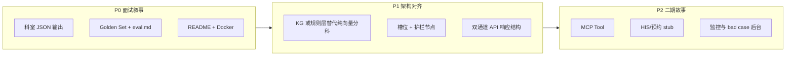

| 优先级 | 任务 | 对应叙事节 |
|--------|------|-----------|
| **P0** | Golden 集 + 评测脚本 + `eval.md` | 三（评测）、六（30w） |
| **P0** | 科室结构化 JSON 输出（先读 Milvus `departments`） | 三（输出形态） |
| **P0** | README + docker-compose 准上线 | 六（准上线） |
| **P1** | Neo4j/规则 KG 或明确「简化版用 Milvus 近似 KG」的诚实口径 | 三（分流）、九（红线） |
| **P1** | 槽位 + 护栏节点 | 三（关键词） |
| **P2** | MCP、HIS 对接 stub | 四（二期） |

---

## 本仓在面试里怎么定位（诚实边界）

按文档第九节，推荐说法：

> **InitialArchitectureForMedicalAgent1** 是智能导诊的 **架构简化参考仓**（LangGraph 双通道 RAG + FastAPI + Redis 会话），**不是** 363 医速递 V3.0 全量线上代码。  
> 线上分科走 KG + 规则；本仓用 Milvus 演示召回链路。个人主责是 AI 编排 + 导诊 API，深度 X 月；第二年偏评测回归与业务 API 对接。

不要把本仓 3 commit 说成「两年唯一成果」；用 **线上项目 + 本仓架构 + eval 数字** 组合讲故事。

---

## 可选下一步

1. **极简 30 行版** 写入 `.cursor/rules/`（新开 Chat 自动套用叙事逻辑）
2. **P0 落地**：`eval/` + 科室 JSON 输出 + README/docker-compose
3. **项目差距清单** 写入 `docs/gap-vs-narrative.md`（与本 narrative 交叉引用）

你更想先做哪一项？

---

**User**

idea是做什么的

---

**Cursor**

`.idea` 是 **JetBrains 系 IDE**（IntelliJ IDEA、PyCharm、WebStorm 等）在你打开项目时自动生成的 **本地 IDE 配置目录**，不是业务代码，也不参与 Python/FastAPI 运行。

## 它存什么

| 文件 | 作用 |
|------|------|
| `misc.xml` | 项目 JDK 版本等（你这里是 JDK 17） |
| `modules.xml` / `*.iml` | 模块结构、源码根目录 |
| `vcs.xml` | 识别 Git 仓库 |
| `.gitignore`（在 `.idea` 里） | IDE 自己的忽略规则 |

你当前仓库里，IDE 甚至把它识别成了 **Java 模块**（`JAVA_MODULE`），但这个项目是 **Python**，说明多半是用 IntelliJ IDEA 打开过，或插件/项目类型没配成 Python。

## 和项目的关系

- **不影响**：`python app/main.py`、Docker、LangGraph 等正常运行  
- **只影响**：在该 IDE 里的打开方式、索引、运行配置、代码提示  
- **一般不进 Git**：属于个人/本机配置，团队每人可能不同  

你 git status 里 `.idea/` 是未跟踪状态，说明还没提交——通常 **建议加入根目录 `.gitignore`**，不要提交。

## 和 Cursor 的关系

Cursor 基于 VS Code，**不依赖 `.idea`**。用 Cursor 开发可以忽略这个目录；删掉后，下次用 JetBrains IDE 打开会重新生成。

---

**一句话：** `.idea` = JetBrains IDE 的本地工程配置，不是你的医疗 Agent 架构的一部分。

---

**User**

datadog做啥的

---

**Cursor**

**Datadog** 是一家做 **可观测性（Observability）** 的 SaaS 平台，用来监控线上系统「跑得怎么样、哪里出问题、为什么慢」。

## 主要做什么

| 能力 | 用途 |
|------|------|
| **Metrics（指标）** | CPU、内存、QPS、延迟、错误率等时序图表与告警 |
| **Logs（日志）** | 集中收集、搜索、关联分析（类似 ELK，但托管在云端） |
| **APM（应用性能）** | 追踪一次请求在微服务/DB/缓存里的完整链路（Trace） |
| **Infrastructure** | 监控服务器、K8s、容器、云资源（AWS/Azure 等） |
| **RUM / Synthetic** | 前端真实用户体验、定时拨测 |
| **Security / SIEM** | 安全事件、合规审计（扩展产品线） |

## 典型使用场景

- 线上 API 突然变慢 → 看 Trace 卡在 LLM 调用还是 ES 查询  
- 错误率升高 → 日志 + 指标联动，定位是哪个服务/版本  
- 发版后对比 → 新版本 P99 延迟是否变差  
- 告警 → Slack/钉钉/PagerDuty 通知 on-call  

## 和你这个项目的关系

当前 **InitialArchitectureForMedicalAgent1 里没有接入 Datadog**。  
若以后「准上线 / 真上线」，常见做法是：

- FastAPI 打结构化日志 → Datadog Logs  
- LangGraph 各节点耗时、LLM token、检索命中率 → 自定义 Metrics  
- 一次对话请求 → APM Trace（从 `/chat` 到 `decision → es_rag → answer`）

## 和类似工具对比（一句话）

- **Prometheus + Grafana**：偏自建、开源、指标为主  
- **Datadog**：一体化托管，指标+日志+APM 打通，按量付费，上手快  
- **Sentry**：更偏应用错误追踪，APM 能力不如 Datadog 全  

**一句话：** Datadog = 帮你看线上系统健康、性能和故障的监控与分析平台，不是业务功能，是 **运维/工程保障** 工具。

---

**User**

cursor的插件datadog是做什么的

---

**Cursor**

**Cursor 的 Datadog 插件** = 把 **Datadog 线上监控数据** 接到 Cursor 里，让 AI 助手能像查同事一样查日志、指标、链路，并在写代码时看到和线上相关的报错/性能信息。

它和「Datadog 平台本身」不是一回事：平台负责**采集监控**；插件负责**在 IDE 里读这些数据、辅助排查**。

---

## 核心能力（你在 Cursor 里能干什么）

### 1. MCP：用自然语言查 Datadog

插件内置 **Datadog MCP Server**，连上账号后，可以在 Agent 对话里直接问，例如：

- 「最近一小时 error 日志有哪些？」
- 「哪些 monitor 正在告警？」
- 「`api-gateway` 延迟 > 500ms 的 trace 找出来」
- 「列出我的 dashboards」

AI 会通过 MCP 去调 Datadog API，把结果带回对话，而不是让你手动开浏览器翻面板。

### 2. 写代码时的线上上下文（扩展能力）

同系列的 Datadog VS Code/Cursor 扩展还支持（取决于你在设置里勾选的服务）：

- **Error Tracking**：堆栈一键跳转到源码
- **Logs / APM / Synthetics / CI Visibility** 等和代码关联
- 基于**真实线上数据**做排查，而不是纯靠猜

### 3. 认证方式

- 浏览器 **OAuth** 登录 Datadog
- 凭证加密存在 Cursor 本地，**不会发给模型厂商**
- 首次配置常用：`/ddsetup` 或 `/datadog-mcp-setup`

---

## 和「纯 Datadog」的区别

| | Datadog 平台 | Cursor Datadog 插件 |
|--|-------------|---------------------|
| 作用 | 监控、告警、看板 | 在 IDE 里**查询 + 辅助调试** |
| 谁用 | 运维/SRE/后端 | 开发者在写代码、和 AI 对话时用 |
| 前提 | 服务已接入 Datadog | 同上，**必须有 Datadog 账号和数据** |

---

## 你需要具备什么

1. **Datadog 账号**（公司一般有，个人项目通常没有）
2. Cursor **v2.6.0+**
3. 在 **Cursor Settings → Plugins** 安装 Datadog 插件
4. 若 `.cursor/mcp.json` 里手动配过 Datadog MCP，要先关掉，避免和插件冲突

---

## 对你当前医疗 Agent 项目

**InitialArchitectureForMedicalAgent1 没接 Datadog**，所以这个插件现在对你**基本用不上**——除非：

- 你把 FastAPI/LangGraph 服务部署并接入 Datadog，或
- 公司线上医速递/导诊服务本来就在 Datadog 上，你想在 Cursor 里查线上故障

---

## 反向：Datadog 也能监控 Cursor 本身

Datadog 还有 **Cursor 集成**（方向相反）：把 Cursor 的团队用量、花费、`cursor.*` 指标采进 Datadog，给管理员看 adoption 和 cost。这是「监控 Cursor 使用情况」，不是「在 Cursor 里查监控」。

---

**一句话：** Cursor 的 Datadog 插件 = **让 AI 和你在 IDE 里直接查线上日志/指标/链路/告警**，用来排障和写修复代码；不是业务功能，需要已有 Datadog 环境才有价值。

---

**User**

我需要买个服务器部署这个项目吗

---

**Cursor**

对照项目依赖，说明本地能否跑、何时需要服务器，以及更省钱的部署方式。


**不一定需要买服务器。** 取决于你的目标：本地学习/面试演示，和「给别人长期访问的线上 demo」，要求完全不同。

---

## 这个项目实际依赖什么

| 组件 | 默认 | 是否必须自备机器 |
|------|------|------------------|
| **DashScope（通义）** | 云端 API | 否，按调用计费 |
| **FastAPI + LangGraph** | 本机 Python | 否，PC 就能跑 |
| **Redis** | `localhost:6379` | 否，已有 `demo/redis/docker-compose.yaml` |
| **Elasticsearch** | `localhost:9200` | 否，Docker 本地起 |
| **Milvus** | `localhost:19530` | 否，Docker 本地起（相对吃内存） |

LLM 推理在阿里云，**不占你机器算力**；你这边主要是跑 API + 三个中间件。

---

## 三种场景，要不要买服务器

### 1. 本地跑通、改代码、面试讲架构 → **不用买**

在你 Windows 电脑上：

- 装 Python + Docker Desktop
- 起 Redis / ES / Milvus
- 配 `.env` 里的 `DASHSCOPE_API_KEY`
- 跑 FastAPI

录屏、带笔记本演示、讲 LangGraph 双通道，**完全够用**。叙事文档里的「准上线」也可以 = **本机 Docker + 录屏 + eval 结果**，不必真买云主机。

### 2. 想给 HR/面试官一个公网链接 → **可选买，也有更便宜的**

需要「别人点开就能用」时，才考虑：

- **轻量云服务器**（阿里云/腾讯云 2C4G～2C8G，约几十～一两百/月）
- 或 **Railway / Render / Fly.io** 等（小 demo 有时更省事）

注意：Milvus + ES **内存偏大**，2G 机器往往不够，建议 **至少 4G，更稳 8G**。

### 3. 对标 363 医速递真上线 → **不是你个人买服务器**

那是医院/公司环境：内网、HIS、小程序、运维、合规。个人开源简化仓 **不必、也不该** 为此单独买生产服务器。

---

## 真正要花钱的往往是 API，不是服务器

- **DashScope**：按 token/调用计费，开发调试通常几元到几十元量级（看用量）
- **云服务器**：只有要 7×24 公网 demo 时才需要，且 Milvus+ES 会让配置不能太低

本地开发阶段，**API 费 > 服务器费**。

---

## 实用建议（按你的叙事目标）

| 目标 | 建议 |
|------|------|
| 搞懂项目、写简历、面试口述 | **不买**，本机 + Docker |
| 作品集「可访问 demo」 | 买 **最低配 VPS 8G**，或先录屏代替 |
| 冲「准上线」三件套 | 本机 Docker + `eval.md` + 录屏即可 |
| 真业务上线 | 公司基础设施，非个人采购 |

---

## 本机最低配置参考

- **内存**：建议 **16G**（Milvus + ES 同时跑较稳；8G 可能勉强）
- **磁盘**：十几 G 给 Docker 镜像和数据
- **网络**：能访问 DashScope API

---

**一句话：** 学习、改代码、面试讲这个项目 → **不用买服务器**；只有当你需要 **24 小时公网可访问的 demo** 时，再考虑买一台 **4G～8G 内存** 的云主机。真上线是另一回事，和本简化仓不是一条路径。

如果你说一下目标是「本机跑通」还是「要公网 demo」，我可以按你的机器配置给一套具体启动步骤（Docker 命令 + `.env` 清单）。

---

**User**

那我这2本理工科，35岁，成都对应的薪资范围多少，过去做测试的，上了一个月的ai agent外包，结果项目预算不足，解散了，主要就是维护提示词，解决用户提出的，问了结果不对的问题，无非就是关键字的更新，维护，提示词的更新， 如果这个导诊项目能达到进行评测，且通过，召回率和准确率，响应时间都有数据的话

---

**Cursor**

结合你的背景和 [`docs/cursor-session-narrative.md`](docs/cursor-session-narrative.md) 里的叙事逻辑，直接给区间判断（成都 · 2025–2026 体感，非精确报价）。

---

## 你的可卖卖点 vs 短板

| 加分 | 减分（面试会被问） |
|------|-------------------|
| 理工科 + **测试背景** → 天然适合 **评测、Golden、回归** | 只有 **1 个月** AI 外包，且偏 **提示词/关键词运维** |
| 35 岁 → 稳定性、沟通、落地 | 35 岁 + 转 AI → 部分公司要「年轻便宜」 |
| **二本**在成都 AI 应用岗不算硬门槛 | 二本在一线大厂/高薪 remote 会卡学历或年限 |
| 若有导诊 **可量化 eval** → 从「调 prompt 的」升级为「能交付指标的 AI 应用」 | 无指标时，履历容易被归到 **AI 运营/外包** 档 |

**关键转折：** 测试经历不要当「过去式」，要当 **「我做 Agent 评测与质量保障」** 的主线——这和导诊项目的 Golden Set 完全对口。

---

## 薪资区间（成都，含 remote）

下面按 **年薪总包（税前）** 估，假设你能把导诊做到 **有 eval 报告**（召回率、准确率、P95 响应时间，可复现）。

### 场景 A：只有 1 个月 prompt 运维经历，**没有**可展示 eval

| 类型 | 年薪大致范围 |
|------|-------------|
| AI 运营 / 提示词外包 / 初级应用 | **10～16w** |
| 带一点 RAG  demo 但无数字 | **14～20w** |
| Remote（非一线团队） | **15～22w** |

→ 很难谈到叙事里说的 **30w remote**。

### 场景 B：导诊项目 **评测跑通 + 有文档 + 能 demo**（你最该冲的档）

「通过」建议自己定可辩护的线，例如：

- 科室 **Top-1 ≥ 70%** 或 **Top-3 ≥ 85%**（简化仓用 Milvus 也要诚实写口径）
- 流程类 FAQ **命中率 ≥ 80%**
- **P95 响应 < 3s**（含 LLM，本机/ staging 写清环境）

| 类型 | 年薪大致范围 |
|------|-------------|
| 成都 onsite · AI 应用 / Agent 工程（中小厂、医疗/政企乙方） | **18～26w** |
| 成都 · **测试转 AI 质量 + 应用**（评测 + 一点后端） | **16～24w** |
| **Remote**（成都 living，远程编） | **20～28w** |
| Remote **30w+** | 需要 **指标不错 + 角色清晰 + 面试表现强**；对你当前履历是 **上限目标**，不是 median |

### 场景 C：若还能补上 **FastAPI 部署 + Docker + 2～3 个月可说的个人深度**

在 B 基础上通常 **+2～4w**，Remote 更有机会摸到 **26～30w**。

---

## 和你问的「有评测数据」差多少

| 维度 | 无 eval | 有 eval（可复现） |
|------|---------|------------------|
| 叙事档位 | 「帮客户改 prompt」 | 「负责导诊 Agent 质量与指标」 |
| 成都 onsite | 12～18w 常见 | **18～24w** 更 realistic |
| Remote | 15～22w | **22～28w** 可谈；30w 要冲 |
| 对标岗位 | AI 运营、初级实施 | **AI 应用工程师、Agent 工程师（偏应用/质量）** |

有数字大概 **抬 4～8w 议价空间**；但抬不到 30w 单靠数字，还要 **角色故事 + 技术面** 一起够。

---

## 35 岁 + 二本：怎么讲才不亏

1. **不要报「2 年 AI」** — 只有 1 个月外包 + 个人项目深度（写清 **X 个月**）。
2. **测试 → 评测** 是优势句：  
   「之前做测试；转 Agent 后主做 Golden Set、bad case 回归、科室/流程分通道指标。」
3. **外包 1 个月** 单独一句：预算裁撤，做 **意图/关键词/提示词迭代与 bad case 闭环**，不吹成架构负责人。
4. **35 岁** 投：医疗信息化、政企、乙方、稳定性要求高的团队；少投纯「年轻卷模型」岗。
5. **二本** 在成都本地 AI 应用/实施 **影响小于** 一线大厂 SP；Remote 看团队，**作品+指标** 比学历更管用。

---

## 现实结论（一句话）

- **现在（无 eval）：** 成都大概 **12～18w**，Remote **15～22w**，偏运营/初级应用。  
- **导诊评测做扎实（有 recall/accuracy/延迟报告 + demo）：** 成都 **18～26w** 合理；Remote **22～28w** 可冲；**30w remote** 是 **上限**，要指标、部署、面试都到位，不是保底。

---

## 为了从 20w 档推到 26w+，最小动作清单

1. `eval/golden.json` + 跑分脚本 + **`docs/eval.md` 一页数字**  
2. 简历写 **测试 → Agent 评测与质量**，不写「纯 prompt 工程师」  
3. 本机 Docker 跑通 + **3 分钟录屏**（问症状 → 出科室/流程）  
4. 面试固定话术：双通道、科室 structured、RAG 只召回、**指标怎么测、bad case 怎么修**

如果你愿意，我可以按你目标薪资（比如 **remote 25w**）反推：`eval.md` 里指标该定多少、简历项目段怎么写一版可直接用的。

---

**User**

那知识图谱索引的时候，是症状--科室，还是症状--疾病--科室呢

---

**Cursor**

这是导诊 KG 里很常见的设计题。**结论先说：一期主链路用「症状/表现 → 科室」，疾病层作可选补充，不要做成「必须先确诊疾病再分科」。**

---

## 一句话结论

| 目标 | 推荐结构 |
|------|---------|
| **智能导诊（挂号推荐）** | 主：**症状/症状簇 → 科室** |
| 用户直接说病名（「我有股癣」） | 补：**疾病/病名 → 科室** |
| 需要可解释、可维护 | 中间可加 **症状 → 身体系统/表现型**，不必强行上完整疾病诊断链 |

**不是二选一**，而是：**导诊主路径走症状；疾病是旁路，不是必经节点。**

---

## 为什么导诊不宜默认「症状 → 疾病 → 科室」

导诊和诊断的目标不同：

| | 导诊 | 诊断 |
|--|------|------|
| 输出 | 去哪个科 | 什么病 |
| 能否说错 | 科室偏了还能换科 | 病名错了风险大 |
| 合规 | 只做就医指引 | 需执业资质 |

「症状 → 疾病 → 科室」等于在 KG 里**先做鉴别诊断**，问题会放大：

1. **错误传播**：疾病推错 → 科室必错（两步累积误差）
2. **维护成本高**：ICD/疾病成千上万，症状–疾病是多对多
3. **和叙事冲突**：你们文档写「科室来自 KG/规则，不交给 LLM 自由生成」——若疾病层不准，整个链条不可辩护
4. **用户表述**：很多人只说「胸口闷」「大腿根痒」，**没有疾病标签**

面试可这样说：

> 导诊 KG 的主边是症状到科室；疾病节点用于用户已说出病名时的快捷路由，不作为默认推理链。

---

## 推荐 KG 结构（三期导诊常用）

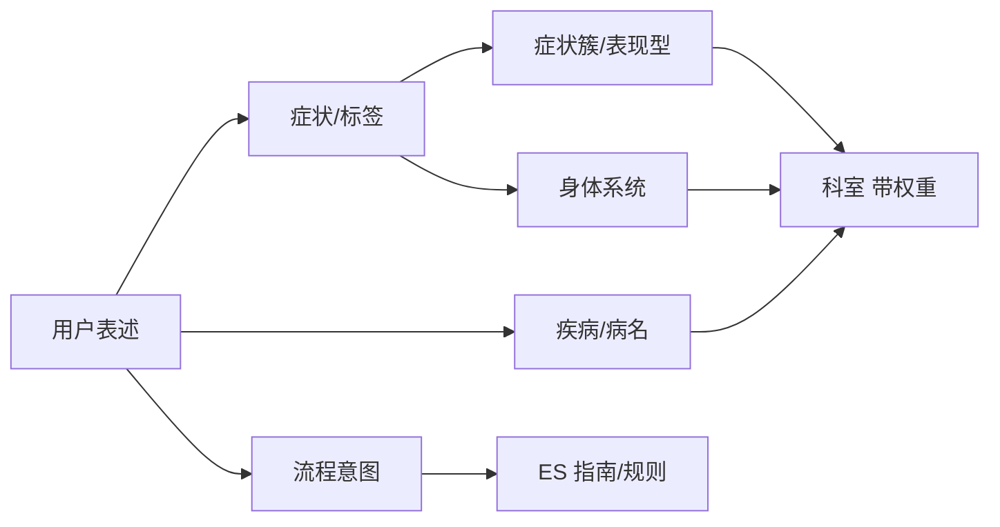

### 1. 主链路：症状 → 科室（或经症状簇）

```
头疼 + 发烧        → 神经内科 / 普通内科
胸痛 + 活动后加重  → 心内科（高权重）
```

- 边带 **权重、优先级、是否危急**
- 多科室时用 **Top-1 / Top-3 + 权重**，不是 LLM 编

你们 Milvus 数据其实已是这个思路：`tags`（症状词）→ `departments`，只是还没建成图数据库。

### 2. 中间层：用「症状簇 / 身体系统」，不一定用「疾病」

比「症状 → 疾病 → 科室」更稳的中间层：

```
症状 → 身体系统（心血管/消化/皮肤…）→ 科室
```

或：

```
症状 → 表现型 Presentation（非确诊病名）→ 科室
```

例如「心慌 + 恶心 + 旋转」→ **前庭/心血管相关表现** → 心内科 + 神经内科，**不必先定「梅尼埃」还是「心律失常」**。

### 3. 旁路：疾病 → 科室（用户已说病名时）

```
股癣     → 皮肤科
卵巢囊肿 → 妇科
```

用户问「肝炎挂哪个科」时，走 **疾病 → 科室** 更直接。  
demo 数据里就有这类 QA，应单独建边，不要硬从症状推疾病再推科室。

---

## 两种结构对比

| 维度 | 症状 → 科室 | 症状 → 疾病 → 科室 |
|------|------------|-------------------|
| 延迟 | 低（一跳或两跳） | 高 |
| 准确率（导诊） | 高，歧义用多科室 Top-K | 疾病层拖累科室 |
| 维护 | 症状–科室对，量可控 | 还要维护症状–疾病–科室 |
| 合规 | 易说清「只分科不诊断」 | 易被理解成在诊断 |
| 适用 | **默认主路径** | 有强医学本体、偏临床决策支持时 |

---

## 一期 / 二期怎么落

### 一期（你现在该做的）

```
Symptom/Tag ──weighted──> Department
DiseaseName ────────────> Department   # 用户说病名
Alias ──> Symptom                      # 心痛/心疼、缩写归一
Rule: 危急词 ──> 急诊科 + 拒答/免责
```

- **索引**：Neo4j 或规则表都行，核心是 **结构化边 + 权重**
- **输出**：`{ "departments": ["消化内科"], "confidence": 0.82 }` JSON，不是长文诊断
- **评测**：Golden 集标的是 **期望科室**，不是期望疾病名

### 二期（可选加深）

- 加 **Presentation / BodySystem** 中间节点，便于解释「为什么推这两个科」
- 疾病层仅作 **内部消歧**（多个科室打平时），**不对用户输出病名**
- 和 HIS 对接：科室 ID 标准化、多院区映射

---

## 和你们当前项目的关系

`milvus数据入库要求提示词.txt` 已是 **tags（症状）→ departments**，**没有疾病节点**——对导诊一期是对的。

若要升级成 KG，建议：

1. **Neo4j 节点**：`Symptom`、`Department`、`Disease`（可选）、`Alias`
2. **主关系**：`(Symptom)-[:ROUTES_TO {weight}]->(Department)`
3. **辅关系**：`(Disease)-[:ROUTES_TO]->(Department)`、`(Alias)-[:MAPS_TO]->(Symptom)`
4. **Milvus/ES 角色**：别名归一、指南检索；**科室主决策仍读 KG 边**

---

## 面试标准答法（30 秒）

> 导诊 KG 主索引是 **症状/症状簇到科室**，因为目标是挂号不是确诊。用户直接说病名时走 **疾病到科室** 旁路。中间可以用 **身体系统或表现型** 做消歧，但一期不把 **症状→疾病→科室** 当默认链，避免诊断误差传导和合规风险。RAG 只做术语归一和指南召回，科室结果来自 KG 加权路由。

如果你愿意，我可以下一步直接给一版 **Neo4j 节点/关系 schema**（含示例 Cypher），对齐你们现有的 `tags` + `departments` 数据格式。

---

**User**

{"id":"qa_014","raw_question":"我上次一不小心使得自己的半月板二度损伤了，半月板二度损伤应该怎样治疗比较好？","safe_answer":"半月板二度损伤属于膝关节内部软骨结构的损伤，主要涉及骨关节和周围肌肉韧带系统，是否需要积极干预要结合年龄、痛感程度和活动受限情况综合判断。不同人适合的管理方式不同，需要通过专业体格检查和影像检查来评估膝关节稳定性。建议尽快到骨科或运动医学科就诊，由医生根据损伤分级和日常活动需求制定康复和保护方案。在家要注意观察膝关节是否反复肿胀、卡顿、锁死或下楼时明显疼痛等，如症状加重或影响行走，应尽早复查。如症状持续或加重，请及时就医。","departments":["骨科","运动医学科"],"tags":["半月板损伤","膝关节疼痛"],"source":"qa_dataset"},
那这种问答对对于导诊来讲，有意义吗

---

**Cursor**

**有部分意义，但不是导诊 Golden 集里的「理想样本」。** 更适合当 **疾病名 → 科室** 的旁路数据，不宜当 **症状导诊** 的主训练/评测用例。

---

## 这条数据在问什么

| 维度 | 内容 |
|------|------|
| 用户状态 | **已有明确诊断**：「半月板二度损伤」 |
| 用户意图 | **问治疗方案**：「应该怎样治疗比较好」 |
| 导诊该答什么 | **去哪个科、什么情况下该复诊** |
| 这条实际提供了 | `departments: 骨科、运动医学科` + 一段合规的就医指引 |

所以：它不是典型的「我不舒服，该挂哪科」，而是 **「我已知病名 + 问怎么治」**。

---

## 对导诊有没有意义？

### 有意义的部分

1. **疾病/损伤名 → 科室**  
   用户说「半月板二度损伤」时，直接路由到 **骨科 / 运动医学科** 是对的。这类数据适合建 KG 边：

   ```
   半月板损伤 ──→ 骨科 (w=0.9)
   半月板损伤 ──→ 运动医学科 (w=0.8)
   ```

2. **评测里可单独一类**  
   Golden 集可以分桶：
   - **A 类**：纯症状（「膝盖疼、下楼痛」）
   - **B 类**：用户自带病名（「半月板损伤怎么治」）  
   B 类测的是 **病名路由**，不是症状推理。

3. **`safe_answer` 写法偏导诊合规**  
   没给具体疗法，强调「去科室、由医生评估」——和导诊边界一致。

### 意义有限 / 有问题的部分

1. **意图是「治疗/流程」，不是「分科」**  
   在你们架构里，这类更像 **ES + 流程通道**（怎么办、如何康复），而不是 KG 症状主链路。

2. **`tags` 和入库规范有点拧**  
   规范写 tags 尽量用症状词、少用药名；这里是 **「半月板损伤」**（损伤/病名），不是「膝关节疼痛、肿胀、卡顿」这类症状。  
   用 Milvus 向量召回时，容易和大量「问治疗」的 QA 混在一起，**对「该挂哪科」帮助不大**。

3. **作导诊主评测样本会拉低叙事可信度**  
   若 Golden 集里这类「已确诊 + 问治疗」太多，指标反映的是 **病名库覆盖**，不是 **症状分科能力**——面试被追问时要能分开讲。

---

## 在数据里应该怎么归类

| 用途 | 是否推荐用这条 | 怎么处理 |
|------|---------------|---------|
| 症状 → 科室（KG 主库） | ⚠️ 弱 | 拆成：`膝关节疼痛/肿胀/卡顿` → 骨科 |
| 疾病名 → 科室（旁路） | ✅ 适合 | 保留，`Disease → Department` |
| Milvus 语义召回 | ⚠️ 一般 | 可留，但别当核心导诊样本 |
| ES 流程/FAQ | ✅ 更合适 | `process_query=半月板损伤 治疗 怎么办` |
| Golden 评测（导诊 Top-3 科室） | ⚠️ 单独成类 | 标注 `intent=disease_known`，和纯症状分开算分 |

---

## 若专门服务导诊，理想长什么样

**原问（治疗向）：**
> 半月板二度损伤应该怎样治疗比较好？

**导诊向改写（更理想）：**

```json
{
  "raw_question": "查出来半月板二度损伤，应该去哪个科？",
  "tags": ["膝关节疼痛", "膝关节肿胀", "下楼痛"],
  "disease_mention": "半月板损伤",
  "departments": ["骨科", "运动医学科"]
}
```

或保留两条：

- **qa_014a**：病名 → 科室（用户已说半月板）
- **qa_014b**：症状 → 科室（用户只说「膝盖疼、下楼痛」）

评测和 KG 都更清晰。

---

## 和你们「双通道」叙事怎么对齐

```
用户问：半月板二度损伤怎么治疗？
         │
         ├─ decision：has_process=true（问怎么办/治疗）
         │
         ├─ 科室结论：仍走 KG/规则
         │   「半月板损伤」→ 骨科、运动医学科  （JSON 输出）
         │
         └─ 自然语言：ES/模板
             「具体方案需骨科面诊评估，导诊不做治疗建议」
```

这条数据 **有价值**，但价值在 **「已知病名时的科室路由 + 流程类拒答/引导」**，不在 **「从症状推科室」**。

---

## 一句话

- **有意义**：当 **疾病→科室** 旁路、流程类 FAQ、合规回答模板。  
- **意义不大**：当 **症状导诊主数据 / 主评测用例**。  
- **建议**：Golden 集里 **≤20%** 放这类「已说病名」样本，其余用纯症状；入库时 **tags 改症状、病名单独字段**，评测分桶报告，面试才站得住。

如果你愿意，我可以按你们现有 `milvus数据.txt` 扫一遍，标出哪些类似 qa_014 该 **保留 / 改写 / 挪到 ES**，方便你做 eval 分桶。

---

**User**

业务线，我肚子疼--疼多久--症状（问了俩次症状）--既往症--推荐科室

---

**Cursor**

这是典型的 **槽位问诊式导诊**，比「一句话直接向量化召回科室」更贴近真实业务，也和你们叙事里的 **护栏 + 槽位 + KG 出科室** 一致。

---

## 这条业务线在干什么

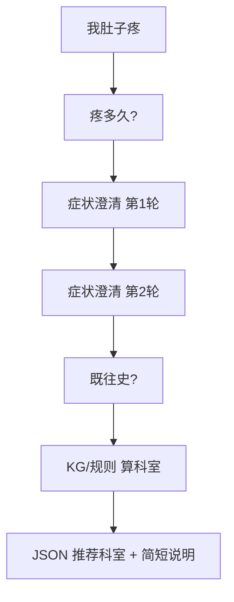

本质不是聊天，而是 **多轮填槽 → 结构化决策 → 输出科室**。

| 步骤 | 槽位 | 作用 |
|------|------|------|
| 首句 | 主诉 / 部位 | 「肚子疼」→ 定位到 **腹部/消化** 域 |
| 疼多久 | 时长 | 急性 vs 慢性，影响 **急诊/普内/消化** 权重 |
| 症状 ×2 | 伴随症状 | 发热、呕吐、便血、位置… → **收窄科室** |
| 既往症 | 既往史 | 胃病、手术、妇科史… → **修正路由** |
| 输出 | 科室 | **来自 KG/规则**，不是 LLM 自由编 |

---

## 这样设计对不对？

**对，且比单轮 RAG 分科更合理**，原因：

1. **「肚子疼」歧义极大**：妇科、消化、泌尿、普外都能沾边，必须多轮澄清。
2. **两次症状问法合理**：  
   - 第 1 轮：大方向（上腹/下腹/绞痛/持续痛）  
   - 第 2 轮：关键分叉（发热？便血？停经？）  
   不是凑轮数，是 **决策树上的必要分支**。
3. **既往症是导诊刚需**：如「有胃溃疡史」「做过阑尾手术」，会改科室优先级。
4. **和合规一致**：你在 **收集信息**，不是在 ChatGPT 式「诊断」。

要注意的边界：

- 问 **既往史 / 过敏 / 是否怀孕**，不要问成「你得了什么病」。
- 出现 **剧痛、便血、休克、剧烈持续痛** 等 → **少问多推**（急诊/立即就医），别为了填槽硬问两轮。

---

## 和 KG 索引怎么对应

导诊 KG **主链不是**「症状→疾病→科室」，而是 **槽位组合 → 科室（带权重）**：

```
(主诉=腹痛) + (时长=≤24h) + (伴=右下腹固定痛) + (既往=无)
    → 普外科 / 消化内科

(主诉=腹痛) + (伴=停经) + (既往=无)
    → 妇科

(主诉=腹痛) + (时长=慢性) + (伴=反酸) + (既往=胃溃疡)
    → 消化内科
```

可落成：

- **规则表 / 决策树**（一期最快、可评测）
- 或 **Neo4j**：`Symptom` + `SlotValue` 节点，边带 `weight` 到 `Department`

**疾病节点可选**：用户自己说「阑尾炎」「盆腔炎」时走 **病名→科室** 旁路，不必等槽位问完。

---

## 和你们现有简化仓的差距

当前 `InitialArchitectureForMedicalAgent1` 基本是：

```
意图识别 → ES/Milvus 检索 → LLM 长文回答
```

**没有**：

- 槽位状态机（疼多久、两轮症状、既往症）
- 「槽位未满 → 继续问；满了 → 只出科室 JSON」
- 危急词短路

要上这条业务线，LangGraph 应改成类似：

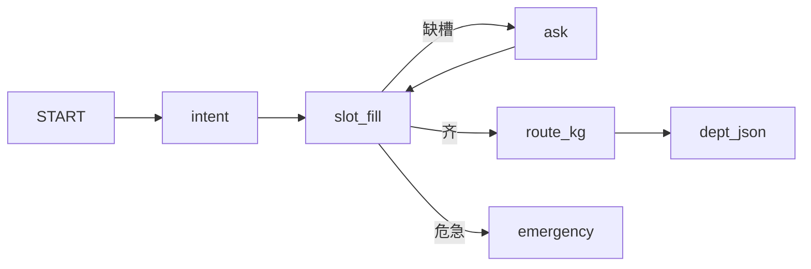

Milvus/ES 角色变为：

- **ES**：流程类（怎么挂号、在哪）
- **RAG/别名**：「心口疼」→「胸痛」归一
- **科室结论**：**KG + 规则**，不是检索 doc 再让 LLM 编

---

## 两轮「症状」建议问什么（腹痛例）

**第 1 轮（定位 + 性质）**  
「主要是上腹、肚脐周围还是下腹？一阵一阵疼还是一直疼？」

**第 2 轮（分叉）**  
按第 1 轮答案分支，例如下腹则问：  
「有没有发烧、恶心想吐、或者大便发黑/带血？」

**既往症（一轮就够）**  
「以前有没有胃病、妇科问题、腹部手术，或者可能怀孕？」

**槽位满了再推荐**，输出例如：

```json
{
  "departments": ["消化内科"],
  "alternatives": ["普外科"],
  "urgency": "normal",
  "reason_codes": ["abdominal_pain", "duration_acute", "no_red_flag"]
}
```

自然语言说明可选、宜短；**科室名单必须来自 KG/规则**。

---

## 评测怎么配这条业务线

Golden 集要按 **多轮对话** 写，不是单句 QA：

| 字段 | 示例 |
|------|------|
| turns | 用户:肚子疼 → 系统:疼多久 → … |
| filled_slots | `{site:下腹, duration:1d, fever:false, ...}` |
| expected_departments | `["普外科"]` |
| bucket | `symptom_slot_fill` |

指标：

- **槽位采集完整率**（该问的是否问到了）
- **科室 Top-1 / Top-3**（槽位齐了之后）
- **平均轮数 / P95 响应时间**
- **危急样本是否少问直接推急诊**

你测试背景这里很加分：**槽位 + Golden + 分桶指标** 就是导诊一期该有的东西。

---

## 一期 / 二期口径（面试用）

**一期：**  
「肚子疼 → 槽位问诊（时长、两轮症状、既往）→ KG/规则出科室 JSON + 护栏」

**二期：**  
接预约、HIS 科室 ID、多院区、bad case 运营；AI 占比下降，**路由与评测** 仍是你主责。

---

## 一句话

这条业务线 **有意义、且是正确导诊形态**：  
**多轮填槽是为了消歧，不是为了聊天；两轮症状要有决策树依据；既往症用来修正路由；最终科室来自 KG/规则，不是检索+长生成。**

如果你要落地到代码，我可以按这个流程直接改一版 LangGraph 节点设计（`SlotState` 字段 + 路由条件 + 示例 Golden 一条）。

---

**User**

我没有牙疼，没有肚子疼，但脚疼
应该推荐什么科室

---

**Cursor**

**仅凭「脚疼」**（且已排除牙疼、肚子疼），导诊一期通常先推：

## 推荐科室（默认）

| 优先级 | 科室 | 理由 |
|--------|------|------|
| **首选** | **骨科** | 脚/踝扭伤、劳损、骨与关节问题最常见入口 |
| **备选** | **运动医学科** | 若与运动、扭伤、反复跑步/打球相关（部分医院挂在骨科下） |

很多医院没有单独「足踝科」，**骨科**就是标准首挂。

---

## 什么情况下要改推别的科

还需要补槽位；不同伴随症状会改科室：

| 若还有… | 更倾向 |
|---------|--------|
| 麻木、刺痛、像过电 | **神经内科**（或骨科 + 神经科二选一） |
| 脚发凉、发紫、走几步就痛要歇 | **血管外科** |
| 多个关节都痛、晨僵 | **风湿免疫科** |
| 红肿热痛、大脚趾关节剧痛（尤其饮酒/海鲜后） | **风湿免疫科** 或 **骨科**（先挂其一，由医生分） |
| 长期糖尿病 + 脚破溃/发黑 | **内分泌科** 并 **尽快** 就诊，不能当普通脚痛拖 |

---

## 少问多推（危急）

若脚 **明显变形、不能着地、开放伤、剧烈肿胀**，或 **外伤后**，优先 **骨科急诊 / 急诊外科**，不必再细问两轮。

---

## 结合你那条槽位业务线

当前已知道：

- 主诉：**脚疼**
- 否定：无牙疼、无肚子疼（说明主诉不在头腹，**不影响**脚→骨科这条主链）

还建议问 **1～2 轮** 再定是否加备选科：

1. **怎么疼？** 扭伤/磕碰？还是没明显原因慢慢疼？  
2. **哪里疼？** 脚后跟、脚背、脚趾、还是整只脚？有没有肿、能不能走路？

答完若仍是「走路痛、扭伤、局部肿」→ **骨科**；若「麻、没力气」→ 加 **神经内科**。

---

## 结构化输出示例（导诊 JSON）

```json
{
  "departments": ["骨科"],
  "alternatives": ["运动医学科"],
  "urgency": "normal",
  "need_more_slots": true,
  "next_question": "脚疼是扭伤或磕碰引起的吗？能不能正常走路？"
}
```

---

**一句话：** 只有「脚疼」、没有别的部位主诉时，**默认挂骨科**；有麻木走神经、循环问题走血管、多关节走风湿；有外伤或不能走路则 **急诊/骨科急诊**。这不是诊断，是导诊分科。

---

**User**

那我直接问ai得到答复，然后限定范围，医院匹配的科室，不就可以了吗，为啥还有解构询问，rag匹配关键字，kg图谱推理呢

---

**Cursor**

可以这么干，而且很多 **Demo 就是这么做的**：  
「用户描述 → LLM → 只能从 \[骨科, 消化内科, …\] 里选一个」。  
但 **真导诊 / 要评测 / 要面试讲清架构** 时，单靠这一招不够，原因是它没解决下面几类 **必然出错** 的场景。

---

## 「直接问 AI + 限定科室列表」能搞定什么

| 优点 | 说明 |
|------|------|
| 实现快 | 一个 prompt + `structured_output` 即可 |
| 体验像聊天 | 不用设计多轮 |
| 小样本看起来「挺准」 | 常见问法（「牙疼挂啥科」）往往对 |

**所以：** 原型、PoC、没有指标要求的内部试用 → 够用。

---

## 为啥还不够（6 个硬理由）

### 1. 限定列表 **挡不住乱推 / 瞎自信**

给 LLM 一个科室列表，它 **仍会**：

- 在多个都合理的科里 **随便选一个**（脚疼：骨科 vs 血管 vs 神经）
- **编造理由**（「根据您的描述建议…」其实描述根本不够）
- 同一句话 **多次问结果不稳定**（今天骨科，明天风湿）

导诊要的是：**可复现、可追责**。  
「模型当时觉得像」≠ 「系统规则/图谱算出来是」。

→ **KG/规则**：科室来自 **可查的边和权重**，不是黑盒感觉。  
→ **评测**：Golden 集才能算 Top-1/Top-3；纯 LLM 只能人工看，没法回归。

---

### 2. 一次问完 **消不了歧义**

「肚子疼」一条消息里信息不够，LLM 只能 **猜**：

- 妇科？消化？普外？

业务线你之前说的 **疼多久 → 两轮症状 → 既往症**，不是为了凑轮数，是因为 **决策树缺分支就必错**。

→ **结构化询问（槽位）** = 用最少的问题换 **信息增益**，不是替代 AI，是 **在该问的时候问，该推的时候推**。

---

### 3. RAG 不是为了「再堆一层 AI」

叙事里 RAG 的角色是 **归一 + 召回**，不是主决策：

| 问题 | 纯 LLM | RAG/ES |
|------|--------|--------|
| 「心口疼」= 胸痛？ | 可能理解偏 | 别名库/指南对齐 |
| 「怎么预约/在哪缴费」 | 易胡编 | ES 查医院流程文档 |
| 医院特有说法 | 不知道 | 院内 FAQ |

**没有 RAG**：LLM 用训练里的「通用医院」知识，和 **363 这家院的科室名、流程** 对不上。  
**限定科室列表** 只解决「别输出列表外的名字」，不解决 **「用户话 ↔ 标准词 ↔ 院内流程」**。

---

### 4. KG 不是为了炫技，是为了 **主决策可解释**

```
脚疼 + 能走路 + 扭伤  → 骨科 (0.92)
脚疼 + 麻 + 过电      → 神经内科 (0.85)
```

- **LLM + 列表**：输出「骨科」，追问「为什么不是神经？」→ 只能再让 LLM 编故事  
- **KG/规则**：路径是 `(脚痛, 扭伤) → 骨科`，运营能改边、测试能回归  

面试/red line：**科室不交给 LLM 自由生成** —— 列表约束仍是「生成」，只是生成空间变小了。

---

### 5. **护栏** 没法写进「一个 prompt」

危急场景要 **少问多推**：

- 剧烈胸痛、休克、大量出血 → **急诊**，别继续槽位问诊  

这类是 **规则优先**，不能赌 LLM 每次记得。  
纯对话模型容易 **继续闲聊式追问**，延误。

---

### 6. 运维和 bad case：你外包经历正好说明问题

你之前做 **关键词维护、提示词迭代** —— 根本原因是：

- 纯 prompt：**改一句牵全身**，没有结构化 bad case  
- 分层后：  
  - 别名错了 → 改 RAG/词表  
  - 某组合推错科 → 改 KG 一条边  
  - 流程答错 → 改 ES 文档  
  - 只有兜底话术 → 才改 prompt  

**测试背景**：分层后才好写 Golden、做回归；一层 LLM 只能人工点踩。

---

## 用一张图看分工（不是四选一）

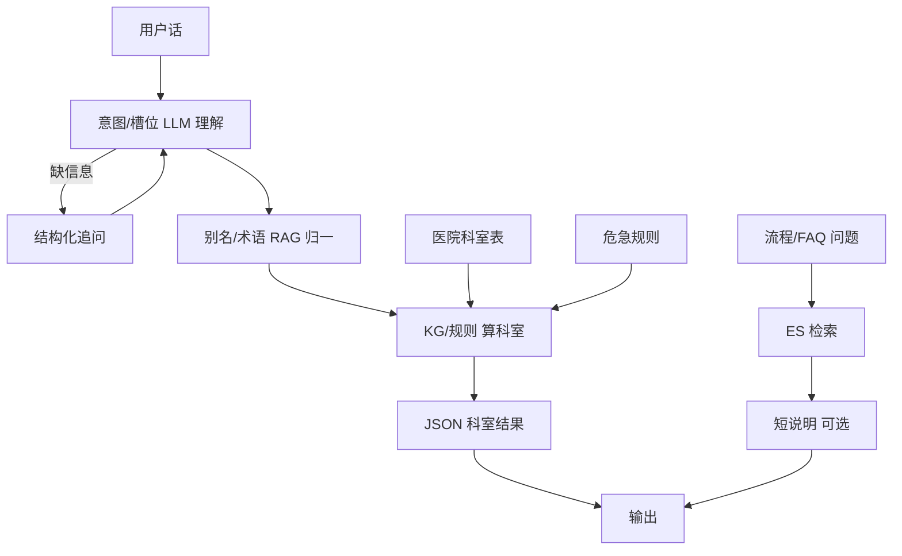

- **LLM**：听懂人话、问问题、写短说明（可选）  
- **槽位**：该问时才问  
- **RAG**：对齐说法、查流程，**不决定科室**  
- **KG/规则**：**决定科室**（+ 医院列表过滤）  
- **科室列表**：只是最后一道 **过滤/映射**，不是智能本身  

---

## 「只问 AI + 限定科室」适合什么时候

| 场景 | 够不够 |
|------|--------|
| 内部 Demo、无指标 | 够 |
| 面试讲架构、要 eval 数字 | 不够 |
| 医院真导诊、要合规可追溯 | 不够 |
| 问题极简单（「牙疼挂啥科」） | 单层有时够，但要 **抽检 + 危急规则** |

---

## 30 秒面试答法

> 限定科室列表的 LLM 能做过 demo，但科室推荐会 **不稳定、不可评测、难追责**。导诊要把 **理解**（LLM）、**消歧**（槽位）、**术语和流程**（RAG/ES）、**分科决策**（KG/规则）分开；医院科室表只是映射层。我做过 prompt 运维，知道单层模型 bad case 越改越乱，分层后才能 Golden 回归和指标交付。

---

**一句话：** 不是「能不能直接问 AI」，而是 **直接问 AI 无法同时满足准确、稳定、可评测、可运维、合规**；解构询问、RAG、KG 各管一类失败，LLM 留在最擅长的「听懂和说话」，别让它单独背锅分科。

---

**User**

大陆目前主流的导诊，是什么逻辑，通过问--科室，还是解构--症状--知识图谱--科室来解决

---

**Cursor**

**大陆主流导诊不是「纯 LLM 问一句出科室」，也不是「纯 KG 推理」**，而是 **混合架构**：  
**结构化问诊（决策树/槽位）为主干 + 规则/知识库/图谱做路由 + LLM 主要做理解和话术**。

你截图里「说说哪里不舒服，我来帮你找科室」+ 指南/教材/病例/临床路径，是典型 **C 端产品包装**；后端多数是 **问卷式导诊 + 知识库/规则引擎**，近年才逐步加 **大模型理解自由文本**。

---

## 大陆主流实际怎么跑（按占比体感）


| 层级 | 常见做法 | 谁在用 |
|------|---------|--------|
| **第一层（最多）** | **部位/症状 → 多轮问卷 → 科室**（决策树、if-else） | 医院自助机、小程序、HIS 厂商导诊模块 |
| **第二层** | 上面 + **症状–科室对照表 / 轻量 KG / 临床路径规则** | 中大型医院、互联网医院 |
| **第三层（新）** | 上面 + **LLM 听懂人话、别名归一、生成追问和说明** | 2024 起新建/改版导诊 |
| **少见作唯一方案** | **只问 AI，限定科室列表直接生成** | Demo、小团队 PoC；真上线很少单独用 |

**结论：** 市场主流是 **「问（结构化）→ 科室」**；  
**「解构 → 症状 → KG → 科室」** 是其中 **路由那一层的实现方式之一**，不是和用户聊天的那一层。

---

## 三种产品形态（从老到新）

### 1. 决策树 / 槽位问诊（仍是主力）

- 入口：点 **头/胸/腹/四肢** 或说「肚子疼」
- 系统：**疼多久？哪块？伴随什么？既往史？**
- 输出：走 **内置决策树** → 消化内科 / 妇科 / 普外…
- **优点：** 可控、可评测、合规好讲、运维改节点即可  
- **缺点：** 问法僵、自由描述体验差  

→ 你之前说的「疼多久 → 两轮症状 → 既往 → 科室」就是 **大陆最主流、最落地** 的形态。

### 2. 知识库 + 规则 / 轻量 KG（中大型常见）

- 症状、病名、路径 **结构化入库**（表或 Neo4j/自研图）
- 问卷填完 or LLM 抽槽后 → **查表/图算权重** → 科室 Top-K
- 「KG」在业内的现实：  
  - 很多是 **症状–科室**、**病名–科室**，不一定上完整 **症状–疾病–科室**  
  - 临床路径、导诊手册进 **规则 + ES**，不全走图推理  

### 3. LLM 增强（2024–2026 增量，不是替换）

- **LLM 干：** 听懂「心口疼」「脚杆儿痛」、生成追问、写短说明  
- **LLM 不干（或仅辅助）：** 最终科室名单、危急分流  
- 营销话术「AI + 上万篇指南」≈ **RAG/知识库 + 决策树**，不是模型背下全部教材  

---

## 直接「问 → 科室」 vs 「解构 → KG → 科室」

| 方式 | 大陆现状 | 原因 |
|------|---------|------|
| **直接 LLM + 科室列表** | 少作唯一方案 | 不稳定、难评测、合规/追责难 |
| **只决策树、无 KG** | 很多 | 够用、便宜、院方敢用 |
| **决策树 + KG/规则** | **中大型趋势** | 可解释、可运营、可对接本院科室 |
| **纯 KG 深度推理** | 少数科研/头部 | 建设贵、要医学团队维护 |

所以不是二选一，而是：

> **对用户：结构化地问（像聊天）**  
> **对系统：解构槽位 → 规则/KG 算科室 → 映射本院科室**

---

## 和你截图的对应关系

| 界面元素 | 背后常见逻辑 |
|---------|-------------|
| 「说说哪里不舒服」 | **部位/主诉解构**（第一步槽位） |
| 「我来帮你找科室」 | 目标是 **科室 JSON**，不是诊断 |
| 指南/教材/病例/临床路径 | 知识来源：**RAG + 规则库 + 路径表**（包装成 AI 学习） |
| 「问诊前确认就诊人」 | 业务链路：导诊 → 挂号/HIS（二期） |

这类产品和你们 narrative 里的 **双通道、槽位、KG 出科室、RAG 归一/流程** 是对齐的；差别在院方 **KG 有多重、LLM 占多少**。

---

## 厂商/场景差异（面试可提一句）

- **HIS/自助机厂商**（卫宁、东软等）：偏 **决策树 + 对照表**，稳  
- **互联网医院 / 大厂**：加 **NLU + RAG + 对话**  
- **单家三甲医院自研**：可能有 **自维护 KG + 评测**  
- **小医院 / 外包 PoC**：常见 **纯 prompt**，但不易大规模替换正式导诊  

---

## 30 秒标准答法

> 大陆主流导诊是 **结构化多轮问诊 + 规则/知识库/轻量 KG 路由**，LLM 主要负责理解和话术；不是用户问一句模型直接挑科室。完整链是 **解构主诉和槽位 → 症状/病名匹配知识库或图谱 → 映射本院科室**；RAG 管别名和流程，危急走规则。营销说的「学指南学路径」通常是知识库和临床路径规则，不是端到端大模型诊断。

---

**一句话：** 大陆主流是 **「问清楚（决策树/槽位）→ 用规则/KG 算科室」**；LLM 是增强理解，不是单独背锅分科。和你截图、以及你们要做的槽位 + KG + 评测路线，是同一条行业主线。

---

**User**

那槽位信息应该有啥key

---

**Cursor**

结合大陆导诊常见决策树和你们说的「主诉 → 时长 → 两轮症状 → 既往 → 科室」，槽位可以分成 **路由必填、条件必填、系统/业务** 三类。

---

## 一、核心槽位（大部分场景都要有）

| Key | 类型 | 说明 | 示例 |
|-----|------|------|------|
| `chief_complaint` | string | 主诉归一后的标准词 | `腹痛` / `脚痛` |
| `body_part` | enum | 大部位 | `head` `chest` `abdomen` `limb` `skin` … |
| `body_site` | string? | 细部位 | `右下腹` `左足背` |
| `symptom_tags` | string[] | 已确认症状标签（KG 用） | `["发热","呕吐"]` |
| `duration` | object | 持续时间 | `{value: 2, unit: "day"}` |
| `onset` | enum? | 起病方式 | `sudden` / `gradual` / `trauma` |
| `severity` | enum? | 轻重 | `mild` / `moderate` / `severe` |
| `red_flags` | string[] | 已触发的危急项 | `["大量出血"]` |
| `urgency` | enum | 紧急度 | `emergency` / `urgent` / `normal` |
| `past_history` | string[] | 相关既往/慢病 | `["胃溃疡","2型糖尿病"]` |
| `negations` | string[] | 用户明确否认 | `["无牙疼","无发热"]` |
| `slot_status` | enum | 当前轮次状态 | `collecting` / `ready` / `blocked` |
| `missing_slots` | string[] | 还缺哪些 | `["duration","companion_2"]` |

**路由最小集（`ready` 前至少要齐）：**

```text
chief_complaint + body_part + duration + symptom_tags(≥1) + past_history(问过即可)
```

---

## 二、条件槽位（按主诉分支才问）

### 通用伴随

| Key | 何时要 | 说明 |
|-----|--------|------|
| `companion_symptoms` | 几乎都要 | 第 1/2 轮症状澄清的累积结果 |
| `trigger` | 外伤/运动相关 | `扭伤` `摔倒` `运动后` |
| `pattern` | 痛/不适类 | `continuous` `intermittent` `colic` |
| `quality` | 痛类 | `sharp` `dull` `burning` `numbness` |

### 人口学（影响科室）

| Key | 何时要 | 说明 |
|-----|--------|------|
| `age` | 儿科/老年路由 | `35` |
| `sex` | 妇科/泌尿等 | `female` / `male` |
| `pregnancy_possible` | 女性 + 腹痛/出血等 | `yes` / `no` / `unknown` |

### 分科专用（示例）

| 主诉域 | 额外 Key |
|--------|---------|
| 腹痛 | `pain_migration` `vomiting` `diarrhea` `bloody_stool` `menstrual_related` |
| 胸痛 | `exertional` `radiation` `sweating` `breathless` |
| 脚痛 | `swelling` `can_walk` `trauma` `numbness` |
| 头痛 | `fever` `vision_change` `neck_stiff` `max_pain_sudden` |
| 皮肤 | `itch` `rash` `spread` |

不必一次全定义：**按决策树节点挂 optional_slots** 即可。

---

## 三、系统 / 业务槽位（不对用户问，但要存）

| Key | 说明 |
|-----|------|
| `patient_id` | 就诊人（截图里「先确认就诊人」） |
| `visit_type` | `first_visit` / `follow_up` |
| `user_mentioned_disease` | 用户自带病名 | `半月板损伤` |
| `normalized_terms` | RAG/别名归一结果 | `心口疼 → 胸痛` |
| `turn_count` | 已问轮数 |
| `asked_topics` | 已问过哪些槽（防重复问） |
| `recommended_departments` | 输出 | `["骨科"]` |
| `alternatives` | 备选科 | `["运动医学科"]` |
| `reason_codes` | 可解释规则码 | `["limb_pain","trauma"]` |
| `confidence` | 规则/KG 置信度 | `0.86` |
| `source` | 决策来源 | `kg` / `rule` / `fallback` |

---

## 四、推荐 JSON 结构（LangGraph `AppState` 可扩展）

```json
{
  "slots": {
    "chief_complaint": "腹痛",
    "body_part": "abdomen",
    "body_site": "右下腹",
    "symptom_tags": ["腹痛", "发热"],
    "companion_symptoms": {
      "fever": true,
      "vomiting": false,
      "bloody_stool": false
    },
    "duration": { "value": 1, "unit": "day" },
    "onset": "gradual",
    "severity": "moderate",
    "pattern": "continuous",
    "past_history": ["无"],
    "negations": ["无牙疼"],
    "age": 28,
    "sex": "female",
    "pregnancy_possible": "no",
    "user_mentioned_disease": null,
    "red_flags": [],
    "urgency": "normal"
  },
  "flow": {
    "slot_status": "ready",
    "missing_slots": [],
    "asked_topics": ["duration", "companion_1", "companion_2", "past_history"],
    "turn_count": 4
  },
  "output": {
    "recommended_departments": ["普外科"],
    "alternatives": ["消化内科"],
    "reason_codes": ["rlq_pain", "acute", "fever"],
    "confidence": 0.82,
    "source": "rule"
  }
}
```

---

## 五、两轮「症状」在 key 里怎么落

不要搞 `symptom_question_1/2` 这种 UI 字段，用 **语义槽**：

| 轮次 | 实际写入的 key |
|------|----------------|
| 第 1 轮（定位/性质） | `body_site` `pattern` `quality` `onset` |
| 第 2 轮（分叉） | `companion_symptoms.*` 或追加 `symptom_tags` |

`asked_topics` 记录「Companion_round_1 / Companion_round_2」已问即可。

---

## 六、什么时候 `slot_status = ready`

满足其一可提前推（少问多推）：

- `urgency == emergency`（危急规则命中）
- `user_mentioned_disease` 有值且 KG 有 **病名→科室** 边

否则需齐：

```python
required = ["chief_complaint", "body_part", "duration"]
# + 该 body_part 决策树要求的 companion 字段
# + past_history 问过（可为空数组）
```

---

## 七、一期最小实现（别一开始做 50 个 key）

**MVP 10 个就够跑通 + 评测：**

```text
chief_complaint
body_part
duration
symptom_tags
companion_symptoms   # 扁平 dict 也行
past_history
negations
urgency
missing_slots
recommended_departments
```

二期再加 `age/sex/pregnancy`、分科扩展字段、`reason_codes`。

---

## 八、和 KG 的对应

KG 查询吃的是 **归一后的槽位**，不是原话：

```text
(body_part=abdomen) ∧ (duration≤3d) ∧ (fever=true) ∧ (site=右下腹)
  → 普外科 0.9, 消化内科 0.4
```

所以要有：

- `symptom_tags` / `companion_symptoms`：给图谱  
- `normalized_terms`：RAG 别名层产出  
- `chief_complaint`：展示和兜底  

---

**一句话：** 槽位核心是 **主诉 + 部位 + 时长 + 伴随症状（两轮问完写进 tags/dict）+ 既往 + 否定 + 危急度**；人口学和分科字段按决策树条件问；输出侧另存 **科室、reason_codes、confidence**，别和采集槽位混在一起。

如果你要落代码，我可以按你们现有 `AppState` 给一版 `TriageSlots` Pydantic 模型和「缺槽 → 下一问」映射表。

---

**User**

槽位填充是啥

---

**Cursor**

**槽位填充（Slot Filling）** = 把用户随口说的话，填进系统预先定义好的 **结构化字段（槽位 / key）** 里。

不是让 AI 自由发挥写一段话，而是：**「这句话里，时长是多少？部位在哪？有没有发热？」→ 填到对应 key 上。**

---

## 用你这张图解释

图里是 **主诉 → 分析 → 疑似患病**，中间「分析」那一列就是槽位填充：

| 用户原话（主诉） | 填进哪个槽（key） | 归一后的值 |
|-----------------|------------------|-----------|
| 拉肚子 | `symptom` / 主诉 | **腹泻** |
| 1天 | `duration` | **1 天** |
| 大量饮酒后 | `trigger` / 诱因 | **大量饮酒后** |
| 4-10次 | `frequency` | **4–10 次** |
| 有不消化食物 | `stool_character`（性状） | **有不消化食物** |
| 黑色 | `stool_color` | **黑色** |

左边是 **自然语言**，中间是 **结构化槽位**，右边才是 **规则/KG/模型** 去推「疑似患病」或（导诊里）**推荐科室**。

---

## 和「普通聊天」的区别

**普通聊天：**
> 用户：拉肚子一天了  
> AI：建议您去消化内科…（一整段话，下次问可能变）

**槽位填充：**
```json
{
  "chief_complaint": "腹泻",
  "duration": {"value": 1, "unit": "day"},
  "frequency": "4-10次",
  "stool_color": "黑色"
}
```
槽齐了 → 再走 **KG/规则** 出科室或疑似病，**可存、可评测、可回归**。

---

## 在导诊里干什么用

你们说的业务线：

```
我肚子疼 → 疼多久？ → 两轮症状 → 既往症 → 推荐科室
```

每一步都是在 **填槽**：

| 系统问 | 填的 key |
|--------|---------|
| 疼多久？ | `duration` |
| 上腹还是下腹？ | `body_site` |
| 有没有发热、呕吐？ | `companion_symptoms` / `symptom_tags` |
| 以前有没有胃病？ | `past_history` |

**槽位未满** → 继续问  
**槽位齐了** → 查 KG/规则 → 输出 `departments: ["消化内科"]`

---

## 谁来做槽位填充

| 方式 | 说明 |
|------|------|
| **点选 / 决策树** | 用户点「1天」「黑色」→ 直接填槽，最稳 |
| **LLM 结构化输出** | 从「拉肚子一天」里抽出 `duration=1天` |
| **RAG/词表** | 「拉肚子」→ 归一成标准词「腹泻」 |

大陆主流是 **点选 + 少量 NLU**；自由说话时用 LLM **只做理解填槽**，**不单独决定科室**。

---

## 和图里「疑似患病」的关系（重要）

你这张图右边是 **疑似患病**（胃肠炎、肠炎…），偏 **辅助诊断/预问诊**。

**智能导诊** 一期通常：

- 槽位一样要填  
- 输出优先是 **科室**，不是确诊病名  
- 即便内部经过「疑似病」节点，对用户也只说「建议挂消化内科」，遵守合规

所以：**槽位填充是手段；导诊和辅诊差在「填完槽之后输出什么」。**

---

## 一句话

**槽位填充 = 把「人话」拆成一组固定 key（时长、部位、性状、既往…），填满了再交给规则/KG 做决策。**  
你图里的「分析」列就是槽位；导诊里填完槽推 **科室**，不是让 LLM 随口答一句就结束。

---

**User**

我看到的是不同的关键字，会有不同的槽位，那这个槽位是固定不变的，比如说拉肚子，就会多问好几轮，而肚子疼只会问俩轮，这个怎么控制的

---

**Cursor**

你的观察是对的：**槽位的「字段定义」可以相对固定，但「要填哪些、问几轮」不是固定的**，而是由 **主诉/关键词 → 决策树（问诊模板）** 控制的。

---

## 核心：两层东西要分开

| 层级 | 是否固定 | 是什么 |
|------|---------|--------|
| **槽位字典（Schema）** | 相对固定 | 全系统共用的 key：`duration`、`frequency`、`stool_color`… |
| **本轮要填哪些槽（Required）** | **不固定** | 由主诉决定：`腹泻` 多问，`腹痛` 少问 |

不是「拉肚子有特殊槽位、肚子疼有另一套槽位」，而是：

> **同一套 key，不同主诉激活不同的「必填子集 + 提问顺序」。**

---

## 怎么控制：主诉 → 问诊模板（决策树）

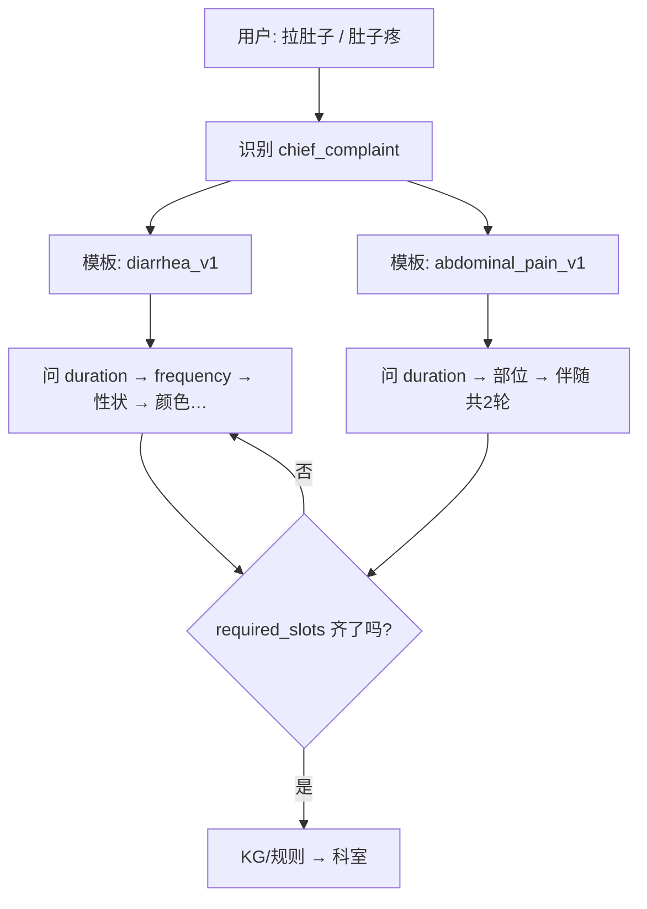

**「拉肚子多问几轮、肚子疼只问两轮」** = 绑定了不同 **模板**，模板里写了：

- `required_slots`：必须填哪些 key  
- `question_plan`：按什么顺序问  
- `stop_condition`：什么情况下提前结束（危急等）

---

## 举例对比

### 肚子疼（`abdominal_pain` 模板）

```yaml
template_id: abdominal_pain_v1
required_slots:
  - duration
  - body_site      # 上腹/下腹/脐周
  - companion_1    # 第1轮伴随：发热/呕吐
  - past_history
max_turns: 2        # 伴随只开1轮深度 + 既往
optional_slots:
  - pregnancy_possible  # 仅 female 时激活
```

→ **大约 2～3 轮** 就够路由。

### 拉肚子（`diarrhea` 模板）

```yaml
template_id: diarrhea_v1
required_slots:
  - duration
  - frequency        # 一天几次
  - trigger          # 是否饮酒/不洁饮食
  - stool_character  # 性状：不消化食物
  - stool_color      # 是否黑色
  - companion_1      # 发热/腹痛/脱水
  - past_history
max_turns: 5
red_flag_rules:
  - if: stool_color == "黑色"
    then: urgency=urgent
```

→ **4～5 轮**，和你图里「性状、黑色、4-10次」一致。

---

## 控制逻辑（代码里通常这样写）

### 1. 先定主诉，再选模板

```python
TEMPLATE_MAP = {
    "腹泻": "diarrhea_v1",
    "拉肚子": "diarrhea_v1",
    "腹痛": "abdominal_pain_v1",
    "肚子疼": "abdominal_pain_v1",
    "脚痛": "limb_pain_v1",
}
```

别名归一后 → `get_template(chief_complaint)`。

### 2. 每轮只算「当前还缺什么」

```python
def next_missing_slot(slots, template):
    for key in template.required_slots:
        if not slots.get(key):
            return key
    return None  # 齐了，可以推荐科室
```

**不会**给肚子疼问 `stool_color`；因为 `diarrhea_v1` 的 required 里才有它。

### 3. 条件分支（同一模板内也能增减）

```yaml
# abdominal_pain_v1 内
branches:
  - when: body_site == "右下腹"
    add_required: [fever, migration_pain]
  - when: sex == female and age 15-50
    add_required: [pregnancy_possible]
```

→ 同样是肚子疼，**右下腹**可能比 **上腹** 多问 1 轮。

### 4. 提前结束（少问多推）

```python
if slots.red_flags or slots.urgency == "emergency":
    return route_immediately()  # 不再追问
```

---

## 在 LangGraph 里长什么样

```
START → parse_intent（填 chief_complaint）
     → load_template（加载 required_slots + question_plan）
     → slot_router
           ├─ missing_slot → ask_question（只问下一个 key）
           ├─ fill_slot（LLM/点选写入）
           └─ all_filled → kg_route → output_dept
```

**控制「问几轮」的开关：**

- `template.required_slots` 长度  
- `max_turns` 上限  
- `branches` 动态加槽  
- `red_flag` 短路  

---

## 关键字和槽位的关系

| 说法 | 实际机制 |
|------|---------|
| 不同关键字对应不同槽位 | ❌ 不完全对 |
| 不同关键字对应 **不同必填槽集合** | ✅ 对 |
| 槽位 key 全系统共用 | ✅ 对 |
| 问几轮由模板决定 | ✅ 对 |

「性状」「黑色」不是全局都要问，只有 **走腹泻/便血相关模板** 才进 `required_slots`。

---

## 运维上谁维护

医院/产品侧通常维护：

- **导诊手册 / 决策树 Excel 或后台**  
- 每个节点：问题文案 + 填哪个 slot + 下一节点  

研发把它编译成 `templates/*.yaml` 或数据库配置，**不用改代码** 就能调「肚子疼问 2 轮、拉肚子问 5 轮」。

---

## 和你测试/评测的关系

Golden 集要 **按模板分桶**：

| bucket | 期望轮数 | 必填槽 |
|--------|---------|--------|
| diarrhea | 4～5 | 含 stool_color |
| abdominal_pain | 2～3 | 不含 stool_color |

否则评测会把「腹泻问多了」判成错，或「腹痛问少了」判漏问。

---

**一句话：** 槽位 key 是 **全局字典**；**问几轮、问哪些 key** 由 **主诉匹配到的问诊模板（决策树）** 控制——拉肚子用 `diarrhea` 模板多问性状/次数/颜色，肚子疼用 `abdominal_pain` 模板只问部位+少量伴随+既往；缺哪个问哪个，齐了就走 KG/规则出科室。

---

**User**

我脚趾头疼---直接就是骨科

---

**Cursor**

对，**「脚趾头疼」在很多导诊规则里可以首轮就直接推骨科**，不必像腹泻、腹痛那样连问好几轮。

---

## 为什么可以「一句 → 骨科」

这句话里 **信息已经够做分科**：

| 已从首句得到的槽 | 值 |
|-----------------|-----|
| `chief_complaint` | 疼痛 |
| `body_part` | 四肢/足 |
| `body_site` | 脚趾 |

歧义小（不太像妇科、消化、牙科），走 **短路径模板** 即可：

```yaml
template_id: limb_pain_simple_v1
required_slots:
  - chief_complaint
  - body_site        # 首句已满足「脚趾」
optional_slots:      # 可选，不阻塞出科
  - duration
  - trauma
  - swelling
min_turns: 0         # 槽够就直接出科
default_departments: ["骨科"]
```

所以不是「没有槽位填充」，而是 **首句就把必填槽填满了**。

---

## 和「拉肚子多问几轮」不矛盾

| 主诉 | 歧义 | 策略 |
|------|------|------|
| 脚趾头疼 | 低 | **0～1 轮** → 骨科 |
| 肚子疼 | 高 | **2～4 轮** → 再分科 |
| 拉肚子 | 高 | **4～5 轮** → 性状/颜色等 |

控制方式：**主诉识别 → 选模板 → 看 `required_slots` 是否已齐**。

```text
脚趾头疼 → limb_pain_simple → 已齐 → 直接 output 骨科
肚子疼   → abdominal_pain   → 缺 duration/site → 继续问
```

---

## 什么时候仍要多问一句（不阻塞出科）

即使先给 **骨科**，仍可 **可选追问**（不算必填）：

- 有没有磕碰、扭伤？→ 区分运动损伤  
- 有没有红肿热痛、大脚趾剧痛？→ 备选 **风湿免疫科**  
- 有没有麻、没知觉？→ 备选 **神经内科**

输出可以是：

```json
{
  "departments": ["骨科"],
  "alternatives": [],
  "slot_status": "ready",
  "need_more_slots": false
}
```

用户急的话 **先给科，追问放后面或省略**。

---

## 规则示例（KG/配置一行）

```text
IF body_site IN (脚趾, 足趾) AND chief_complaint = 疼痛
THEN 骨科 (confidence=0.9)
UNLESS red_flag(坏死/开放伤/无法行走) → 急诊/骨科急诊
```

---

## 面试一句话

> 导诊不是固定问 N 轮，而是 **按主诉选模板**：低歧义如「脚趾疼」首句槽位已齐，**短路径直推骨科**；高歧义如腹痛、腹泻才多轮填槽。槽位机制仍在，只是 **required 少、min_turns=0**。

**结论：「脚趾头疼 → 直接骨科」合理，这是短路径导诊，不是跳过架构。**

---

**User**

这个槽位表是为了消除歧义吗

---

**Cursor**

**主要是，但不只是为了消除歧义。**

---

## 槽位表首要作用：消除歧义、收窄分科

同一句话信息不够时，系统只能猜：

| 用户只说 | 可能去的科 |
|---------|-----------|
| 肚子疼 | 消化 / 妇科 / 普外 / 泌尿… |
| 脚疼 | 骨科 / 神经 / 血管 / 皮肤… |

槽位表 + 多轮提问 = **用结构化信息把「很多可能」收成「少数科室」**。

所以：**高歧义主诉（腹痛、腹泻）→ 槽位表价值最大。**

低歧义如「脚趾头疼」→ 首句已够，槽位表 **几乎不用多问**，但仍会记录 `body_site=脚趾`。

---

## 槽位表还干的另外几件事

| 作用 | 说明 |
|------|------|
| **给 KG/规则吃标准输入** | 图谱不认「拉肚子」，认 `symptom=腹泻` + `duration=1d` |
| **危急识别** | `stool_color=黑色` → 抬高 urgency，少问多推 |
| **条件分支** | 女性腹痛 → 才问 `pregnancy_possible` |
| **可评测** | Golden 集标槽位 + 期望科室，能算准确率 |
| **可运维** | bad case 改规则/改边，不用改整段 prompt |
| **合规边界** | 填槽是「收集信息」，输出科室；不是让 LLM 随口诊断 |

---

## 一句话区分

- **消除歧义** → 槽位表存在的 **最主要原因**（尤其腹痛、腹泻这类）  
- **标准化 + 决策 + 评测 + 护栏** → 同样依赖槽位表，不只是为了多问几句  

**槽位表 = 把模糊人话变成机器可决策的结构；消除歧义是核心场景，不是唯一用途。**

---

**User**

也就是不同的主诉会有不同的槽位表和询问顺序，那这个是怎么做到的，通过腹泻举例子，说下业务逻辑

---

**Cursor**

对，**不同主诉 = 不同「问诊模板」**（必填槽位 + 询问顺序 + 分支规则）。下面用 **腹泻** 走一遍完整业务逻辑。

---

## 整体机制（3 步）

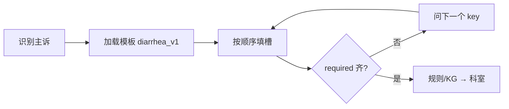

**实现上**通常是：

1. **配置表 / YAML / 后台决策树**（产品医学团队维护）  
2. **运行时引擎**：`缺哪个 slot → 问哪道题 → 写入 slots → 再检查`  
3. **路由规则**：槽位组合 → 科室（+ 权重）

代码不写死在「拉肚子问 5 句」，而是 **读模板配置**。

---

## 腹泻模板配置（示例）

```yaml
template_id: diarrhea_v1
aliases: ["腹泻", "拉肚子", "拉稀"]
required_slots:
  - duration          # 1. 多久了
  - frequency         # 2. 一天几次
  - trigger           # 3. 诱因（饮酒/不洁饮食等）
  - stool_character   # 4. 性状
  - stool_color       # 5. 颜色
  - companion_fever   # 6. 是否发热
  - past_history      # 7. 既往（问过即可，可为空）
question_plan:        # 询问顺序（固定）
  - duration
  - frequency
  - trigger
  - stool_character
  - stool_color
  - companion_fever
  - past_history
branches:             # 填槽过程中触发的分支
  - when: { stool_color: "黑色" }
    set: { urgency: "urgent", red_flags: ["黑便"] }
  - when: { companion_fever: true, duration_value_lte: 1, unit: "day" }
    add_note: "急性发热腹泻"
max_turns: 7
default_if_unclear: ["消化内科"]
```

**肚子疼** 会用另一个模板 `abdominal_pain_v1`，`required_slots` 只有 4 个、`question_plan` 更短——**这就是「不同主诉不同槽位表和顺序」**。

---

## 业务 walkthrough：用户说「拉肚子」

### 第 0 轮：首句（可一次抽多个槽）

**用户：** 「大量饮酒后拉肚子，1天了，一天4-10次，有不消化食物，大便黑色」

**NLU / 槽位填充**（一次能抽多少抽多少）：

```json
{
  "chief_complaint": "腹泻",
  "template_id": "diarrhea_v1",
  "duration": { "value": 1, "unit": "day" },
  "frequency": "4-10次/天",
  "trigger": "大量饮酒后",
  "stool_character": "有不消化食物",
  "stool_color": "黑色",
  "companion_fever": null,
  "past_history": null
}
```

**引擎检查 `required_slots`：**

| slot | 状态 |
|------|------|
| duration | ✅ |
| frequency | ✅ |
| trigger | ✅ |
| stool_character | ✅ |
| stool_color | ✅ |
| companion_fever | ❌ 未问 |
| past_history | ❌ 未问 |

→ **不会直接出科**，按 `question_plan` 找 **第一个还缺的**：`companion_fever`  
→ 同时 **分支已触发**：`stool_color=黑色` → `urgency=urgent`（可先提示尽快就医，但仍可问完关键槽）

---

### 第 1 轮：系统追问

**系统：** 「有没有发烧？」

**用户：** 「没有」

```json
"companion_fever": false
```

下一缺：`past_history`

---

### 第 2 轮

**系统：** 「以前有没有肠胃病、肝病，或长期喝酒？」

**用户：** 「没有」

```json
"past_history": []
"slot_status": "ready"
```

**required 全部齐** → 进入 **路由**。

---

## 路由逻辑（槽 → 科室，不是 LLM 瞎编）

规则引擎 / KG 查表，例如：

```text
IF chief_complaint=腹泻 AND stool_color=黑色
   → 消化内科 (0.85) + 急诊/消化急诊 (urgency)
IF chief_complaint=腹泻 AND trigger=饮酒 AND stool_character=不消化食物
   → 消化内科 (0.80)
IF companion_fever=true AND duration≤3天
   → 消化内科 (0.75) + 感染科 (备选，看医院)
IF 仅腹泻无 red_flag
   → 消化内科 (0.90)
```

**输出（导诊对用户）：**

```json
{
  "departments": ["消化内科"],
  "urgency": "urgent",
  "reason_codes": ["diarrhea", "black_stool", "alcohol_trigger"],
  "message": "建议尽快到消化内科就诊；黑便需重视，如加重请急诊。"
}
```

> 你之前图里的「胃肠炎 / 肠炎 / 功能性消化不良」是 **内部疑似方向**（辅诊/预问诊）；**导诊一期对用户主输出仍是科室**。内部可以有，不必当确诊说给用户。

---

## 若用户只说「拉肚子」——逐轮问满

首句只抽到 `chief_complaint=腹泻`，其余全空：

| 轮次 | 系统问（来自 question_plan） | 写入 slot |
|------|------------------------------|-----------|
| 1 | 拉了多久？ | `duration` |
| 2 | 一天大概几次？ | `frequency` |
| 3 | 发病前有没有饮酒、不洁饮食？ | `trigger` |
| 4 | 大便性状？有没有不消化食物？ | `stool_character` |
| 5 | 什么颜色？有没有发黑？ | `stool_color` |
| 6 | 有没有发烧？ | `companion_fever` |
| 7 |  relevant 既往？ | `past_history` |
| 8 | — | **出科室** |

**每一轮只做一件事：**  
`next_slot = question_plan 里第一个 missing 的 key` → 问对应话术 → 用户答 → 填槽 → 再检查。

---

## 和「脚趾头疼直接骨科」对比

| | 腹泻 `diarrhea_v1` | 脚趾疼 `limb_pain_simple` |
|--|-------------------|---------------------------|
| required 数量 | 7 个 | 2 个（主诉+部位） |
| question_plan 长度 | 7 步 | 0 步（首句齐） |
| 目的 | 消歧 + 筛危急（黑便） | 低歧义，直推 |

**同一套 slot 字典**（全系统都有 `duration`、`stool_color`），但 **只有腹泻模板把它们设为 required**。

---

## 工程里「怎么做到」（落地形态）

```
configs/triage_templates/
  diarrhea_v1.yaml
  abdominal_pain_v1.yaml
  limb_pain_simple_v1.yaml

engine/
  load_template(chief_complaint)   # 别名 → template_id
  get_next_question(slots, template)
  fill_slot(slots, key, value)
  route(slots, template)         # 规则或 Neo4j
```

LangGraph 里一个 **`slot_fill` 节点** 循环：

```text
slot_fill → 缺槽? → ask → 用户回复 → parse_slot → slot_fill
         → 齐了? → kg_route → END
```

产品改 **YAML/后台树** 即可调「腹泻问 7 轮、腹痛问 3 轮」，不必改 Python 主流程。

---

## 30 秒总结

1. 用户说出 **主诉** → 匹配 **腹泻模板**  
2. 模板定义 **要填哪些槽、按什么顺序问**  
3. 每轮 **只补 missing 的 key**；首句能抽的先抽（省轮次）  
4. 填槽过程中 **分支规则** 改 urgency / 加 red_flag  
5. **required 齐** → 规则/KG **出消化内科等**，不是 LLM 自由生成  

这就是「不同主诉不同槽位表和询问顺序」的完整业务逻辑；**腹泻是多轮消歧 + 筛黑便，脚趾疼是短路径直推骨科。**

---

**User**

那意思就是 腹泻--（模板，询问顺序，分支规则），交给大模型去做问询，让用户做选择填槽位，那这个关键字识别的内容具体是什么

---

**Cursor**

可以这么理解一半：**模板、顺序、分支规则是「程序/配置」管的；大模型主要负责「听懂 + 说人话」**；用户 **点选填槽** 时甚至不用模型填。  
**关键字识别** 是更前面一层：**从用户原话里认出「属于哪个主诉、提到了哪些槽位值」**。

---

## 先分清谁干什么

| 环节 | 谁做 | 干什么 |
|------|------|--------|
| 选模板 | **规则/小模型/LLM 分类** | 「拉肚子」→ `diarrhea_v1` |
| 问什么、第几问 | **模板配置** | `question_plan` 固定顺序 |
| 怎么问（话术） | **LLM 可选** | 把「请选大便颜色」说得自然 |
| 用户怎么答 | **点选 / 打字** | 点「黑色」或说「发黑」 |
| 答完写进哪个 key | **关键字识别 + 归一** | `stool_color = 黑色` |
| 黑便要不要加急 | **分支规则** | `if stool_color=黑色 → urgent` |
| 最后挂哪科 | **规则/KG** | `→ 消化内科` |

**不是**「全交给大模型问询到出科」；模型 **不决定** 顺序和分支，只 **辅助理解** 和 **生成问句**。

---

## 「关键字识别」具体识别什么

分 **两层**：**主诉识别（选模板）** 和 **槽位值识别（填 key）**。

### 1. 主诉识别（第一句就要做）

**输入：** 用户整句或首句  
**输出：** `chief_complaint` + `template_id`

| 用户说法 | 识别结果 | 加载模板 |
|---------|---------|---------|
| 拉肚子、拉稀、腹泻 | `chief_complaint=腹泻` | `diarrhea_v1` |
| 肚子疼、腹痛 | `chief_complaint=腹痛` | `abdominal_pain_v1` |
| 脚趾头疼 | `chief_complaint=足趾痛` | `limb_pain_simple_v1` |

**实现通常是：**

- **关键词/别名表**（最常用）：  
  `{"拉肚子":"腹泻", "拉稀":"腹泻", "解大手次数多":"腹泻"}`
- 或 **LLM 分类**：  
  `{"chief_complaint":"腹泻", "template_id":"diarrhea_v1"}`

这一层 **只负责「这是哪种病/哪种主诉」**，还 **不负责** 问几轮、挂什么科。

---

### 2. 槽位值识别（每一轮用户回答时）

**输入：** 当前要问的 slot（如 `stool_color`）+ 用户回答  
**输出：** 写入对应 key 的 **标准枚举值**

#### 用户 **点选**（大陆导诊很常见）

用户点按钮「黑色」→ **不需要关键字识别**，直接：

```json
{ "stool_color": "黑色" }
```

#### 用户 **打字**（才需要识别）

| 用户说 | 当前问的 slot | 识别/归一结果 |
|--------|--------------|--------------|
| 发黑、黑便、像柏油 | `stool_color` | `黑色` |
| 一天大概五六次 | `frequency` | `4-10次/天` 或 `5-6次/天` |
| 昨晚喝白酒了 | `trigger` | `大量饮酒后` |
| 有不消化食物、没消化 | `stool_character` | `有不消化食物` |
| 两天了、48小时 | `duration` | `{value:2, unit:"day"}` |
| 没有、不发烧 | `companion_fever` | `false` |

**关键字识别内容 = 把这些口语映射到模板里预定义的 slot 枚举值。**

---

## 关键字库长什么样（腹泻例子）

不是一整段 prompt，而是 **结构化词表 + 槽位绑定**：

```yaml
chief_complaint_aliases:
  腹泻: [拉肚子, 拉稀, 跑肚, 水样便]
  腹痛: [肚子疼, 肚子痛, 小腹痛]

slot_value_aliases:
  stool_color:
    黑色: [发黑, 黑便, 柏油样, 黑乎乎]
  stool_character:
    有不消化食物: [没消化, 食物残渣, 不消化食物]
  trigger:
    大量饮酒后: [喝酒后, 酗酒, 白酒, 啤酒]
  frequency:
    4-10次/天: [一天好几次, 五六次, 7-8次]
  companion_fever:
    true: [发烧, 发热, 烫]
    false: [不烧, 没发烧, 没有]
```

LLM 也可以做同一件事（结构化输出），但 **值必须落在枚举里**，不能自由写「用户大便颜色有点深」这种无法进规则的值。

---

## 一轮完整业务（腹泻 + 点选为主）

```text
用户: 「拉肚子」
  ↓ 主诉识别
chief_complaint=腹泻 → 加载 diarrhea_v1
  ↓ 引擎看 question_plan[0]
缺 duration → 系统展示选项 [今天 / 1-3天 / 3天以上]
  ↓ 用户点「1-3天」
duration = {value:2, unit:"day"}   ← 点选，无关键字识别
  ↓ 下一缺 frequency
… 依次 frequency → trigger → stool_character → stool_color …
  ↓ 用户点 stool_color=「黑色」
分支规则: stool_color=黑色 → urgency=urgent
  ↓ required 齐
规则: 腹泻+黑便 → 消化内科
```

若某轮用户 **打字**「大便跟柏油似的」→ **关键字/RAG/LLM 归一** → `stool_color=黑色` → 再走同一分支。

---

## 「关键字识别」**不包含**什么

| 不属于关键字识别 | 属于谁 |
|-----------------|--------|
| 先问时长还是先问颜色 | 模板 `question_plan` |
| 黑便是否 urgent | 分支规则 |
| 推荐消化内科 | KG/规则路由 |
| 问句怎么说顺 | LLM 话术（可选） |

---

## 和大模型分工（推荐说法）

```text
关键字/主诉识别  →  选模板 + 填槽（归一成枚举）
模板引擎         →  问什么、问几轮、分支
规则/KG          →  出科室
LLM              →  自由句理解兜底 + 自然语言追问/解释（可选）
用户点选         →  最稳的填槽方式
```

---

## 一句话

**关键字识别** = 从用户话里认出 **① 主诉类型（腹泻/腹痛/…）→ 选模板** 和 **② 各轮答案对应哪个 slot、标准值是什么（发黑→`stool_color=黑色`）**；  
**询问顺序和分支** 由 **腹泻模板配置** 管，**不是**关键字识别算出来的；用户 **点选** 时直接填槽，**打字** 才靠关键字/LLM 做归一。

---

**User**

多个槽位不满足，生成多个选项让用户做选择，最多8个，如果不够，那就多一轮问询，让用户做选择有没有症状

---

**Cursor**

对，这就是大陆导诊里很常见的一种 **「选项式填槽」**：  
**一次展示多个待填信息（最多 8 个选项），用户点选；8 个不够就再开一轮「有没有下列症状」**。

下面把它收成可落地的业务逻辑。

---

## 这一模式在干什么

传统是一问一槽：

> 拉了多久？ → 一天几次？ → 什么颜色？ …

选项式是 **一轮尽量多填**，减少轮次、适合小程序：

> 请选择符合您的情况（可多选，最多选几项）：  
> [1天] [4-10次] [饮酒后] [不消化食物] [黑色] [发热] [腹痛] [脱水]

用户点选 → **一次写入多个 slot** → 再看还缺什么。

---

## 整体流程

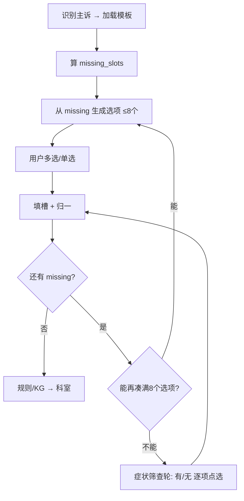

---

## 第 1 步：从模板得到「还缺哪些槽」

腹泻模板 `required_slots`：

```text
duration, frequency, trigger, stool_character,
stool_color, companion_fever, past_history
```

已有槽位（首句或上一轮选的）去掉 → 得到 `missing_slots`。

---

## 第 2 步：把 missing_slots 变成 **≤8 个选项**

每个 missing slot 对应 **一组 UI 选项**（来自配置，不是 LLM 瞎编）：

| missing slot | 选项示例（单选/多选看配置） |
|--------------|---------------------------|
| `duration` | 今天 / 1–3天 / 3天以上 |
| `frequency` | &lt;4次 / 4–10次 / &gt;10次 |
| `trigger` | 饮酒 / 不洁饮食 / 无明确诱因 |
| `stool_character` | 水样 / 有不消化食物 / 黏液 |
| `stool_color` | 黄色 / 绿色 / **黑色** |
| `companion_fever` | 有发热 / 无发热 |

**一轮最多 8 个选项** 的凑法：

1. **优先高价值、能消歧/触发分支的 slot**（如 `stool_color` 黑便）  
2. 每个 slot 只暴露 **2～3 个最常见枚举**，不一次铺全  
3. 按 `question_plan` 顺序取 missing，直到凑满 8 个或没有可展示的

示例（首句只说「拉肚子」）：

```text
第1轮选项（8个）:
  [1-3天] [4-10次/天] [饮酒相关] [无不洁饮食]
  [水样便] [有不消化食物] [大便发黑] [无发热]
```

用户可多选 → 一次填多个 key。

---

## 第 3 步：用户选完 → 填槽 + 跑分支

用户选了 `[1-3天] [4-10次] [发黑] [无发热]`：

```json
{
  "duration": {"value": 2, "unit": "day"},
  "frequency": "4-10次/天",
  "stool_color": "黑色",
  "companion_fever": false
}
```

**分支规则立即生效**（配置，不是模型）：

```text
stool_color=黑色 → urgency=urgent
```

再算 `missing`：还缺 `trigger`、`stool_character`、`past_history` …

---

## 第 4 步：8 个不够 → **症状筛查轮**（有/无）

当 remaining missing **不好做成短选项**，或 **一轮 8 个仍填不满**，开 **第二轮形态**：

**不是开放问答**，而是 **清单式有/无**：

```text
请确认是否有以下情况（逐项选择 有 / 无）：

1. 发病前大量饮酒        [有] [无]
2. 大便带不消化食物      [有] [无]
3. 明显腹痛              [有] [无]
4. 既往肠胃病/肝病       [有] [无]
```

特点：

- 每题 **二元**，UI 简单  
- 一次只展示 **≤8 条症状/情况**（一页）  
- 还有剩余 → **再一页**（多一轮问询）  
- 答完写入 `trigger`、`stool_character`、`companion_pain`、`past_history` 等

这就是你说的：**「不够就再多一轮，让用户选择有没有症状」**。

---

## 和「一问一槽」怎么统一

同一套模板，两种 UI 模式共用引擎：

| 模式 | 何时用 |
|------|--------|
| **选项批填**（≤8） | missing 多、枚举清晰、要快 |
| **症状有/无轮** | 选项太多、或 slot 是 boolean/伴随症状 |
| **单槽追问** | 只剩 1 个 ambiguous slot（如「上腹还是下腹」） |

引擎只看 **`missing_slots` 齐不齐**，不关心 UI 是批选还是有/无。

---

## 控制规则（产品上要写死）

```yaml
ui_policy:
  max_options_per_round: 8
  allow_multi_select: true
  priority_slots: [stool_color, companion_fever, duration]  # 优先进首轮
  fallback_mode: symptom_yes_no_list                      # 8不够时
  max_yes_no_rounds: 3                                    # 最多几页有/无
  skip_if_filled: true                                    # 已有槽不再问
```

**LLM 的角色（可选）：**

- 把配置选项改写成自然话术  
- 用户打字时做 **归一**（「柏油样」→ `stool_color=黑色`）  
- **不生成** 第 9 个选项、不改变顺序、不决定科室  

---

## 腹泻完整例子（2 轮 UI）

**用户：** 「拉肚子」

**第 1 轮（8 选项批填）**  
选：`1-3天` `4-10次` `发黑` `无发热`  
→ 填 4 槽，触发 `urgency=urgent`

**第 2 轮（症状有/无，剩 4 项）**  
- 饮酒 [有/无] → 无  
- 不消化食物 [有/无] → 有  
- 腹痛 [有/无] → 无  
- 既往肠胃病 [有/无] → 无  

**required 齐** → `消化内科` + urgent 提示

若第 1 轮用户一句话已说全（像你之前图），**missing 少**，可能 **0～1 轮 UI** 就出科。

---

## 和「脚趾头疼直接骨科」

`limb_pain_simple` 模板 **missing 为空** → **不展示 8 选项**，直接出骨科；  
同一套 UI 策略，**模板决定要不要问**。

---

## 一句话

**业务逻辑 = 模板定缺哪些槽 → 引擎把 missing 转成最多 8 个可点选项让用户填槽 → 仍缺则进入「有没有某症状」的有/无轮（仍可分页每页≤8）→ 槽齐走规则出科室**；大模型只管话术和打字归一，选项内容和分支来自配置。

---

**User**

那症状--科室，，，症状有权重吗，还是看命中数来确定科室

---

**Cursor**

**两种都有，但成熟导诊很少「纯看命中个数」**；更常见是 **带权重的匹配分**，命中数只是其中一种简化版。

---

## 三种做法对比

| 方式 | 怎么算 | 优点 | 缺点 |
|------|--------|------|------|
| **纯命中数** | 某科匹配到的症状条数越多 → 越推荐 | 简单 | 「发热、腹痛」很多科都中，容易平票 |
| **加权求和** | 每个症状对每个科有不同 **weight**，求和 | 可解释、可运营 | 要维护权重表 |
| **规则优先 + 加权** | 危急/黑便 **硬规则** 先定，其余加权 | 最贴近大陆导诊 | 配置稍复杂 |

**大陆主流（有 KG/规则表的）→ 第 2、3 种。**

---

## 加权是怎么工作的

关系不是只有「症状 → 科室」，而是 **「症状 → 科室（权重）」**：

```text
黑便     → 消化内科  0.95
黑便     → 普外科    0.30
发热     → 消化内科  0.60
发热     → 感染科    0.55
腹痛     → 消化内科  0.50
腹痛     → 普外科    0.45
```

用户槽位填完后，对每个科室 **累加权重**：

```text
用户: 腹泻 + 黑便 + 无发热 + 饮酒

消化内科 = 0.90(腹泻) + 0.95(黑便) + 0.40(饮酒) = 2.25
普外科   = 0.20 + 0.30           = 0.50
感染科   = 0.55(若算发热，但无发热则不加)
```

→ **Top-1 消化内科**，不是「中了 3 个词所以消化科」。

---

## 纯命中数为什么不够

「发热」「腹痛」「乏力」在表里可能 **5 个科都有边**：

| 科室 | 命中症状 |
|------|---------|
| 消化内科 | 腹痛、发热 |
| 普外科 | 腹痛、发热 |
| 妇科 | 腹痛、发热 |

命中数都是 2 → **平票**，还得靠：

- **部位槽**（右下腹 → 普外加权更高）  
- **权重**（同症状对不同科 weight 不同）  
- **互斥/加成规则**（`右下腹+发热` 组合规则 +0.3 普外）

---

## 实际系统里常有的几层

### 1. 基础边权重（KG/配置表）

```yaml
- symptom: 黑便
  department: 消化内科
  weight: 0.95
- symptom: 右下腹痛
  department: 普外科
  weight: 0.85
```

### 2. 组合规则（比单症状更准）

```yaml
- when:
    chief_complaint: 腹痛
    body_site: 右下腹
    companion_fever: true
  then:
    普外科: +0.40
    消化内科: +0.20
```

### 3. 硬规则（覆盖权重）

```text
黑便 + 大量出血 → urgency=emergency，直接急诊/消化，不算分
```

### 4. 主诉/部位先验

```text
chief_complaint=腹泻 → 消化内科 基础分 +0.5（所有腹泻案例）
body_site=脚趾 → 骨科 基础分 +0.9
```

---

## 和槽位填完后的关系

```text
槽位(标准化症状) 
  → 查 KG 边权重 
  → 按科室 sum / max 
  → 可选: 组合规则加成 
  → 硬规则覆盖 
  → Top-1 或 Top-3 科室
```

**不是**「用户选了 8 个选项里 5 个带『消化』字样就去消化科」，而是 **每个选项映射到标准 symptom + weight，再算分**。

---

## 输出长什么样

```json
{
  "departments": [
    { "name": "消化内科", "score": 2.25 },
    { "name": "普外科",   "score": 0.50 }
  ],
  "method": "weighted_sum",
  "hit_symptoms": ["腹泻", "黑便", "饮酒"]
}
```

面试可说：**Top-3 科室 + 分数 + reason_codes**，不是黑盒。

---

## 什么时候用「命中数」

- **极简决策树**、无权重表的小医院  
- **演示/PoC**  
- 或作为 **加权里的 tie-break**：分数相同再比命中数

正式导诊 + 要评测 → **建议加权 + 组合规则**。

---

## 30 秒答法

> 症状到科室 **不是简单数命中几个**，而是 **症状–科室带权重**，填完槽后对每个科 **加权求和**，再用 **组合规则**（如右下腹+发热）和 **危急硬规则** 修正，取得分最高的 1～3 个科。命中数最多当辅因子或平票决胜。

**一句话：有权重；命中数是简化思路，真导诊靠「权重 + 组合 + 规则优先」。**

---

**User**

那我说腹泻以及其他3个症状，但腹泻的槽位症状和这三个无关，那这些症状该怎么处理

---

**Cursor**

这是导诊里很常见的 **「一个主诉 + 几个无关伴随症状」** 问题。处理原则是：**先定主诉走哪条模板，只让相关槽进算分；无关症状另存、另路由，不硬塞进腹泻槽位。**

---

## 场景举例

**用户：** 「腹泻，而且牙疼、脚疼、眼睛痒」

| 内容 | 和 `diarrhea_v1` 的关系 |
|------|-------------------------|
| 腹泻 | ✅ 主诉，走腹泻模板 |
| 牙疼、脚疼、眼睛痒 | ❌ 不是腹泻要问的槽（不是性状/次数/颜色） |

**错误做法：** 把牙疼当成 `stool_character`，或强行忽略用户说的三件事。  
**正确做法：** 拆成 **主诉路径 + 伴随症状列表**，分开处理。

---

## 处理逻辑（4 步）

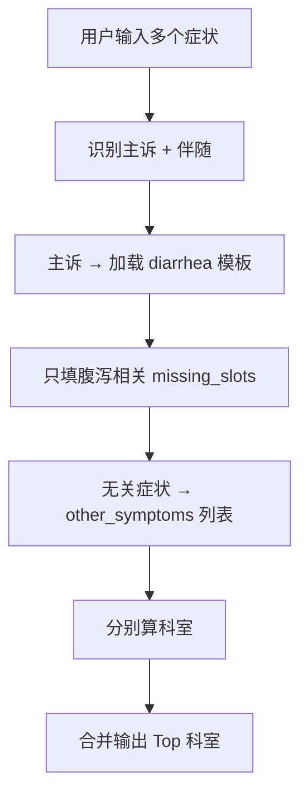

### 1. 先拆：主诉 vs 其他症状

```json
{
  "chief_complaint": "腹泻",
  "template_id": "diarrhea_v1",
  "other_symptoms": ["牙疼", "脚疼", "眼睛痒"]
}
```

**主诉怎么定：**

- 用户首句强调 / 点选「主要不适」→ 以它为准  
- 或 LLM/规则：**最急、最具体、或用户勾选「主要问题」**  
- 一次会话 **通常只跑一个主模板**；其余进 `other_symptoms`

### 2. 腹泻模板：只问、只算 **腹泻相关槽**

`diarrhea_v1` 仍然只填：

`duration, frequency, trigger, stool_character, stool_color, companion_fever…`

**牙疼/脚疼/眼睛痒 不参与** 腹泻的 8 选项批填，也不写入 `stool_*` 这类 key。

UI 上可以提示：

> 「我们先根据 **腹泻** 为您推荐科室；其他不适也会一并给出建议。」

### 3. 无关症状：单独路由（轻量 KG）

每个 `other_symptom` **单独查** 症状→科室权重，不经过腹泻模板：

```text
牙疼   → 口腔科
脚疼   → 骨科
眼睛痒 → 眼科
```

写入：

```json
{
  "secondary_routes": [
    { "symptom": "牙疼", "departments": ["口腔科"], "score": 0.9 },
    { "symptom": "脚疼", "departments": ["骨科"], "score": 0.9 },
    { "symptom": "眼睛痒", "departments": ["眼科"], "score": 0.85 }
  ]
}
```

### 4. 合并输出（对用户怎么说）

**方案 A（常见）：分条给，主诉优先**

```json
{
  "primary": {
    "reason": "腹泻",
    "departments": ["消化内科"]
  },
  "secondary": [
    { "symptom": "牙疼", "departments": ["口腔科"] },
    { "symptom": "脚疼", "departments": ["骨科"] },
    { "symptom": "眼睛痒", "departments": ["眼科"] }
  ],
  "suggestion": "若只能先挂一个科，建议优先消化内科；其余症状可分别到对应科室或咨询导诊台。"
}
```

**方案 B：** 多个无关问题 → 建议 **导诊台 / 全科 / 普通内科** 统筹（看医院策略）。

---

## 在「8 选项填槽」UI 里怎么处理

用户一轮里 **多选了腹泻相关 + 无关项**：

- **腹泻相关** → 写入腹泻槽位  
- **无关项** → 不进腹泻槽，进 `other_symptoms`，触发 **secondary_routes**

配置里给选项打标签：

```yaml
options:
  - label: "大便发黑"
    slot: stool_color
    value: 黑色
    template: diarrhea_v1
  - label: "牙疼"
    slot: null              # 不属于当前模板
    symptom: 牙疼
    route: standalone       # 单独算科
```

---

## 要不要为「那 3 个症状」也走完整模板？

| 策略 | 说明 |
|------|------|
| **默认（推荐）** | 无关且 **低歧义**（牙疼→口腔科）→ **不追问**，直接短路径出科 |
| **高歧义伴随** | 如伴随「胸痛」→ 即使主诉是腹泻，也要 **胸痛规则/加急** |
| **用户要求详细** | 主诉导诊结束后再问：「是否继续为牙疼详细导诊？」→ 换 `tooth_pain` 模板 |

避免一次会话里 **4 套完整模板问 20 轮**。

---

## 和算分的关系

- **腹泻槽位** → 只参与 **消化内科等** 的主诉加权  
- **无关症状** → **各自独立加权**，**不加进** 腹泻那条 sum 里  

```text
消化内科分 = f(腹泻, 黑便, 发热, …)     # 只用腹泻模板槽
口腔科分   = f(牙疼)                   # 独立
骨科分     = f(脚疼)                   # 独立
```

**不是**「4 个症状命中数加起来谁最多」—— **分两条链路算，再合并展示**。

---

## 特殊情况

| 情况 | 处理 |
|------|------|
| 伴随其实是腹泻相关（腹痛、发热） | 写入 `companion_*`，参与腹泻算分 |
| 伴随是危急（大量出血、休克） | **硬规则优先**，可打断模板 |
| 用户说不清哪个主诉 | 让用户 **点选「最主要的问题」** 再加载模板 |
| 多个主诉都重要 | 输出多个 primary，或推 **导诊台/全科** |

---

## 一句话

**腹泻走腹泻模板和槽位；另外 3 个与腹泻槽无关的症状不要硬填进腹泻槽，而是进 `other_symptoms` 各自短路径/加权出科，最后合并推荐。** 主诉管「问什么、算什么」，无关症状管「附加科室建议」，两套逻辑分开。

---

**User**

rag召回，实际上也只有关键词，才会用到，其他地方也用不到咯

---

**Cursor**

**在导诊这条业务里，你的理解大体对：RAG 不是主链路，主要干「词对齐 + 文档召回」这类事；分科、填槽、问几轮，都不靠 RAG。**

但说「只有关键词」略窄一点——更准确是下面这样。

---

## 导诊里 RAG 实际会用在哪

| 用途 | 是不是 RAG | 例子 |
|------|-----------|------|
| **别名 / 术语归一** | ✅ 最常用 | 拉肚子→腹泻，心口疼→胸痛 |
| **流程 / FAQ / 指南** | ✅（也常叫 ES） | 怎么预约、科室在哪、报销流程 |
| **相似病例 / 科普说明** | ⚠️ 可选 | 给一句「建议观察…」，**不决定科室** |
| **科室推荐** | ❌ | 走 KG/规则加权 |
| **槽位要问什么** | ❌ | 走模板 `question_plan` |
| **分支 / 危急** | ❌ | 走规则 |
| **8 选项从哪来** | ❌ | 走配置枚举 |

所以：**RAG ≈ 把用户话和院内说法对齐，以及查「办事类」文档**；不是导诊的大脑。

---

## 和 ES 的关系（大陆很常见）

很多项目 **流程类直接用 ES 关键词检索**，不叫 RAG：

```text
用户: 怎么预约挂号
  → ES 查 hospital_procedures
  → 返回指南片段
  → LLM 可选：改写成短回答
```

**向量 RAG（Milvus）** 在导诊里更常用来：

- 症状/问法 **相似召回** → 辅助归一或找相似 QA  
- **不是** 召回完让 LLM 融合生成长答案再出科室（你们 narrative 里明确要砍这种）

你们简化仓里：`es_rag` = 流程，`milvus_rag` = 症状文档——**都是召回，决策仍在后面**。

---

## 一条请求里谁干什么（复习）

```text
用户话
  ├─ 主诉/槽位识别     → LLM + 词表（RAG 可辅助归一）
  ├─ 填槽 / 选项 UI    → 模板配置
  ├─ 科室              → KG / 规则权重
  ├─ 挂号/在哪/怎么办  → ES / RAG 召回文档
  └─ 话术润色          → LLM（可选）
```

**RAG 出现在前面「归一」和侧面「流程 FAQ」，不出现在中间「算科室」。**

---

## 什么时候 RAG 也「用不上」

若用户 **全程点选**、词表已覆盖别名，且 **只问分科不问流程**：

- 可以 **几乎不调 RAG**  
- 主诉识别 + 模板 + KG 就够

所以 RAG 是 **增强层**，不是 **必选层**。

---

## 面试 20 秒版

> 导诊里 RAG 不负责分科，主要负责 **术语归一** 和 **流程/FAQ 文档召回**；科室来自槽位 + KG 权重。向量检索可以找相似问法，但不替代规则。很多流程直接用 ES 关键词就行。

---

**一句话：** 在导诊架构里，RAG **基本就用在「关键词/别名对齐」和「指南流程检索」**；填槽、权重、分支、出科室 **都用不到 RAG**——这也是「双通道」里检索通道的边界。

---

**User**

昨天在收到客户通知后第一时间与项目组及招采了解了相关情况后已经与您电话沟通， 由于客户侧的预算导致您的退项：
1. 需要您提供更新简历， 我们给您推荐其他项目机会， 能不能被客户看上得看咱面试的情况， 您说第二天更新好后发我， 还没有发呢
2. 在退项前如果还没合适的项目机会续上， 会在退项第二天按照您签的待岗协议， 先到公司待岗， 公司也会给您发送待岗通知及开通打卡权限。公司没有要跟您解除劳动合同哈
3. 对于工资的结算， 在项期间的工资正常结算（前提是一定要及时保证所有的工时按时提交系统，一定更不要忘了）， 待岗期间按待岗薪资进行结算
4. 关于您提的补偿方案， 公司这边可以跟您协商看看怎么处理。怎么回答

---

**Cursor**

这是 **外包/人力驻场退项 + 待岗** 的常见话术。回复目标：**态度配合、把事实和时间点钉死、补偿别口头糊过去、工时别留坑**。下面给你可直接改的发法 + 谈判要点。

---

## 回复原则

| 要做 | 别做 |
|------|------|
| 承认未及时发简历，给 **明确时间** | 只回「好的收到」 |
| **书面确认** 退项日、待岗日、薪资标准 | 补偿只电话聊、不留文字 |
| 工时 **已交/补交** 说清楚 | 忘了工时，在项工资会被卡 |
| 补偿 **要书面方案或邮件确认** | 情绪对抗或威胁 |

---

## 推荐回复（复制改名字即可）

> XX 老师您好，  
>  
> 收到通知，感谢说明。退项原因和客户预算情况我理解了，也感谢公司继续保留劳动关系、并帮忙推其他项目。  
>  
> **1. 简历**  
> 之前说次日更新，是我这边耽搁了，抱歉。我计划在 **【今天/明天 18:00 前】** 把更新版简历发您，重点补充最近 AI Agent / 导诊相关经历与技能，麻烦继续帮忙推荐合适项目。  
>  
> **2. 待岗安排**  
> 想跟您确认几个时间点，方便我安排：  
> - 客户侧 **正式退项日期** 是哪天？  
> - 若此前没有新项目衔接，**待岗从哪一天开始**（是否退项次日）？  
> - 待岗 **打卡方式、地点、时长要求** 以及 **待岗薪资标准**（占正常工资比例或具体金额），能否以 **邮件/待岗通知** 形式发我留存？  
>  
> **3. 工资与工时**  
> 在项期间工我会 **按制度及时在系统提交**；如有遗漏我会 **【X日前】** 补全。请帮忙确认：**最后结算周期** 和 **发薪日期** 是否按 usual 流程。  
>  
> **4. 补偿协商**  
> 您提到补偿可以协商，我这边希望了解一下公司 **初步方案或考虑方向**（例如：待岗补贴、项目切换缓冲、N 天薪资等）。若方便，希望 **本周内电话或书面** 给一个可讨论的范围，我再结合待岗协议条款一起看，争取双方都能接受的处理方式。  
>  
> 再次说明，我理解目前不是解除劳动合同，我也愿意配合待岗和推项。以上麻烦您帮忙确认，谢谢。

---

## 四条里分别要「钉死」什么

### 1. 简历  
- **今天或明天具体时点** 必须发，重建信用。  
- 简历突出：**测试 → 评测/质量**、AI Agent、提示词/bad case、导诊/槽位（若有项目材料）。

### 2. 待岗  
务必书面确认：  
- 退项日 vs 待岗起算日  
- 待岗工资 **比例/金额**（协议里常有，对照原文）  
- 是否 **全勤打卡**、能否远程  
- **待岗最长多久**、期间是否必须接任意项目  

### 3. 工资  
- **立刻登录工时系统**，在项最后一天是否已填。  
- 问清：待岗首月发薪是否打折、五险一金是否照常。

### 4. 补偿  
你主动提协商，对方说「可以谈」——别先开底价，先问 **公司方案**。  
可接受的谈判方向（按常见外包实践，非法律意见）：  
- 退项非个人原因 → **待岗工资不低于协议约定**；若协议过低，谈 **缓冲期按原薪或差额补贴 1～2 周**  
- 或 **协商解除 + N 补偿**（若你其实想走、且待岗薪太低）  

若你 **想续项目、待岗也能接受**：补偿可谈 **推项优先级 + 待岗不低于 X%**。  
若 **待岗薪很低、推项不确定**：可倾向谈 **N+1 或协商离职**，但要查协议里 **主动离职 vs 公司解除** 的差别。

---

## 若对方追问「补偿你想要多少」

可先答：

> 我倾向先了解公司制度和待岗协议里的标准，再看能否针对 **非个人原因退项、项目空窗期** 给一点缓冲。您这边 **内部通常怎么处理类似情况**？我可以在这个基础上谈。

避免第一个数字报太低。

---

## 和你处境相关的现实建议

- **35 岁 + 外包待岗**：推项高度依赖简历和面试，**简历今天必须发**。  
- **1 个月 AI 外包**：简历写 **项目名 + 职责 + 技术栈 + 个人贡献**，别写「维护提示词」四个字就完。  
- **导诊个人项目 + eval**：并行推进，推项和社招都用得上。  
- **所有关键结论要邮件/企微文字留存**，口头「不会解除合同」也要落到 **待岗通知** 上。

---

## 超短版（忙就用这个）

> 收到，抱歉简历未及时更新，**明天 18:00 前** 发您。麻烦确认：**退项日、待岗起算日、待岗薪资标准** 及 **待岗通知**；在项工时会按时提交。补偿您说可协商，希望 **本周给个书面或电话方案**，我再一起看，谢谢。

---

如果你愿意补充：**待岗协议里工资比例、是否想留公司还是拿补偿走**，我可以帮你改一版 **更偏留 / 更偏走** 的回复，以及简历项目段怎么写那 1 个月外包。

---

**User**

我不想考虑外包，可以拒绝提供简历吗

---

**Cursor**

可以 **不提供**，但要清楚：**你现在劳动关系还在外包公司**，拒简历一般不违法，却可能影响 **待岗待遇、协商空间和同事关系**。若目标是 **彻底不做外包**，有更稳的做法。

---

## 直接回答：能拒吗？

| 角度 | 说明 |
|------|------|
| **有没有义务必须给** | 劳动法通常 **没有「必须给 HR 更新简历推项目」** 这种 universal 义务；除非 **劳动合同/员工手册** 里写了配合调岗、推项等 |
| **拒了会怎样** | 公司可能：少推或不推项目、待岗照协议执行、记录「不配合」；一般 **不能因此单方开除**（需看是否构成严重违纪，通常单纯拒简历够不上） |
| **他们会不会解除合同** | 对方已说 **暂不解除**；你若拒简历，更可能是 **长期待岗 + 低待岗薪**，不是立刻开除 |

**结论：** 可以拒，但等于告诉对方 **「我不打算再通过你们上项目」**，要准备好 **待岗怎么熬、怎么合法离开**。

---

## 若你确定不做外包，三种路

### 方案 A：明说不推项，接受待岗（较稳）

不撕破脸，也不给推项简历：

> 感谢帮忙推项。我这边 **近期不考虑再通过外包形式上项目**，想 **自行看正式岗/自研机会**。待岗我会 **按协议配合打卡**；补偿和待岗待遇仍希望按之前说的 **书面确认**。简历就不更新了，谢谢理解。

**适合：** 还能忍待岗薪、需要时间面试正式岗。

---

### 方案 B：谈协商离职 + 补偿（想快刀斩乱麻）

若待岗工资很低、不想耗：

> 我 **不打算继续外包驻场**。能否 **协商解除劳动合同**，谈 **N 或约定补偿**？我可以配合交接和工时。

**适合：** 有积蓄、外面有机会、待岗不划算。  
**注意：** 协商解除通常 **比** 你裸辞或他们违法辞退，在 **补偿、失业金** 上各不同——签任何协议前 **看清条款**（有无竞业、是否写「个人原因」）。

---

### 方案 C：不给简历，也不说死，静默待岗 + 自己投正式岗（灰色但常见）

不给简历，回复简短配合待岗；私下投 **直招、正编、Remote**。  
**风险：** 若合同要求 **待岗期间不得兼职/需报备**，要自查合同。

---

## 不建议的做法

- **已读不回 / 单方面消失** → 工时、打卡出问题，在项工资和补偿谈判都被动。  
- **口头拒简历但补偿不谈** → 待岗低薪耗着，更亏。  
- **以为拒简历 = 自动离职** → 劳动关系还在，待岗协议可能仍约束你。

---

## 若选「拒简历」，建议仍回复一封（短版）

> XX 老师好，  
>  
> 收到待岗和结算说明，我会 **按时提交工时、配合待岗打卡**。  
>  
> 关于推其他外包项目：**我这边近期不打算再走外包驻场，简历就先不更新了**，我自己在看 **直招/正式岗** 机会。  
>  
> 待岗起算日、待岗薪资标准，以及之前提到的 **补偿协商**，仍希望 **邮件或书面确认**，谢谢。

这样既 **拒了推项**，又 **留痕、要待遇**，比单纯不回强。

---

## 和你目标（成都、AI 应用、不想外包）的关系

- **外包简历** 给的是下一家 **驻场客户**，不是社招；**拒 = 合理**。  
- **社招简历** 要自己写一版（导诊项目、测试转评测、1 个月 Agent 经历怎么写）。  
- 待岗期间若薪资打折，要算：**待岗 2～3 个月 vs 协商走 + 补偿**，哪个更划算。

---

## 一句话

**可以拒绝提供推项简历**；更稳妥是 **书面说明不做外包驻场 + 配合待岗/工时 + 继续谈补偿书面方案**。若待岗不划算，直接谈 **协商离职** 往往比硬耗着强。

如果你愿意说下：**待岗工资大概几折、合同还有多久、更想「耗着面试」还是「拿钱走」**，我可以帮你选 A/B/C 并改一版更贴合的回复。  
（涉及合同权益的，最终以 **劳动合同、待岗协议** 为准；重要签字前可问当地劳动仲裁/律师。）

---

**User**

我提交了简历，如果面过了，我可以拒绝吗，只是拿外包练习面试，以后不考虑外包

---

**Cursor**

**面过了可以拒，但代价不小**；把外包面试当「纯练手」风险高于收益，尤其你 **人还在外包公司劳动关系里**。

---

## 面过了能不能拒？

| 环节 | 能不能拒 | 常见后果 |
|------|---------|---------|
| **客户面试通过后，不上项目** | 一般 **可以拒**（除非合同写必须接受调岗且岗位合理） | 销售/HR 和客户都不高兴，内部记录差 |
| **对公司** | 仍是在职员工，通常 **不能直接开除** | 推项优先级归零、待岗更久、补偿谈判变难 |
| **对客户** | 客户可能要求换人 | 损害的是 **外包公司** 信誉，公司可能找你说理 |

没有 universal 法律说「过了必须去」，但 **劳动合同里常有「服从合理工作安排」**——反复拒，公司可能走 **调岗、待岗延长、协商解除** 等路径。

---

## 当练手面试：为什么不划算

1. **伤的是自家公司**  
   简历是 HR 推的，面过了不去 → 销售、交付、HR 挨骂，**第一个记恨的是你**。

2. **圈子小**  
   成都医疗 IT、外包圈，客户 PM、甲方 HR 可能 **换公司又碰见**；「面过放鸽子」口碑难洗。

3. **练到的和直招不完全一样**  
   外包客户面 often 偏 **驻场、配合度、稳定干 6 个月**；和你想要的 **AI 应用直招/Remote** 题型、深度可能不对路。

4. **你已在退项/待岗**  
   再 **面过不去** = 叠加「不配合」标签，**补偿、待岗待遇** 更被动。

5. **时间成本**  
   准备外包面 + 往返，不如投 **目标公司直招** 或 **Mock 面试**。

---

## 更稳妥的做法

### 若 **还没面 / 刚约面**

跟 HR **明说或婉拒**，比面完再拒好得多：

> 我近期目标是非外包的正式岗/远程，这次推项我先 **不参加** 了，抱歉占用您时间；待岗和结算我会配合。

或不再接新面试邀约。

### 若 **已经面了、等结果**

- **不打算去** → 结果出来前可 **私信 HR 撤回意向**（说个人规划变更），比 offer 后拒强。  
- **拿不准** → 当 **了解市场、练题型**，但 **别故意吊着**；确定不去就 **尽早拒**。

### 练面试替代

- 投 **你想去的直招**（中小厂 AI 应用、医疗信息化）  
- **Mock**：朋友、牛客、付费辅导  
- **导诊项目 + eval**：面试讲架构，比空练外包面更值  

---

## 若已经提交简历、又不想继续推项

发一条 **止损**，避免再被约面：

> XX 老师，简历之前已发。我 **慎重考虑后，决定不再接外包驻场类项目面试**，麻烦 **暂停推项**。我会配合待岗/工时；若有 **协商离职或补偿**，也希望能继续沟通。谢谢。

这样比 **面过了再拒** 干净。

---

## 和「待岗 + 自己找直招」怎么并行

- **可以**：待岗打卡 + 私下投直招（先看合同有无限制）。  
- **不建议**：待岗 + 接外包面练手再拒。  
- **简历**：给外包公司的版本可 **简化**； **直招简历** 单独写（导诊、测试转评测、Agent 经历）。

---

## 一句话

**面过了技术上可以拒，但等于坑推你的 HR 和客户，待岗和补偿都会更难；别拿外包面当练手，尽快书面停推项，把精力投直招和项目作品。**

如果你说下 **有没有下一场已约面试、HR 态度如何**，我可以帮你写 **拒面 / 停推项** 的一两句，尽量不撕破脸还能待岗。

---

**User**

那这个项目，落地部署，并有评测数据，那么对应的薪水，成都是多少

---

**Cursor**

在你这个背景（**二本理工科、35 岁、测试转 AI、外包 1 个月**）下，若 **导诊项目能落地部署 + 有可复现评测数据**，成都薪资大致如下（**税前年薪**，2025–2026 体感，供谈判参考）。

---

## 先说你多了什么议价筹码

| 有 deploy + eval | 没有 |
|------------------|------|
| 从「会改 prompt」→ **能交付指标的应用** | 多落在 AI 运营/实施档 |
| 可讲 **双通道、槽位、KG/规则、Golden** | 口述架构，追问易虚 |
| 面试能贴 **数字 + 录屏 + eval.md** | 只能谈「做过类似」 |

**大致多抬 4～8w/年** 的议价空间，但 **抬不到** 纯 3 年 AI 后端无短板的上限。

---

## 成都薪资区间（deploy + eval 齐全）

###  onsite（成都本地）

| 档位 | 年薪 | 典型岗位/公司 |
|------|------|----------------|
| **保守** | **16～20w** | 中小乙方、医疗信息化、实施型 AI 岗 |
| **合理** | **20～26w** | AI 应用 / Agent 工程（偏应用+质量+后端） |
| **偏上** | **26～30w** | 面试强 + 指标不错 + 角色讲清；35 岁/学历会卡部分厂 |
| **30w+ onsite** | 较难 | 需 **指标亮眼 + 后端也稳 + 对口业务** |

### Remote（人住成都，远程编）

| 档位 | 年薪 |
|------|------|
| **可谈** | **22～28w** |
| **冲一冲** | **28～32w**（指标+表达+项目闭环都到位） |
| **35w remote** | **上限目标**，不是保底 |

Remote 往往看 **作品和面试**，比学历友好一点，但 **35 岁 + 商业 AI 经历短** 仍会被问「深度多久」。

---

## 评测数据「好不好」会差一档

同样 deploy，**数字一般 vs 数字漂亮** 可能差 **2～4w**：

| 指标水平（导诊） | 体感档位 |
|------------------|---------|
| 有 eval 但 **Top-1&lt;60%**、样本&lt;50 | **18～22w**（「有评测意识」） |
| **Top-3≥80%**、Golden≥100、有 P95 延迟 | **22～26w** onsite / **24～28w** remote |
| 上条 + **Docker 一键起 + 录屏 + bad case 闭环** | **26～30w** 可谈 |
| 声称「生产上线」但无院方证据 | **别按真上线要价**，按准上线档 |

Honest 口径：简化仓用 Milvus 近似 KG，**简历和面试要说清**，别按「363 全院上线负责人」报价。

---

## 按岗位类型（同一套项目）

| 岗位 | deploy+eval 后成都大致 |
|------|------------------------|
| **AI 应用 / Agent 工程师** | **20～26w**（最匹配） |
| **测试 / 质量 + AI 评测** | **18～24w**（测试背景是优势） |
| **纯 prompt / AI 运营** | **14～20w**（浪费 deploy+eval） |
| **资深后端（纯 Java/Go）** | 本项目 **帮 AI 岗更多**，纯后端要另补 |

---

## 和你之前问的「30w remote」关系

| 条件 | 30w remote |
|------|------------|
| 仅口述导诊、无 eval | 很难 |
| deploy + eval + 角色清晰 + 面试稳 | **可冲 28～32w** |
| 再加 **6 个月+可说的个人深度** 或 **对口医疗乙方 offer 竞价** | 30w 更 realistic |

**30w 是上限谈判目标**；**落地预期建议：成都 onsite 22～25w，remote 24～28w**。

---

## 仍会被压价的因素（即使有 eval）

- **35 岁** + 转岗叙事要顺  
- **二本**（大厂 SP/部分 remote 仍卡）  
- **商业 AI 只有 1 个月外包**（要说清 **个人项目深度 X 月**）  
- **外包履历**（直招要强调 **个人项目 + 评测**，弱化驻场）  

---

## 面试报价建议（成都）

| 策略 | 说法 |
|------|------|
| **期望薪资** | onsite **23～25w**，remote **26～28w**（留谈判空间） |
| **底线** | onsite **不低于 20w**（有 eval+deploy）；再低不如待岗+继续投 |
| **证据包** | eval.md 一页数字 + Docker/README + 3 分钟录屏 |

---

## 一句话

**导诊项目 deploy + 可复现评测后，成都 onsite 合理预期 **20～26w**，remote **22～28w**；做得漂亮、面试讲清 **24～28w / 26～30w** 可谈；**30w remote** 要当 **冲顶目标**，不是 median。**

若你定下 eval 目标（例如 Top-3≥85%、Golden 100 条），我可以反推 **简历项目段怎么写** 才配得上 **25w** 这个数。

---

**User**

需要补齐图片中的技能吗

---

**Cursor**

**不必为了成都 20～26w 的 AI 应用岗，去补齐图片里那一整套技能。** 那些项目和你的目标赛道 **不是同一条路**；硬补容易 **耗 3～6 个月、简历还像培训班拼接**。

---

## 图片里是什么赛道

| 项目 | 核心技能 | 典型岗位 |
|------|---------|---------|
| DeepResearch Agent | 多 Agent、规划、长上下文、红蓝对抗 | 大模型 **研发/算法**、平台 Agent |
| 智能找车 Qwen2-VL | **SFT/DPO/KTO、难样本、端侧部署** | **多模态算法 / 训练** |
| 旅行规划 Agentic RL | **强化学习、长程 Agent** | 算法 / Research 向 |

这是 **「大模型 / 多模态 / 训练对齐」** 培训课常见卖点，偏 **算法与 post-training**，不是 **医疗导诊 / 企业 Agent 落地**。

---

## 你的目标需要什么（对照）

你要的是：**Agent 应用 + 后端 + 评测 + 准上线**，成都 **AI 应用 / Agent 工程**，不是训 Qwen2-VL。

| 你已有/在做 | 图片里的 | 要不要补 |
|------------|---------|---------|
| LangGraph 编排、双通道 RAG | 多 Agent DeepResearch | ⚠️ **概念懂即可**，导诊项目深化就够 |
| 槽位 / KG / 规则（在学） | Planning、memory | ✅ 用 **导诊模板+状态机** 体现，不必另做 DeepResearch |
| deploy + eval（待做） | Benchmark | ✅ **必做**，比任何课项目都值钱 |
| 测试背景 | 红蓝对抗、降噪 | ⚠️ 可讲 **Golden/bad case 回归**，不必做对抗训练项目 |
| 无训练经验 | SFT/DPO/KTO/RL | ❌ **短期不必补**，面试也追不上算法岗 |
| 无多模态 | Qwen2-VL 找车位 | ❌ **与导诊无关**，除非转多模态算法 |

---

## 结论：要不要补齐？

### ❌ 不建议现在系统补

- **SFT / DPO / KTO / Agentic RL / 多模态 post-training** → 换 **算法岗** 赛道，你 **35 + 测试转岗 + 无 GPU 训练经历**，和 **应用岗 25w** 不对口。  
- 三个课项目都写简历 → HR 会问 **你个人贡献、数据从哪来**，容易 **像网课作业**，不如 **一个导诊 + eval 数字** 硬。

### ✅ 建议「点到为止」即可（面试能讲一句）

从图里 **只抽和应用岗相关的词**，在导诊里 **真做一点**：

| 概念 | 在导诊里怎么体现（1～2 周） |
|------|---------------------------|
| 多 Agent / 多节点 | LangGraph：**意图 / 填槽 / 路由 / 出科** 分工（你已有） |
| Benchmark | **Golden + Top-3 + P95** → `eval.md` |
| 文本降噪 / bad case | **别名表 + bad case 表**，不是对抗训练 |
| Planning | **问诊模板 + question_plan**（槽位决策树） |

### ✅ 真正该补齐的（优先级）

1. **导诊 deploy**（Docker + README）  
2. **评测数据**（Golden、指标、复现脚本）  
3. **槽位 + 规则/KG 出科室**（和大陆主流叙事一致）  
4. **简历 + 面试话术**（测试→评测、1 个月外包诚实写）  

这四项对 **成都 22～26w** 的拉动 **大于** 图片里任意一个课项目。

---

## 若课程已买 / 已上，怎么用才不浪费

| 做法 | 建议 |
|------|------|
| 三个项目全做写进简历 | ❌ |
| 只听 **Agent 编排、评测、bad case** 章节 | ✅ |
| 大作业改成 **导诊 eval 或槽位引擎** 的一部分 | ✅ |
| SFT/DPO/RL 章节 | 知道名词即可，**简历不写** |

---

## 和薪资的关系（直接说）

| 路径 | 成都 onsite 体感 |
|------|-----------------|
| 导诊 **deploy + eval + 槽位/KG** 讲清 | **20～26w** |
| 再加图片里 **训练/RL/多模态** 写满简历但 **无深度** | 易被问穿，**不一定更高**，还可能被当算法岗刷掉 |
| 算法岗真做 SFT/DPO | 要 **GPU、数据、6 月+**，赛道完全不同 |

---

## 一句话

**不需要补齐图片里那套 SFT/DPO/RL/多模态/post-training 技能**；那是 **算法/多模态岗**，不是你现在该冲的 **AI 应用 + 导诊落地 + 评测**。  
从图里 **只吸收「多节点 Agent、Benchmark、bad case」**，全部 **并进导诊项目**；时间 **all in deploy + eval + 槽位规则**，对薪资和面试最划算。

若你告诉我 **课是否已付费、还剩多少时间**，我可以帮你划 **「只听哪几节 + 导诊哪 3 件事必做」** 的一周计划。

---

**User**

我记得面试的时候，经常被问到skill和多agent，agent联邦，蒸馏，有用到项目么，可是该项目用不到啊，我该怎么处理

---

**Cursor**

这是 **应用岗面试很常见的情况**：面试官按 **算法/平台课纲** 问，你的项目是 **导诊落地**，很多词 **确实用不上**。处理原则是：**不硬贴项目，要会「映射 + 诚实边界 + 延伸理解」**。

---

## 总原则（四条）

1. **有就用项目讲**；**没有就别写进简历**，也别说「我们生产用了蒸馏」。  
2. **LangGraph 多节点 ≠ 多 Agent 联邦**——先把概念拆开，很多追问会消失。  
3. **测试背景** 用来接 **评测、bad case、回归**，不必硬接蒸馏。  
4. 答完加一句：**「导诊一期没上，是因为业务不需要 / 性价比低」**——显得有判断力。

---

## 各话题怎么答（可直接背框架）

### 1. Skill（工具 / MCP Skill）

**面试官 often 指：** Agent 可调用的工具、MCP Server、Function Calling。

**你项目里有没有？**  
**有一部分：** `tool_calling`、患者查询工具；**不是**完整 MCP Skill 平台。

**推荐答法：**

> 导诊项目里 Tool 层做的是 **病历查询类工具**，用 LangChain `bind_tools` + ToolNode，由路由节点决定要不要调。  
> **流程类、挂号类** 走 ES，不硬塞进 Tool。  
> 若二期接 HIS，会按 **MCP/HTTP API** 封装成 Skill，一期业务没接所以 **没上 MCP 协议**，但 **「理解 → 路由 → 调工具 → 结构化结果」** 这条链路和 Skill 设计是一致的。

**被追问「和生产 Skill 平台差在哪」：**

> 差在 **注册发现、权限、版本化**；我这边是 **单服务内工具**，原理相同，工程化还没做全。

---

### 2. Multi-Agent（多 Agent）

**最容易踩坑：** 把 LangGraph 里 `decision / es_rag / slot_fill / kg_route` 说成「五个 autonomous Bot」——会被深挖协作协议。

**推荐答法（对齐你们 narrative）：**

> 我们用的是 **LangGraph 多节点分工**，不是多个自治 Agent 互聊。  
> - **决策/填槽节点**：理解、追问  
> - **检索节点**：ES/Milvus 召回  
> - **路由节点**：KG/规则 **出科室 JSON**  
> - **生成节点**：可选短说明  
> 科室 **只信 KG/规则**，检索节点 **不决策**。这是 **编排式 multi-node**，不是 AutoGPT 那种 multi-agent。

**若问「为什么不用多 Agent」：**

> 导诊要 **可控、可评测、可追责**；多 Agent 协作 **不稳定、难回归**。多节点 + 规则/KPI 更合适。

---

### 3. Agent 联邦（Federation）

**项目里：** 基本 **用不到**（多服务、多租户、跨组织 Agent 协作）。

**诚实答法：**

> **当前导诊单体内没做 Agent 联邦。** 我理解联邦是 **多 Agent/多服务在统一网关下做发现、路由、权限与上下文边界**；我们一期是 **单 LangGraph 应用 + FastAPI**，联邦属于 **多院区、多子系统（导诊/HIS/预约）拆服务后的二期架构**。  
> 若做二期，会是 **导诊 Agent 服务 + 业务 API 服务** 通过 API/MCP 协作，而不是多个 LLM Bot 联邦对话。

**别说的：** 「我们用了 Agent 联邦」——一追问注册中心、冲突消解就穿帮。

---

### 4. 蒸馏（Distillation）

**项目里：** **用不到**，也 **不应该** 为了面试硬加。

**诚实答法：**

> **导诊项目没有模型蒸馏。** 科室路由靠 **规则/Kg + 槽位**，LLM 只做理解和话术；小模型蒸馏一般用在 **降本、端侧、专用分类器**，我们一期优先 **Golden 评测 + 规则**，蒸馏 **ROI 不高**。  
> 我了解蒸馏是 **大模型打标/生成数据 → 训小模型承接部分子任务**；若以后要把 **意图/槽位分类** 从云端 Qwen 换成本地小模型，**才会考虑蒸馏或 LoRA**，那是优化项不是主线。

**若你上过课 / 看过资料：**

> 课程里讲过 SFT/DPO，和 **导诊应用岗** 不是一条线；我 **不会在项目经历里写蒸馏**，避免被当算法岗深挖。

---

## 一张对照表（面试前扫一眼）

| 面试词 | 项目有没有 | 你怎么讲 |
|--------|-----------|---------|
| **Skill / Tool / MCP** | 部分（Tool 节点） | 讲工具调用链；MCP 作二期 |
| **Multi-Agent** | 多节点，非多 Bot | **Multi-node orchestration** |
| **Agent 联邦** | 无 | 讲理解 + 二期多服务拆分 |
| **蒸馏 / SFT / DPO** | 无 | 讲原理 + 为什么导诊不用 + 何时才用 |
| **RAG** | 有（ES/Milvus） | 讲 **归一/流程**，不替代分科 |
| **KG / 规则** | 方向有 / 简化仓近似 | 讲 **权重出科室** |

---

## 简历和项目描述怎么处理

**写：**

- LangGraph **多节点编排**、Tool 调用、双通道检索、槽位/规则路由、Golden 评测  

**不写：**

- Multi-Agent 联邦、蒸馏、DPO、RL、自进化 Agent  

**技能栏可写「了解」不写「熟练」：**

- 了解：Agent 编排、MCP、模型蒸馏（应用层不依赖）  
- 熟练：LangGraph、FastAPI、评测集、Prompt/ bad case 闭环  

---

## 万能收尾句（被问「项目里用了吗」）

> 这道题 **在我们一期导诊里 intentionally 没上**，原因是 **业务要可评测、科室要走规则**。我可以说 **设计边界和若二期怎么接**；若您这边生产已经上了 **Skill 平台/联邦**，我也希望了解贵司 **怎么权衡稳定和迭代** 的。

——把「不会」变成 **工程判断**，比瞎编强。

---

## 和你外包 1 个月经历怎么拼

| 经历 | 能接的话题 |
|------|-----------|
| 外包 Agent | bad case、提示词/关键词、**没有**联邦/蒸馏 |
| 导诊项目 | multi-node、RAG、槽位、KG、eval |
| 测试 | Golden、回归、指标 |

**不要** 把外包 + 导诊 + 网课 **拼成「全能大模型算法」**。

---

**一句话：** Skill/多 Agent/联邦/蒸馏 **很多在导诊一期确实用不到**；面试时 **Multi-node 代替 Multi-Agent 吹**，Tool 代替 Skill 讲，联邦/蒸馏 **诚实说未用 + 原理 + 为何不做**；简历 **不写没用过的重词**，用 **评测和规则** 撑应用岗深度。

如果你愿意，我可以按 **「Skills 一句 + Multi-Agent 一句 + 联邦一句 + 蒸馏一句」** 写一版 **30 秒口播**，你背了就能答大部分追问。

---

**User**

那这个导诊项目里，用到skill，多agent的地方有哪些

---

**Cursor**

对照代码说明导诊项目里与 Skill、多 Agent 对应的部分，以及尚未落地的部分。


按 **本仓库实际代码** 说明：哪些地方能 **对标 Skill / 多 Agent**，哪些 **还没有**（面试别夸大）。

---

## 一、Skill 在本项目里对应什么

面试说的 **Skill**，多数指 **Agent 可调用的工具能力**（Function Calling / MCP Tool）。  
本项目 **没有 MCP 协议**，但有 **LangChain Tool + ToolNode**，属于 **Skill 的工程雏形**。

### 1. 已实现的 Skill（工具）

```30:61:d:\InitialArchitectureForMedicalAgent1\app\tools\patient_tools.py
@tool
def get_patient_history(patient_name: str) -> str:
    ...
@tool
def get_patient_by_id(patient_id: str) -> str:
    ...
```

| 工具 | 作用 | 导诊场景 |
|------|------|---------|
| `get_patient_history` | 按姓名查 mock 病历 | 用户提到既往/本人姓名时 |
| `get_patient_by_id` | 按 ID 查病历 | 二期可接 HIS |

这就是 **2 个 Skill**（能力单元），只是还没注册成 MCP Server。

### 2. Skill 的调用链

```13:55:d:\InitialArchitectureForMedicalAgent1\app\graph\nodes\tool_calling.py
tools = [get_patient_history, get_patient_by_id]
tool_node = ToolNode(tools)
llm_with_tools = get_chat_llm().bind_tools(tools)
...
result = llm_with_tools.invoke(query)
...
tool_result = tool_node.invoke({"messages": [result]})
```

流程：**LLM 决定是否调 Tool → ToolNode 执行 → 结果写进 `medical_docs`（source=tool）**。

### 3. 路由里预留的 Tool 入口

```13:16:d:\InitialArchitectureForMedicalAgent1\app\domain\routing.py
    if hasattr(ir, 'need_tool_call') and ir.need_tool_call:
        logger.info("route_after_decision -> tool_calling")
        return "tool_calling"
```

`decision` 节点若设 `need_tool_call=True` → 走 `tool_calling` → 再进 `es_rag`。

### 4. 不算 Skill、但常被误说成 Skill 的

| 模块 | 实际是什么 | 面试怎么说 |
|------|-----------|-----------|
| `es_rag` | ES 检索流程文档 | **检索通道**，不是 Skill |
| `milvus_rag` | 向量检索症状 QA | **检索通道**，不是 Skill |
| `decision` 结构化输出 | `IntentResult` | **NLU/意图槽**，不是 Skill |

### 5. 本仓库 **没有的 Skill**

- MCP Server / `@mcp.tool`  
- 挂号、缴费、HIS、预约（二期）  
- 槽位填写的「选项 API」  

**面试说法：**  
> Skill 层目前只有 **病历查询 2 个 Tool**；流程走 ES，分科应走 KG/规则（简化仓尚未实现 KG 节点）。

---

## 二、Multi-Agent 在本项目里对应什么

本项目是 **LangGraph 多节点编排**，不是多个自治 Agent 互相对话。

### 1. 图里有哪些「节点 Agent」

```19:53:d:\InitialArchitectureForMedicalAgent1\app\graph\builder.py
    graph.add_node("decision", decision_node)
    graph.add_node("tool_calling", tool_calling_node)
    graph.add_node("es_rag", es_rag_node)
    graph.add_node("milvus_rag", milvus_rag_node)
    graph.add_node("check_docs", check_docs_node)
    graph.add_node("rewrite_question", rewrite_question)
    graph.add_node("answer_generate", answer_generate_node)
    graph.add_node("trim_history", trim_history_node)
```

| 节点 | 职责 | 像「专岗 Agent」吗 |
|------|------|-------------------|
| `trim_history` | 截断会话历史 | 预处理 |
| `decision` | 意图识别（symptom/process） | **路由 Agent** |
| `tool_calling` | 调病历 Tool | **Tool Agent** |
| `es_rag` | 流程/指南 ES 召回 | **检索 Agent** |
| `milvus_rag` | 症状 Milvus 召回 | **检索 Agent** |
| `check_docs` | 文档是否够答 | **质检 Agent** |
| `rewrite_question` | 改写 query 再检索 | **查询优化 Agent** |
| `answer_generate` | 生成自然语言回答 | **生成 Agent** |

**共 8 个节点**，共享 `AppState`，由 **条件边** 串联，不是 Bot 互相发消息。

### 2. 路由（多节点协作）

```text
START → trim_history → decision
         ├→ tool_calling → es_rag → …
         ├→ es_rag → milvus_rag? → check_docs
         │                      ├→ rewrite → es_rag（循环）
         │                      └→ answer_generate → END
         └→ answer_generate
```

这是 **multi-node orchestration**；面试可说 **「多节点分工的 Agent 编排」**，别说 **「多 Agent 联邦」**。

### 3. 本仓库 **没有** 的 Multi-Agent 形态

| 没有 | 说明 |
|------|------|
| Agent 联邦 | 无跨服务注册/发现 |
| Agent 互聊 | 无 A2A 消息 |
| 槽位填槽节点 | 聊过的业务线，**代码未做** |
| KG 路由节点 | 科室仍靠检索 + LLM 生成 |
| Supervisor 多 Bot | 无总控 Bot 派活给子 Bot |

---

## 三、对照表（面试直接用）

| 面试词 | 本项目有没有 | 具体位置 |
|--------|-------------|---------|
| **Skill / Tool** | ✅ 有（2 个） | `patient_tools.py` + `tool_calling.py` |
| **MCP Skill** | ❌ 无 | 二期可包装 Tool |
| **Multi-node Agent** | ✅ 有（8 节点） | `builder.py` |
| **Multi-Agent 自治协作** | ❌ 无 | — |
| **Agent 联邦** | ❌ 无 | — |
| **蒸馏** | ❌ 无 | — |

---

## 四、30 秒口播（背这个）

> 导诊简化仓里，**Skill 对应 LangChain Tool**：`get_patient_history`、`get_patient_by_id`，在 `tool_calling` 节点里 `bind_tools` + `ToolNode` 执行，结果进 state 再参与回答。  
> **Multi-Agent 我讲的是 LangGraph 八节点编排**：意图、Tool、双路 RAG、文档评估、改写、生成，条件路由分工；**不是**多个 LLM Bot 联邦。  
> **MCP、槽位填槽、KG 出科室、联邦、蒸馏** 一期没上或下阶段做，原因是导诊要 **可评测、科室走规则**。

---

## 五、若要对齐真实导诊业务（你还缺什么）

聊过的 **槽位 + KG 出科室**，应在图里 **再加节点**，才算完整 narrative：

```text
slot_fill 节点  →  ask 节点  →  kg_route 节点  →  dept_json 节点
                      ↑              │
                   decision ──────────┘
```

那时可以多说一个 **「填槽 Agent + 路由 Agent」**，Still **不是联邦**。

---

**一句话：** 本项目 **Skill = 2 个病历 Tool + tool_calling 节点**；**Multi-Agent = LangGraph 8 节点分工**；**没有 MCP、联邦、蒸馏、槽位/KG 节点**——面试按上表讲，别整仓说成「全栈 Agent 平台」。

---

**User**

抛开的这个github项目，说下导诊项目会有什么skill和多agent的应用

---

**Cursor**

下面按 **真实医院智能导诊（如医速递 V3.0 一类）** 来说，**不绑你那个简化 GitHub 仓**。重点：**Skill 是「办事能力」；Multi-Agent 是「编排分工」**——导诊里都有，但形态和培训课里的 DeepResearch / 联邦 / 蒸馏 **不是一回事**。

---

## 总览：导诊里两者各管什么

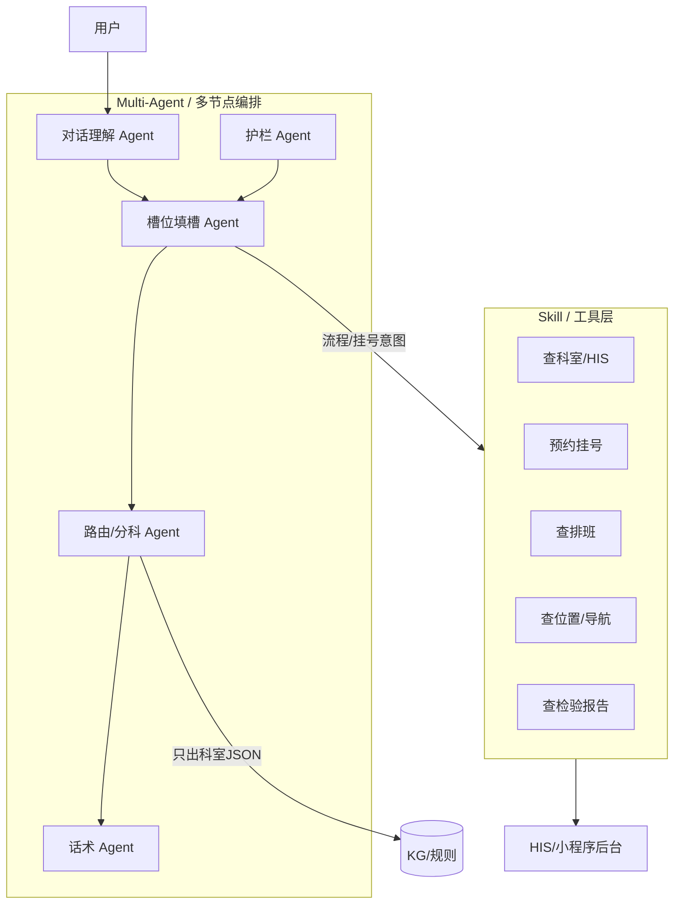

| | Skill | Multi-Agent |
|--|-------|-------------|
| **解决什么** | **调业务系统、查数据** | **谁负责理解、追问、分科、合规** |
| **导诊典型** | 挂号、排班、科室位置 | 填槽、KG 出科、危急拦截 |
| **一般不干什么** | Skill **不决定** 最终科室 | Agent **不直接** 调 HIS 支付（走 Skill） |

---

## 一、导诊里会有哪些 Skill（工具能力）

Skill = 封装好的 **可调用能力**（MCP Tool / HTTP API / Function），给 Agent **在需要「办事」时** 调用。

### 一期常见（和分科并行）

| Skill | 干什么 | 触发场景 |
|-------|--------|---------|
| **科室字典查询** | 本院科室 ID、名称、是否开诊 | 输出前映射「消化内科」→ 院内编码 |
| **导诊规则/KG 查询** | 症状组合 → 科室权重 | 槽位齐了之后 **路由 Agent 调**（也可内嵌规则引擎，不一定 LLM 调） |
| **别名/术语归一** | 「心口疼」→「胸痛」 | 理解层或轻量 RAG Skill |
| **危急词规则检查** | 是否命中急诊/拒答 | 护栏 Agent 或独立 Skill |
| **FAQ/流程检索** | 预约、缴费、在哪报到 | 「怎么挂号」类 **流程意图** |

### 二期常见（办事闭环）

| Skill | 干什么 |
|-------|--------|
| **预约挂号** | 选科室、医生、时段，占号 |
| **排班查询** | 某科今天有没有号 |
| **取消/改约** | 改预约 |
| **报告查询** | 检验/检查是否已出（需鉴权） |
| **院内导航** | 科室楼层、路线 |
| **就诊人管理** | 切换本人/家属（对应截图「先确认就诊人」） |
| **费用/医保咨询** | 查价格、报销政策（多为规则+FAQ） |

### 导诊里 Skill **通常不负责**

- ❌ 根据聊天 **自由决定** 挂哪个科（那是 **KG/规则 + 路由 Agent**）  
- ❌ 给出 **确诊、处方**（合规红线）  
- ❌ 替代 **槽位问卷**（点选填槽多为前端 + 状态机，不一定每次走 LLM Tool）

**面试说法：**  
> 导诊 Skill 主要是 **HIS/小程序/API 的 MCP 封装**；分科走 **KG/规则**，流程走 **ES/FAQ Skill**，两者分开。

---

## 二、导诊里 Multi-Agent 怎么用（真实形态）

生产里多数是 **「多节点编排 + 专责 Agent」**，不是 5 个 Bot 群聊。

### 典型 6～8 个「Agent」分工

| Agent / 节点 | 职责 | 输入 → 输出 |
|--------------|------|-------------|
| **1. 对话理解** | 主诉识别、别名归一 | 用户话 → `chief_complaint` + 模板 ID |
| **2. 槽位填槽** | 按模板问缺失槽、解析点选/打字 | 模板 + 缺失槽 → 更新 `slots` |
| **3. 路由/分科** | **KG/规则加权出科室** | `slots` → `{departments, scores}` JSON |
| **4. 护栏/合规** | 危急、非医疗、敏感拒答 | 任意轮 → `urgency` / 拦截话术 |
| **5. 检索** | ES 流程、RAG 术语（可选） | 流程意图 → 文档片段 |
| **6. Tool 执行** | 决定是否调 Skill | 挂号/查报告 → 调 MCP |
| **7. 话术生成** | 短说明、追问自然语言 | 结构化结果 → 用户可读回复 |
| **8. 评测/日志**（离线或旁路） | Golden 回归、bad case | 不参与线上对话 |

**协作方式：** 共享 **会话状态（slots + 模板 + 科室结果）**，由 **LangGraph / 自研状态机** 条件跳转，**不是** Agent 互相 `@` 聊天。

### 和你聊过的业务线怎么对应

```text
「我肚子疼」
  → 理解 Agent：chief_complaint=腹痛，模板=abdominal_pain
  → 填槽 Agent：疼多久 → 两轮症状 → 既往（8 选项 / 有无可选）
  → 护栏 Agent：若黑便/剧痛 → urgency
  → 路由 Agent：KG 加权 → 消化内科 / 普外科
  → 话术 Agent：短回复 + 科室 JSON
  → （二期）Tool Agent：要预约吗 → 挂号 Skill
```

「脚趾头疼直推骨科」= **填槽 Agent 发现 required 已齐 → 跳过追问 → 路由 Agent 短路径**。

### 不算导诊主流、但面试爱问的

| 概念 | 导诊里常见吗 |
|------|-------------|
| **Multi-Agent 互聊** | ❌ 很少 |
| **Agent 联邦** | ⚠️ 仅 **多院区/多系统** 拆服务时（导诊服务 + HIS 网关） |
| **自进化 / 红蓝对抗** | ❌ 线上不用；评测 offline 可能有 bad case 对抗集 |
| **模型蒸馏** | ❌ 一期几乎没有；以后或蒸馏 **意图/槽位小模型** 降本 |

---

## 三、按一期 / 二期看 Skill 与 Agent

| 维度 | 一期 | 二期 |
|------|------|------|
| **Multi-Agent** | 理解 + 填槽 + 路由 + 护栏 + 话术 | 加 **Tool Agent**、监控 Agent |
| **Skill** | 科室映射、KG/规则、FAQ、危急规则 | **挂号/排班/报告/导航** 等 HIS Skill |
| **AI 占比** | 高（编排、填槽、理解） | 中（路由、Tool、运营）；后端对接升高 |
| **输出** | **科室 JSON + 护栏** | 科室 + **可预约/可跳转** |

---

## 四、和「直接问 AI + 科室列表」差在哪

| | 直接 LLM | Skill + Multi-Agent |
|--|----------|---------------------|
| 分科 | 模型从列表里挑 | **路由 Agent + KG** |
| 挂号 | 易胡编 | **挂号 Skill 调真实 API** |
| 多轮 | 模型随意问 | **填槽 Agent 按模板** |
| 评测 | 难 | 每 Agent 可单测 + 端到端 Golden |

---

## 五、面试 40 秒版（脱离 GitHub 也能讲）

> 真实导诊里，**Multi-Agent 是多节点编排**：理解、填槽、路由、护栏、话术，必要时加 Tool 节点；科室由 **路由 Agent + KG/规则** 出 JSON，不是 LLM 自由生成。  
> **Skill** 主要是 **MCP 封装的业务 API**：一期是科室映射、FAQ、危急规则；二期是 **挂号、排班、报告、导航**。  
> RAG 做术语和流程召回，**不替代分科**。没有 Agent 联邦和蒸馏也能上线；联邦是多服务拆开后的事，蒸馏是后期降本选项。

---

**一句话：** 导诊的 **Skill = 查院务、挂号、导航等办事 API**；**Multi-Agent = 理解、填槽、KG 分科、护栏、话术的专责编排**——两者配合，**分科走规则，办事走 Skill**，不是一个大模型包打天下。

---

**User**

一期感觉像是为了skill而skill，也没必要用啊

---

**Cursor**

你的直觉 **对**：**一期若以「稳定分科 + 槽位 + 护栏 + 评测」为目标，大部分 Skill 确实可以不上**，强行包一层 MCP 容易 **为 Skill 而 Skill**。

---

## 一期真正要的是什么

| 必须有 | 可以没有 |
|--------|---------|
| 主诉 → 模板 → 填槽 | MCP / Skill 平台 |
| KG 或规则 **出科室 JSON** | 挂号、排班、报告查询 |
| 护栏（危急/拒答） | Tool Agent 专门一层 |
| Golden + 指标 | 多个自治 Agent 互聊 |
| 可选：ES 查 **流程 FAQ** | 把 ES 包装成 Skill |

**一期核心闭环：**

```text
用户说话 → 填槽 → 规则/Kg 算科室 → 返回 JSON + 短话术
```

这条链路 **全是状态机 + 规则 +（可选）LLM 理解与润色**，**不依赖 Skill**。

---

## 为什么之前会列一堆 Skill

那是 **「完整医院产品地图」**，把 **二期办事能力** 和 **一期** 混在一起了。拆开看：

| 能力 | 一期要不要 | 更合适的做法 |
|------|-----------|-------------|
| 科室映射 | 要 | **配置表 / KG 内嵌**，不必 MCP |
| KG/规则查询 | 要 | **代码里直接调规则引擎** |
| 别名归一 | 要 | **词表 / 小 RAG**，不必叫 Skill |
| FAQ/预约指南 | 看需求 | **ES 节点直查**；只有多系统复用才 Tool 化 |
| 挂号/排班/HIS | **不要** | 二期再说 |
| 病历查询 | **不要**（除非产品强需求） | 你 GitHub 里 mock 病历就是 **演示过度** |

所以：**一期 0 个对外 Skill 也完全可以上线试点。**

---

## Multi-Agent 一期要不要？

比 Skill **更有用**，但也可以 **瘦身**：

**一期最小编排（4 节点就够）：**

```text
理解(主诉/槽位解析) → 填槽(按模板) → 路由(KG/规则) → 话术(可选)
         ↑
       护栏(可合并进路由)
```

不必 8 个 Agent，更不必 Tool Agent——**没有 Tool 就不需要 Tool Agent**。

面试可以说：

> 一期是 **multi-node 状态机**，不是 **multi-skill 平台**；节点是 **职责拆分**，不是为了凑 Agent 数量。

---

## 什么时候才「值得」上 Skill

**有一个实用标准：**

> 是否要 **跨系统、带鉴权、被多个 Agent/前端复用** 的外部能力？

| 场景 | 上 Skill？ |
|------|-----------|
| 规则算科室 | ❌ 内嵌 |
| ES 查本院 FAQ | ❌ 节点直调 ES |
| 小程序 + 导诊 + 客服 **都要挂号** | ✅ 挂号 Skill / MCP |
| 对接 HIS 排班、报告 | ✅ 二期 Skill |

**一期没有 HIS 闭环 → 没有 Skill 很正常。**

---

## 和「直接问 AI + 科室列表」怎么自洽

你之前质疑 **解构、RAG、KG 是否过度**；现在质疑 **Skill 是否过度**——可以统一成：

| 层级 | 一期是否必要 | 原因 |
|------|-------------|------|
| LLM 直接出科室 | ❌ 不够 | 不稳、难评测 |
| 槽位 + KG/规则 | ✅ 必要 | 歧义、指标、合规 |
| RAG | ⚠️ 轻量即可 | 别名 + FAQ，不是主决策 |
| Skill | ❌ 非必要 | 没有外部办事 |
| Multi-Agent | ⚠️ 简化版 | 4 节点编排即可 |

**不是堆技术，是「分科」这一条链必须可控；Skill 是二期接业务时才划算。**

---

## 面试怎么说（避免被说过度设计）

> 我们 **一期 deliberately 没上 Skill 平台**，因为目标是 **科室推荐稳定可评测**，不涉及挂号/HIS。规则/Kg、填槽、护栏都在 **单服务内** 完成；ES 做流程 FAQ 也是 **节点直调**。  
> **二期** 接预约、排班、报告，才把 HIS API **MCP 化**，避免一期为 Skill 而 Skill。

这比简历写满「10 个 Skill」 **更可信**。

---

## 对你 GitHub 简化仓的含义

- `tool_calling` +  mock 病历：**可删或标成 demo**，别当一期必选项  
- 重点补：**槽位模板、KG/规则出科室、eval**  
- Skill / MCP 写 **「二期规划」** 即可  

---

**一句话：** 一期 **不必为了 Skill 而 Skill**；**槽位 + KG/规则 + 护栏 + 评测** 才是主体，Skill 等 **真要接 HIS、挂号** 再做——你的判断和真实导诊落地路径是一致的。

---

**User**

这个导诊的话，面试的话，该怎么说自己团队需要多人，多久，与后端，前端交付物是啥

---

**Cursor**

下面按 **真实导诊一期试点** 来讲，面试里 **怎么说团队、周期、分工、交付物**，并带上 **诚实边界**（不夸大、不被追问穿帮）。

---

## 一、先说清：你在讲哪一档

| 口径 | 适用 |
|------|------|
| **线上医速递 / 363 智能导诊**（工作经历） | 讲平台里的 **智能导诊子模块**，不包整个 V3.0 |
| **InitialArchitectureForMedicalAgent1** | **架构参考 / 个人复现**，不冒充两年唯一成果 |

面试固定一句：

> 医速递是大平台多模块；我主责 **智能导诊 AI 子服务 + 导诊 API**，不是全院小程序全栈负责人。

---

## 二、团队要多少人（一期试点）

**一期不需要大团队**，常见 **6～10 人（含兼职/共用）**，不是「4 人全职 2 年做完所有图标」。

### 推荐说法（一期 · 6～9 个月到试点）

| 角色 | 人数 | 职责 |
|------|------|------|
| **你（AI + 导诊后端）** | 1 | LangGraph/槽位/KG·规则/评测 + 导诊 FastAPI |
| **业务后端** | 1～2 | HIS/挂号/科室主数据、鉴权、与院方接口（协作） |
| **前端** | 1～2 | 小程序导诊页、点选填槽 UI、会话展示 |
| **产品** | 1 | PRD、决策树/槽位表、Golden 验收 |
| **测试/质量** | 0.5～1 | Golden、bad case、回归（你可强调这块） |
| **医学/运营** | 0.5 | 症状–科室规则、危急词（院方或外包顾问） |
| **项目经理** | 0.5 | 排期、院方沟通 |

**口述：**

> 导诊 **一期试点** 我们大概是 **7～8 人矩阵**，核心全职约 **4～5 人**；我 **1 人** 扛 AI 编排和导诊服务 API，HIS 和挂号是 **业务后端** 另一条线。

**别说的：** 「2 年 4 人全职做完整个 V3.0 所有功能」。

---

## 三、做多久（项目 vs 个人深度）

### 项目时间（对外）

| 阶段 | 周期 | 目标 |
|------|------|------|
| **一期** | **6～9 个月** 到试点 | 分科稳定、槽位、护栏、评测 |
| **二期** | 第 2 年 | 挂号/HIS、多院区、运营后台 |

**口述公式（背）：**

> **第一年**把分科和安全带稳；**第二年**接业务系统和评测运营。

### 你个人深度（必须单独说）

| 说法 | 示例 |
|------|------|
| 项目存续 | 平台/导诊模块 **约 X 年**（按真实写） |
| **你深度参与** | **约 8～14 个月**（AI+导诊 API，分阶段） |
| 外包 1 个月 | **单独一句**：另一项目，预算裁撤，偏 prompt/bad case |

**拆分示例（可按真实改数字）：**

```text
M1–M3   意图/槽位模板、KG·规则初版、与产品定 Golden
M4–M6   LangGraph 联调、ES 流程、评测脚本、staging
M7–M9   试点 bad case、指标回归、与前端/后端联调
M10+    二期挂号 Skill、HIS（若你参与再说）
```

**35 岁 + 转 AI：** 强调 **「建设 N 月 + 运营/对接 M 月」**，不是 24 个月全写 LangGraph。

---

## 四、与后端、前端：谁交付什么

### 总原则

- **你**：智能 **理解 + 填槽逻辑 + 分科决策 + 导诊 API + 评测**  
- **业务后端**： **院方数据与交易**（科室主数据、HIS、挂号、用户鉴权）  
- **前端**： **对话 UI + 点选填槽**，不承载分科算法  

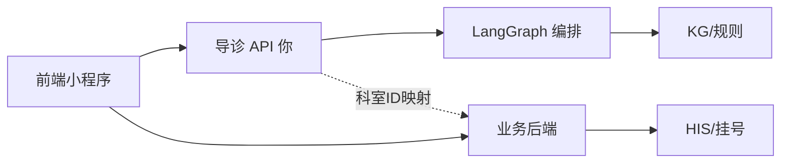

### 交付物对照表（面试直接讲）

| 角色 | 交付物 | 验收标准 |
|------|--------|---------|
| **你 AI+导诊后端** | ① 导诊 API（`/chat`、会话、结构化出科）<br>② LangGraph（理解/填槽/路由/护栏）<br>③ KG 或规则配置 + 别名表<br>④ Golden 集 + eval 脚本 + eval 报告<br>⑤ Docker/staging 部署说明 | Top-3 科室达标；P95 延迟；危急样本拦截率 |
| **业务后端** | ① 科室/院区主数据 API<br>② 用户/就诊人鉴权<br>③ 二期：挂号、排班、HIS 对接<br>④ 与导诊的科室 ID 映射 | 导诊出的科能 **挂到真实号源**（二期） |
| **前端** | ① 导诊入口页、会话 UI<br>② **8 选项 / 有无可点选** 填槽组件<br>③ 展示科室 JSON + 跳转挂号（二期）<br>④ 确认就诊人 | 完整走通 **说→选→出科** |
| **产品** | ① 主诉–模板–槽位表<br>② 决策树 / 问诊路径<br>③ Golden 与 bad case 优先级 | 医学可解释、可配置 |
| **测试** | ① Golden 维护<br>② 发版回归<br>③ 线上 bad case 单 | 每次发版有指标对比 |

### 一期 ** deliberately 没有** 的交付（主动说）

> 一期 **没强上 MCP Skill 平台**，挂号走 **业务后端 + 前端跳转**；导诊服务 **只出科室结构化结果**，不替代 HIS。

---

## 五、接口怎么划分（显得懂协作）

**你给前端的（一期）：**

```json
POST /triage/chat
{
  "reply": "短话术",
  "slot_status": "collecting|ready",
  "options": [{"label":"1-3天","slot":"duration","value":"..."}],
  "departments": [{"name":"消化内科","code":"DEPT_xxx","score":0.9}],
  "urgency": "normal|urgent|emergency"
}
```

**你依赖业务后端的：**

- `GET /departments` 本院科室树（映射用）  
- 用户/就诊人 token（鉴权）  
- 二期：`POST /appointment` 挂号  

**边界句：**

> 分科 **不算** 在后端 Java 里写死 if-else，在 **导诊 AI 服务**；挂号 **不算** 在 AI 里，在 **业务后端**。

---

## 六、面试 60 秒完整版（可背）

> 智能导诊是一期子模块，平台还有挂号、缴费等，我主责 **AI 编排 + 导诊 API**。  
> 团队一期试点大概 **7～8 人矩阵**，核心 **4～5 人全职**；我 **1 人** 负责 LangGraph、槽位模板、KG/规则出科室、Golden 评测和 FastAPI 部署。  
> 周期 **6～9 个月** 到试点；我个人深度 **约 10 个月**，分建设期和 bad case 回归期。  
> **交付物**：我这边是导诊 API、编排服务、规则/KG 配置、eval 报告；**前端**是点选填槽和会话 UI；**业务后端**是科室主数据、鉴权，二期接 HIS 挂号。  
> 一期 **不上 Skill 平台**，科室 **JSON 来自规则/Kg**，不用 LLM 自由生科；和开源简化仓的关系是 **架构参考**，线上口径以院方试点为准。

---

## 七、诚实红线（别踩）

| 禁止 | 推荐 |
|------|------|
| 四人全职 2 年做完 V3.0 全部 | 平台多模块，我只负责导诊 AI + API |
| 全院正式上线（无证据） | 试点 / staging + 录屏 + eval |
| 2 年纯 AI | 建设 N 月 + 对接/运营 M 月 |
| 开源 3 commit = 两年成果 | 开源是参考，深度在个人/线上模块 |
| 一期就 Skill/HIS 全闭环 | 一期出科 + 评测；二期挂号 |

---

## 八、按你现状微调数字

| 你的情况 | 建议口径 |
|---------|---------|
| 外包仅 1 个月 | 不写进导诊主项目；单独 **Agent 运维/bad case** |
| 测试背景 | 强调 **Golden、回归、指标**，团队里 **测试 0.5～1 人**，你可兼 |
| 导诊个人仓 | **个人 3～6 个月** 复现 + eval，与「线上 10 个月」分开陈述 |

---

**一句话：** 面试讲 **7～8 人矩阵、6～9 个月一期试点**；你 **1 人 AI+导诊 API**，交付 **API + 编排 + 规则/KG + eval**；前端 **UI+点选**，业务后端 **主数据+鉴权+二期挂号**；项目 2 年 ≠ 你 2 年全写 LangGraph，**建设期与运营期分开说**。  

如果你给 **真实参与月数**（例如 8 还是 12），我可以压一版 **简历项目段 + 面试追问时间表** 可直接粘贴。

---

**User**

那我给后端，前端什么交付物

---

**Cursor**

你是 **AI + 导诊服务** 负责人，下面是你 **要给前端、要给业务后端** 的交付物清单（一期为主）。面试就按 **「我交什么、对方交什么、怎么联调」** 讲。

---

## 一、你给 **前端** 什么

前端做：**对话 UI + 点选填槽 + 展示科室**；**不算科室、不碰 KG**。

### 1. 接口文档（必交）

| 交付物 | 内容 |
|--------|------|
| **OpenAPI / Swagger** | `POST /triage/chat`、`GET /session`、`POST /session/reset` 等 |
| **请求/响应 JSON Schema** | 字段含义、枚举、示例 |
| **错误码表** | `400` 参数错、`503` 模型超时、`451` 护栏拦截等 |

### 2. 核心响应结构（前端按这个渲染）

```json
{
  "session_id": "xxx",
  "reply": "请先选择下列符合您的情况",
  "slot_status": "collecting",
  "chief_complaint": "腹泻",
  "missing_slots": ["companion_fever"],
  "options": [
    {
      "option_id": "opt_1",
      "label": "1-3天",
      "slot": "duration",
      "value": {"value": 2, "unit": "day"},
      "multi_select": false
    },
    {
      "option_id": "opt_2",
      "label": "大便发黑",
      "slot": "stool_color",
      "value": "黑色",
      "multi_select": true
    }
  ],
  "yes_no_items": [],
  "departments": [],
  "urgency": "normal",
  "disclaimer": "导诊仅供参考，不能替代医生诊断"
}
```

**槽位齐了以后：**

```json
{
  "slot_status": "ready",
  "options": [],
  "departments": [
    {"name": "消化内科", "dept_code": "DEPT_001", "score": 0.92, "rank": 1},
    {"name": "普外科", "dept_code": "DEPT_002", "score": 0.35, "rank": 2}
  ],
  "urgency": "urgent",
  "primary_reason": "腹泻伴黑便"
}
```

### 3. 交互约定（必交，Word/Confluence 一页也行）

| 约定 | 说明 |
|------|------|
| `slot_status=collecting` | 展示 **options / yes_no_items**，隐藏或灰显「去挂号」 |
| `slot_status=ready` | 展示 **departments** 卡片，可跳转挂号（二期） |
| `urgency=emergency` | 红色提示 + 急诊文案，少轮次也出科 |
| 多选/单选 | 每个 option 带 `multi_select` |
| 用户点选上报 | `POST /triage/chat` body：`{"session_id","selected_options":["opt_1","opt_2"]}` |
| 用户打字 | `{"session_id","message":"..."}` |

### 4. 联调环境（必交）

| 交付物 | 说明 |
|--------|------|
| **Staging URL** | 如 `https://triage-staging.xxx.com` |
| **Mock 数据** | 3～5 条固定 session 响应（腹泻/腹痛/脚趾疼） |
| **Postman/Apifox 集合** | 前端自测不用等你 |

### 5. 可选但加分

- **WebSocket** 流式话术（若一期不用 SSE，就写清 **一期仅 HTTP 同步**）  
- **UI 文案包**：追问句、危急提示、免责声明（可与产品共出，你提供技术触发的文案 key）

---

## 二、你给 **业务后端** 什么

业务后端做：**科室主数据、用户鉴权、HIS/挂号**；**不写导诊规则**。

### 1. 你需要对方提供的（写进联调文档「依赖项」）

| 你向对方要 | 用途 |
|-----------|------|
| **科室主数据 API** | `dept_code`、名称、院区、是否开诊 |
| **科室映射表** | 你规则里的「消化内科」↔ `DEPT_001` |
| **用户/就诊人 token 校验方式** | 导诊 API 鉴权 |
| 二期：**挂号/排班 API** | 前端点「去挂号」时他们接 |

### 2. 你交给业务后端的

| 交付物 | 内容 |
|--------|------|
| **科室推荐结果规范** | 你只输出 `dept_code` + `score` + `urgency`，不输出 HIS 订单 |
| **dept_code 映射需求表** | Excel：规则科室名 → 要求对方提供的 code |
| **回调/埋点字段**（若需要） | `session_id`、`chief_complaint`、`recommended_depts[]`，供运营统计 |
| **服务部署说明** | 导诊服务端口、健康检查 `/healthz`、依赖 Redis/ES |
| **二期对接说明** | 导诊 **只到出科**；挂号请求 **前端 → 业务后端**，不经过 LLM |

### 3. 边界文档（面试金句）

> 导诊服务 **不直连 HIS**；出 `dept_code` 后，**挂号由业务后端 + 前端** 完成。一期 **无 Skill/MCP**，避免职责混乱。

### 4. 联调清单

| 场景 | 谁主导 |
|------|--------|
| 导诊出 `DEPT_001` 能否在挂号列表里找到 | 业务后端 + 前端 |
| token 过期导诊 401 | 你接他们鉴权中间件 |
| 科室下线/改名 | 他们改主数据，你改映射配置 |

---

## 三、一张表总结（面试 30 秒）

| 对象 | 你交的 | 对方交的 |
|------|--------|---------|
| **前端** | API 文档、JSON Schema、options/departments 结构、Mock、Staging | UI 点选协议、埋点、异常展示 |
| **业务后端** | 出科 JSON 规范、dept 映射需求、部署与健康检查 | 科室主数据、鉴权、二期挂号 API |

---

## 四、一期最小交付包（说「我实际交过这些就够」）

```
docs/
  triage-api.openapi.yaml      # 给前端
  triage-response-examples.json
  slot-option-protocol.md      # 点选怎么回传
  dept-mapping-request.xlsx    # 给业务后端
  integration-checklist.md     # 联调清单
deploy/
  docker-compose.staging.yml   # 联调环境
eval/
  eval.md                      # 指标（给产品/测试，前端可不关心）
```

---

## 五、面试口述示例

> **给前端**：OpenAPI、会话接口、以及 **collecting/ready 两种响应**——collecting 带 **options 填槽**，ready 带 **departments 数组**；另给 Staging 和 Postman。  
> **给业务后端**：我不接 HIS，只输出 **标准 dept_code**；提前给 **科室映射表需求**，他们提供主数据和鉴权；挂号二期走他们 API。  
> 我 **不** 把 KG 规则塞给 Java 后端写，也 **不** 让前端算分科。

---

**一句话：** 给前端 = **API + 填槽选项结构 + 出科 JSON + 联调环境**；给业务后端 = **出科规范 + 科室 code 映射需求 + 部署与边界说明**，挂号鉴权主数据 **他们给你**，不是你给他们写业务代码。

---

**User**

skill的概念是什么，举个例子，运用

---

**Cursor**

## Skill 是什么（一句话）

**Skill = Agent 能「调用」的一项具体能力**，通常封装成 **函数 / API / MCP Tool**。  
Agent 负责 **决定要不要用、传什么参数**；Skill 负责 **真的去查库、挂号、算路由**。

可以把它理解成：**给 AI 装的「APP」或「插件」**，不是让模型自己编答案。

---

## 和几个容易混的概念

| 概念 | 是什么 | 导诊例子 |
|------|--------|---------|
| **Skill / Tool** | 可调用的外部能力 | 查排班、挂号 |
| **Prompt** | 告诉模型怎么说话 | 「你是导诊助手…」 |
| **RAG** | 从文档里 **检索** 片段 | 查预约流程 FAQ |
| **KG/规则** | **结构化** 推理/算分 | 症状→科室权重 |
| **Agent 节点** | 编排里的一步 | 填槽、路由、调 Tool |

**Skill 是「动手办事」；RAG 是「翻书查」；KG 是「查表算」。**

---

## 长什么样（技术形态）

常见三种：

1. **Function Calling / `@tool`**（LangChain）  
2. **MCP Tool**（Cursor/Claude 那种，标准化注册）  
3. **HTTP API 包装**（内部微服务）

结构都差不多：

```text
名称: book_appointment
描述: 为用户在指定科室预约号源
参数: dept_code, patient_id, date
返回: { appointment_id, time_slot }
```

Agent 看到用户说「帮我挂明天消化内科」，若判断需要预约，就 **调用这个 Skill**，而不是编造「已帮您挂好」。

---

## 举个例子 1：导诊 **二期**（典型 Skill）

**场景：** 槽位已齐，系统推荐 **消化内科**，用户说「帮我约明天的号」。

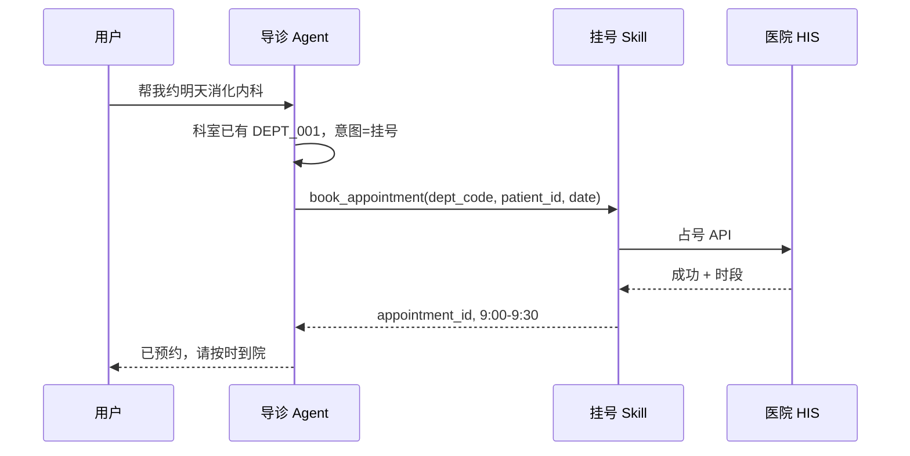

| Skill 名 | 干什么 |
|----------|--------|
| `query_schedule` | 查某科哪天有号 |
| `book_appointment` | 预约 |
| `cancel_appointment` | 取消 |
| `query_report` | 查检验报告是否已出 |
| `hospital_navigation` | 查科室在几楼 |

这些都是 **Skill**：要 **鉴权、调真实系统、返回结构化结果**。

---

## 举个例子 2：导诊 **一期**（多数 **不算** Skill）

**场景：** 「我腹泻 1 天，大便发黑」→ 推荐 **消化内科**。

这里用的是：

- **填槽**（duration、stool_color）  
- **KG/规则**（黑便 → 消化内科 + urgent）  

**直接在服务内代码完成**，不必包一层 MCP，也 **不必叫 Skill**。

若硬要叫 Skill，只有这种 **边缘情况**：

| 能力 | 是否值得叫 Skill |
|------|-----------------|
| 规则引擎算科室 | ❌ 内嵌即可 |
| ES 查「怎么预约」 | ❌ 检索节点即可 |
| 调 **院方统一科室主数据 API** | ⚠️ 多系统复用时可 Tool 化 |

所以你之前说 **「一期为 Skill 而 Skill 没必要」** 是对的。

---

## 举个例子 3：非医疗（更好理解）

| Skill | 用户说 | Agent 做什么 |
|-------|--------|---------------|
| `get_weather(city)` | 北京今天天气？ | 调天气 API |
| `send_email(to, body)` | 给张三发邮件 | 调邮件服务 |
| `query_order(order_id)` | 查订单 12345 | 调订单系统 |

没有 Skill 时，模型只能 **编造** 天气或订单状态；有 Skill 才能 **查真数据**。

---

## Skill 在 Agent 里怎么用（流程）

```text
1. 注册 Skill 列表（名称 + 描述 + 参数 schema）
2. 用户输入
3. LLM / 路由判断：要不要调 Skill？调哪个？参数是什么？
4. 执行 Skill，结果写回上下文
5. Agent 用结果组织回复（或继续下一步）
```

导诊里 **只有「办事」类** 才值得走这条链；**分科** 走 KG，**FAQ** 走 ES。

---

## 和 Multi-Agent 的关系

- **Tool Agent 节点**：专门判断并 **调用 Skill**  
- **路由 Agent**：**不** 通过 Skill 分科，走规则/Kg  
- 一期可以 **没有 Tool Agent**（没有 Skill 可调）  
- 二期接 HIS 后，**挂号 Skill** 才常用

---

## 面试 20 秒版

> **Skill 是 Agent 可调用的封装能力**，比如挂号、查排班、查报告，通过 Function Calling 或 MCP 调真实 API。  
> 导诊 **一期** 核心是槽位和 KG **出科室**，一般 **不上 Skill**；**二期** 接 HIS 才把挂号等 **MCP 化**。  
> Skill 是 **办事**，RAG 是 **查文档**，KG 是 **算科室**，三者别混。

---

**一句话：** Skill = **AI 的「手」**，能调外部系统干实事；导诊里 **挂号/排班/报告** 是典型 Skill，**分科本身不是 Skill**，一期没有 HIS 闭环时可以 **不用 Skill**。

---

**User**

指南，比如说问哪里报销

---

**Cursor**

**「哪里报销」属于流程/指南类问题**，不是分科导诊。走 **ES（或 RAG）查院内指南**，**不走 KG 算科室**，一般也 **不必上 Skill**。

---

## 这类问题是什么意图

| 用户问 | 意图 | 通道 |
|--------|------|------|
| 我肚子疼挂什么科 | 分科 | 槽位 + **KG/规则** |
| **哪里报销、怎么报销** | **办事/FAQ** | **ES 指南检索** |
| 怎么预约、在哪取报告 | 同上 | ES + 规则 |

「指南」= 医院写好的 **流程文档**（报销、预约、出院、缴费…），在你们数据里类似 `es医院导诊指南_clean.json` 那种。

---

## 业务怎么处理（一期就够）


### 1. 意图识别

```json
{
  "main_intent": "process",
  "has_process": true,
  "has_symptom": false,
  "process_query": "报销 在哪里"
}
```

**不进入** 腹泻/腹痛那种 **填槽模板**，也 **不算科室**。

### 2. ES 检索指南

在索引里搜 `scene`、`raw_text`，例如字段：

- `process_type`: `reimbursement` / `outpatient` / `inpatient`  
- `scene`: 「门诊医保报销流程」  
- `raw_text`: 窗口位置、材料、时间…

你们简化仓里 `es_rag_node` 就是干这个的：**流程类 query → ES → `process_docs`**。

### 3. 回答方式

| 做法 | 说明 |
|------|------|
| **推荐** | 以 **检索到的指南原文/结构化步骤** 为主，LLM **只做 shorten** |
| **避免** | 让 LLM 凭空编「在一楼窗口报销」 |

示例输出：

> 门诊医保报销请到 **门诊大厅 X 号窗口**（以院内指南为准），需携带：医保卡、身份证、发票…  
> 具体以 **《门诊报销须知》** 为准。

可加：`source: "门诊报销流程"` 方便溯源。

---

## 和 Skill、KG、RAG 分别啥关系

| 技术 | 「哪里报销」用不用 | 原因 |
|------|-------------------|------|
| **KG（症状→科室）** | ❌ | 不是分科 |
| **Skill** | ⚠️ 通常不用 | 除非要 **实时查医保系统余额/政策 API** |
| **ES 检索** | ✅ 主路径 | 指南已入库 |
| **RAG（向量）** | 可选 | 问法多样时补充召回 |
| **LLM** | 可选 | 整理步骤，**不编造窗口号** |

**Skill 什么时候才涉及报销？**  
例如院方有 **`query_reimburse_policy(insurance_type)`** 实时接口——那可以包成 Skill；多数医院 **一期只有静态指南 PDF/JSON**，**ES 就够**。

---

## 和「双通道」叙事对齐

```text
症状/分科  →  槽位 + KG  →  科室 JSON
流程/指南  →  ES/RAG    →  步骤/位置文案
办事交易  →  二期 Skill →  挂号、查报告（报销办理若在线办才接 API）
```

「哪里报销」在 **第二条通道**。

---

## 完整对话例子

**用户：** 门诊在哪里报销？  

**系统内部：**

1. `intent = process`，`process_query = "门诊 报销 哪里"`  
2. ES 命中：`scene: "门诊医保报销"`，`raw_text: "...至门诊大厅2号窗口..."`  
3. 不填 `duration`、`stool_color` 等槽  
4. 不输出 `departments: [消化内科]`  

**用户看到：**

> 根据《门诊医保报销须知》，请携带医保卡、身份证、收费票据到 **门诊大厅 2 号窗口** 办理。  
> 办理时间：工作日 8:00–17:00。  
> （以上内容来自医院指南，如有变动以现场为准。）

若用户接着问 **「我同时肚子痛挂什么科」** → **切换通道**，走导诊填槽 + KG。

---

## 面试怎么说

> 「哪里报销」是 **流程意图**，走 **ES 查院内指南**，和 **症状分科 KG** 分开；回答 **引用指南片段**，LLM 只负责压缩话术，不编窗口位置。只有对接 **医保实时查询 API** 时才考虑 **Skill**；一期静态 FAQ **不需要 Skill**。

---

**一句话：** 「哪里报销」= **指南/FAQ 通道**，用 **ES（+ 可选 RAG）查报销流程文档** 回答；**不是 KG 分科，也不是为指南单独上 Skill**，除非要调真实医保系统。

