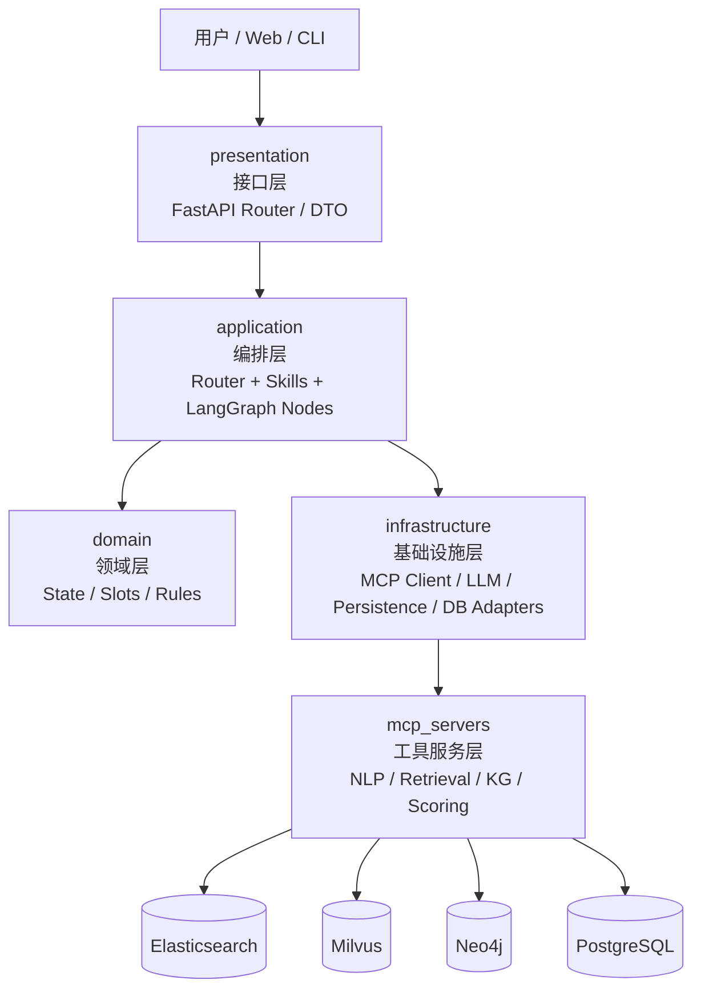
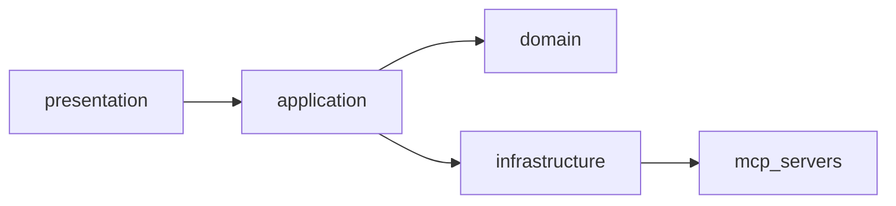
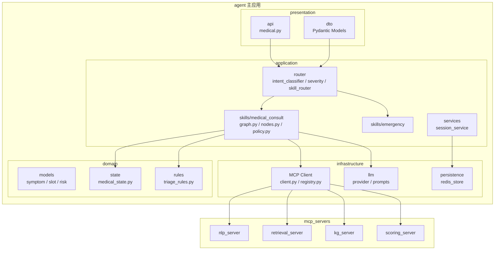
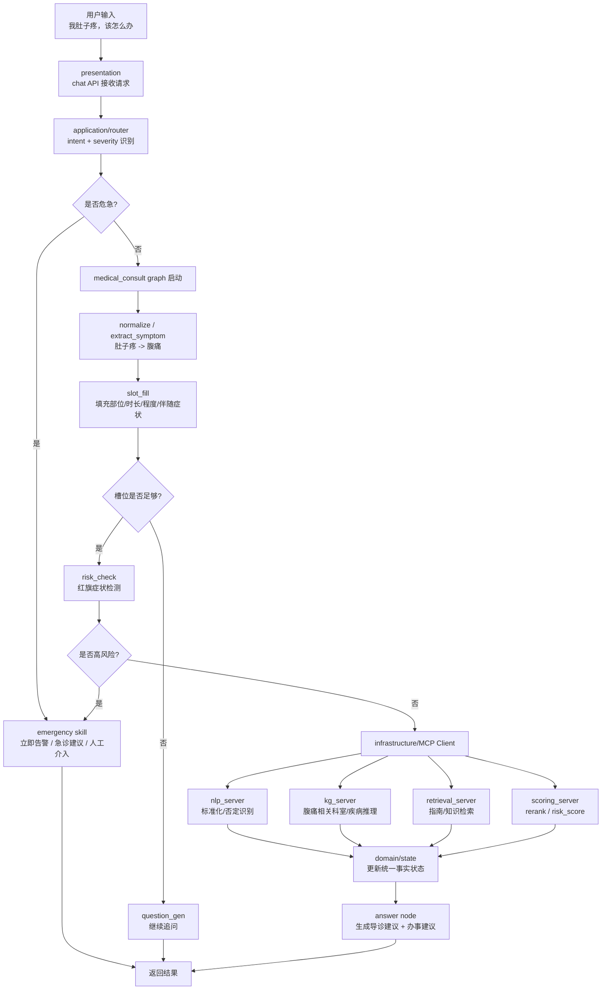

# 分层架构与业务流设计（以“我肚子疼，该怎么办”为例）

本文把你提出的分层思路，映射到当前仓库已有的 `FastAPI + LangGraph + MCP` 实现上，并用一个具体场景说明业务流如何跑通。

> 说明：下面的“腹痛”流程是系统编排示例，用于展示架构与节点职责，不构成真实医疗诊断建议。

---

## 1. 总体分层架构图



### 一句话理解

- **presentation**：接请求、校验参数、返回响应。
- **application**：决定走哪个 skill，用 LangGraph 编排流程。
- **domain**：保存事实状态，定义槽位、规则、风险判断。
- **infrastructure**：统一封装 MCP、LLM、数据库、缓存等外部能力。
- **mcp_servers**：提供原子化、无状态的工具能力。

---

## 2. 在当前仓库中的落点映射

虽然当前代码目录还没有完全切成 `presentation / application / domain / infrastructure` 这套名字，但已经有比较清晰的对应关系：

| 理想分层 | 当前仓库落点 | 说明 |
|---|---|---|
| presentation | `app/main.py`、`app/api/routers/*` | FastAPI 入口、HTTP 接口 |
| application | `app/graph/builder.py`、`app/graph/nodes/*`、`app/services/*` | LangGraph 编排、节点调度、会话流程 |
| domain | `app/domain/models.py`、`app/domain/routing.py`、`app/domain/diagnosis/*` | AppState、IntentResult、槽位、问诊规则 |
| infrastructure | `app/mcp/client.py`、`app/infra/*`、`app/core/*` | MCP Client、Neo4j/ES/Milvus/Postgres 客户端、LLM 配置 |
| mcp_servers | `app/mcp/patient_server.py` | 当前是单一 MCP Server，后续可拆为多个 server |

---

## 3. 推荐的单向依赖关系



### 必须坚持的边界

#### 允许

- `presentation -> application`
- `application -> domain`
- `application -> infrastructure`
- `infrastructure -> mcp_servers`

#### 禁止

- `domain -> infrastructure`
- `domain -> mcp_servers`
- `skill / node -> 直接访问 ES / Neo4j / Milvus / Postgres`
- `mcp_server -> 反向依赖 application / domain`
- `mcp_server -> 写业务决策（例如分级、追问、终止条件）`

换句话说：

- **业务决策在 application + domain**
- **工具能力在 infrastructure + mcp_servers**
- **状态事实只在 state 里收敛**

---

## 4. 建议拆分后的结构图

这张图体现的是你提议的目标结构，以及和当前实现的衔接方式。



---

## 5. “我肚子疼，该怎么办” 的业务流

这个输入是一个很典型的 **混合意图**：

- `我肚子疼`：症状意图
- `该怎么办`：流程/建议意图

因此比较合理的路由不是“只检索文档”或“只做问诊”，而是：

1. 先识别为 `mixed`
2. 先进入 `medical_consult skill`
3. 补齐必要槽位并做风险判断
4. 再调用检索与知识图谱工具
5. 最后给出 **导诊建议 + 就诊流程建议**

### 5.1 业务流图



### 5.2 这一轮里 State 怎么变化

用户刚说：

```text
我肚子疼，该怎么办
```

Router 和 skill 初步处理后，`state` 可以理解为：

```json
{
  "query": "我肚子疼，该怎么办",
  "main_intent": "mixed",
  "severity_level": "unknown",
  "slots": {
    "chief_complaint": "肚子疼",
    "normalized_symptoms": ["腹痛"],
    "location": null,
    "duration": null,
    "severity": null,
    "accompanying_symptoms": []
  },
  "risk_flags": [],
  "next_action": "ask_clarifying_question"
}
```

如果用户补充：

```text
右下腹疼了 8 小时，越来越痛，还有点发烧和恶心
```

那么 state 会继续收敛，例如：

```json
{
  "main_intent": "mixed",
  "slots": {
    "chief_complaint": "肚子疼",
    "normalized_symptoms": ["腹痛", "发热", "恶心"],
    "location": "右下腹",
    "duration": "8小时",
    "severity": "进行性加重",
    "accompanying_symptoms": ["发热", "恶心"]
  },
  "risk_flags": ["右下腹痛", "发热", "进行性加重"],
  "next_action": "emergency_or_surgical_triage"
}
```

这里的关键点是：**State 是唯一事实来源**。  
无论是路由、追问、工具调用还是最终回答，都只读写这一份状态。

---

## 6. 这条业务流里每层分别做什么

### 6.1 presentation 层

只负责：

- 接收 `/chat` 请求
- 校验用户输入
- 构造 DTO
- 调用 application
- 返回结构化响应

不负责：

- 判断是腹痛还是咳嗽
- 决定要不要追问
- 直接连 Neo4j / ES / Milvus

### 6.2 application 层

这是核心编排层，负责：

- 判定 `我肚子疼，该怎么办` 是 `symptom + process` 的混合意图
- 决定先跑 `medical_consult`，还是直接走 `emergency`
- 在 graph 里组织 `extract -> slot_fill -> risk_check -> retrieval -> answer`
- 根据 policy 决定“继续追问 / 终止 / 输出”

### 6.3 domain 层

负责沉淀纯业务事实：

- `AbdominalPainState`
- `SymptomSlot`
- `RiskFlag`
- `TriageRule`
- `红旗症状规则`

例如：

- 腹痛 + 呕血 -> 高风险
- 腹痛 + 黑便 + 头晕 -> 高风险
- 腹痛 + 右下腹固定痛 + 发热 -> 需要外科/急诊优先评估

### 6.4 infrastructure 层

负责把 application 想要的能力包装成统一接口：

- `MCPClient.call(tool_name, payload)`
- `LLMProvider.generate(...)`
- `RedisStore.save_session(...)`

application 不关心：

- tool 在哪个 server
- server 用 HTTP、SSE 还是 JSON-RPC
- 检索底层是 ES、Milvus 还是别的系统

### 6.5 mcp_servers 层

只做原子工具：

- `extract_symptom(text)`
- `normalize_symptom(term)`
- `query_graph(symptoms)`
- `vector_search(query)`
- `rerank(candidates)`
- `risk_score(slots)`

它们不做：

- “腹痛是否应该追问 3 轮”
- “什么时候结束会话”
- “优先推荐哪个 skill”

这些都属于 application/domain。

---

## 7. 从“腹痛”例子看为什么这套分层好用

### 7.1 新增一个工具，不影响 skill

如果以后要给腹痛增加：

- `appendicitis_risk_score`
- `abdominal_ct_guideline_search`

只要：

1. 在 `mcp_servers` 增加工具
2. 在 `registry` 注册映射
3. 在 `medical_consult` graph 里决定何时调用

不用重写 Router，也不用改 Domain 模型。

### 7.2 替换底层实现，不影响上层编排

例如把 `retrieval_server` 从 ES + Milvus 换成别的检索引擎，application 仍然只认：

```python
mcp.call("vector_search", {...})
```

skill 不需要知道底层服务改了什么。

### 7.3 多 skill 可以并存

腹痛是 `medical_consult`，但以后还可以增加：

- `guideline skill`
- `emergency skill`
- `followup skill`
- `chronic_disease skill`

它们共享：

- Router
- Domain state/rules
- MCP Client

而不是每个 skill 各写一套直连外部系统的逻辑。

---

## 8. 如果按当前仓库逐步演进，建议这样落地

### 第一阶段：先做目录重命名映射

保持现有实现不大改，只做概念归位：

- `app/api` => 对应 `presentation`
- `app/graph` + `app/services` => 对应 `application`
- `app/domain` => 保持 `domain`
- `app/mcp` + `app/infra` + `app/core` => 对应 `infrastructure`

### 第二阶段：把 MCP Client 做成统一入口

目标接口：

```python
class MCPClient:
    def call(self, tool_name: str, payload: dict) -> dict:
        ...
```

然后 skill 里只保留：

```python
result = mcp.call("extract_symptom", {"text": state.query})
```

而不是散落很多 `xxx_mcp()` 函数。

### 第三阶段：把单体 `patient_server.py` 拆成多 server

优先按职责拆：

- `nlp_server`
- `retrieval_server`
- `kg_server`
- `scoring_server`

这样以后每个 server 的部署、扩缩容、缓存策略都会更清晰。

---

## 9. 一个最实用的落地原则

如果只记一条，请记这条：

> **Skill 只负责编排，State 只负责事实，Tool 只负责能力。**

对应到“我肚子疼，该怎么办”这个场景：

- **Skill** 决定先问什么、何时调用检索、何时终止
- **State** 记录腹痛部位、时长、严重程度、伴随症状、风险标记
- **Tool** 提供症状标准化、图谱查询、检索、重排、评分

这三者一旦混写，后面加 MCP、加新 skill、加新数据源都会变得很痛苦。

---

## 10. 最后给一个简化版口头描述

如果用一句比较接地气的话描述这套系统：

1. **接口层**先把“我肚子疼，该怎么办”收进来。
2. **编排层**判断这是“症状 + 求建议”的混合问题。
3. **领域层**把“腹痛、部位、时长、发热、恶心”等事实写进 state。
4. **基础设施层**统一去调 MCP 工具和检索系统。
5. **工具服务层**分别做标准化、检索、图谱推理、风险评分。
6. 最后由 **编排层** 综合 state 和工具结果，返回“是否紧急、建议挂什么科、下一步怎么办”。

如果你愿意，我下一步可以继续把这份文档再往前推一层，直接补一版 **“当前代码目录 -> 目标目录”的重构迁移图**，把每个现有文件应该迁到哪里也画出来。
